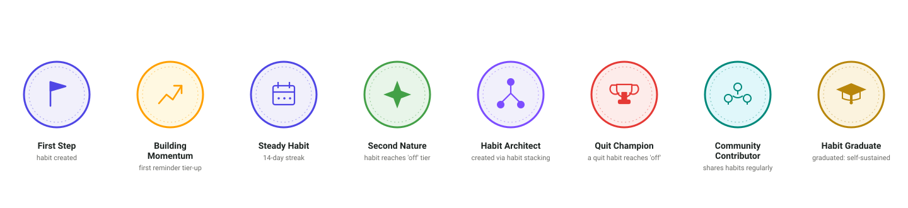
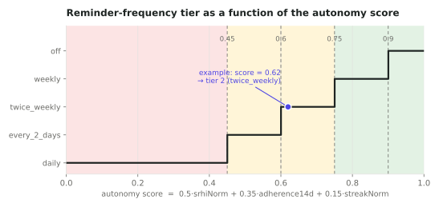
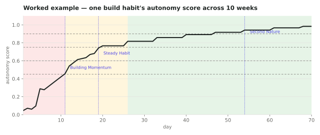
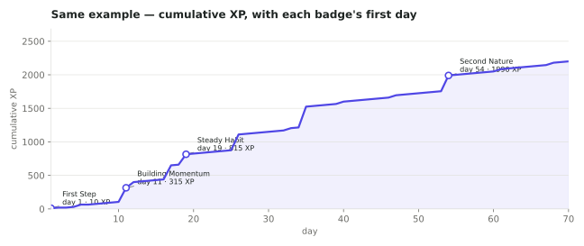
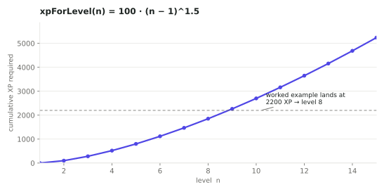
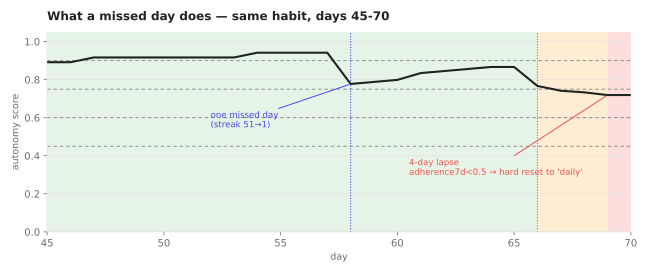
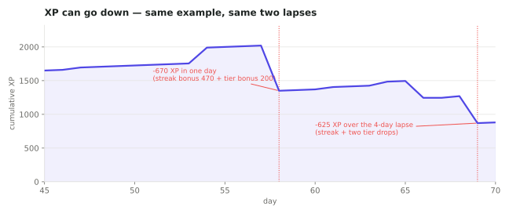

# Health Habit Hub — Documentation

**Version:** 3.1
**Last Updated:** June 2026
**Production Domain:** https://habit.wiwi.tu-dresden.de
**Repository:** https://github.com/helict/health-habit-hub

---

## Table of Contents

1. [Project Overview](#1-project-overview)
2. [Architecture](#2-architecture)
3. [Repository Structure](#3-repository-structure)
4. [Tech Stack](#4-tech-stack)
5. [Environment Variables](#5-environment-variables)
6. [Local Development](#6-local-development)
7. [Production Deployment](#7-production-deployment)
8. [Admin Application](#8-admin-application)
9. [Testing](#9-testing)
10. [API Reference](#10-api-reference)
11. [Security](#11-security)
12. [Troubleshooting](#12-troubleshooting)
13. [Behavioral Principle Features](#13-behavioral-principle-features)

---

> **This file is the central reference** — architecture, containers, environment,
> security, and API. Deeper, task-specific docs live alongside it:
> | Doc | Use it for |
> | --- | --- |
> | [`DEPLOYMENT.md`](DEPLOYMENT.md) | Step-by-step first production deploy (Portainer, secrets) |
> | [`docs/runbook.md`](docs/runbook.md) | Day-two ops: updates, rollback, backup/restore, secret rotation, Neo4j Browser access, troubleshooting |
> | [`docs/DEPLOYMENT_TESTING_CHECKLIST.md`](docs/DEPLOYMENT_TESTING_CHECKLIST.md) | Post-deploy smoke-test checklist |
> | [`docs/data-model.md`](docs/data-model.md) | MongoDB collections + Neo4j graph schema |
> | [`docs/architecture.md`](docs/architecture.md) | Extended architecture narrative |
> | [`docs/diagrams/`](docs/diagrams/README.md) | Diagrams-as-code (system, sequences, use cases, class model) |
> | [`docs/migration.md`](docs/migration.md) | Fuseki → Neo4j/LightRAG migration history |
> | [`docs/identity-mode-plan.md`](docs/identity-mode-plan.md) | Design for optional per-study verified-identity mode (clinical studies) — **approved, not yet implemented** |
> | [`docs/design-system.md`](docs/design-system.md) | Mobile app color tokens, the primary/primaryDark usage rule, icon-style convention, and the spring-based motion vocabulary (`AppSpring`, `PressableScale`, reduced-motion handling) |

## 1. Project Overview

Health Habit Hub (H3) is a mobile-first research platform developed at TU Dresden (Chair of Business Informatics, esp. Health Informatics). It enables participants to donate, explore, and receive recommendations about health habits in the context of a longitudinal research study.

### Key Features

- **Flutter mobile app** — cross-platform (iOS, Android, web), Keycloak PKCE login, habit donation, AI-powered recommendations, guided onboarding
- **Habit classification pipeline** — LLM-based habit extraction, BCIO ontology mapping, and recommendation generation via the Python FastAPI service
- **Semantic knowledge base** — Neo4j habit graph with BCIO ontology alignment, plus a LightRAG graph+vector knowledge base _(the former Fuseki/RDF triplestore has been retired — see docs/migration.md)_
- **Multi-language support** — English, German, French, Japanese, and Dutch (LibreTranslate for automatic translation + LLM refinement)
- **Automated notifications** — Redis-coordinated scheduled push notification dispatch, plus per-habit check-in delivery (see _Questionnaire Scheduling & Check-in Delivery_)
- **Researcher admin panel** — study management, participant tracking, questionnaire authoring and scheduling
- **Physics-based motion** — a shared spring vocabulary (damping/response, not fixed-duration easing) drives interactive animations in both the mobile app and admin portal, with momentum handoff on drag release and full reduced-motion support; see `docs/design-system.md` → Motion

---

## 2. Architecture

> **Diagrams-as-code:** the maintained diagram suite — system architecture ([Mermaid source](docs/diagrams/architecture/system-architecture.mmd)), UML use case diagram + [use case catalogue](docs/diagrams/use-cases/use-case-overview.md), one sequence diagram per use case (UC-01 … UC-39, [docs/diagrams/sequences/](docs/diagrams/sequences/)), and the [domain class diagram](docs/diagrams/classes/class-diagram.mmd) — lives in [docs/diagrams/](docs/diagrams/README.md) with rendering/export instructions (SVG · PNG · PDF).

### System Diagram

Everything runs as Docker containers on one host, path-routed behind Traefik on a
single domain (`habit.wiwi.tu-dresden.de`). The Flutter app and admin panel are
the public entrypoints; a set of internal admin/debug tools sit behind a Keycloak
SSO gate (`oauth2-proxy`).


The diagram above shows the main request path. Not pictured (see the service
tables below for the full picture): `knowledge-mcp` (MCP/SSE server exposing the
LightRAG KB to AI agents, :8002), `translate` (self-hosted LibreTranslate), and
ops/support containers with no inbound routes — `config-sync` (git pull),
`backup`, `docker-socket-proxy`, `blackbox-exporter`, `keycloak-init`.

### Service Responsibilities

All 22 containers, grouped by role. Container names are prefixed `hhh-`
(e.g. service `app` → container `hhh-app`).

**Edge & identity**

| Service | Image | Responsibility |
| --- | --- | --- |
| `proxy` | `traefik:v3.6.1` | Reverse proxy; TLS via Let's Encrypt; path-based routing on `${DOMAIN}`; dedicated `neo4jbolt` entrypoint on :7687 |
| `oauth2-proxy` | `oauth2-proxy:v7.13.0` | Keycloak SSO **forward-auth gate** for the internal tools; only realm `admin` role passes. Identifies users by `preferred_username` |
| `keycloak` | `keycloak:26.5.5` | Identity provider; realm `hhh`; clients: `hhh-flutter` (public PKCE), `hhh-backend` (confidential SA), `hhh-admin`, `hhh-ropc`, `grafana`, `oauth2-proxy` |
| `keycloak-db` | `postgres:16-alpine` | Keycloak's persistence backend |
| `keycloak-init` | `keycloak:26.5.5` | One-shot init: injects client secrets, creates the `oauth2-proxy` client if missing, seeds the admin user (via `kcadm`) |

**Application**

| Service | Image | Responsibility |
| --- | --- | --- |
| `app` | `hhh/app` (Node 22, Express) | REST API `/api/v1/*` (JWT-verified via Keycloak JWKS); WebSocket recommendations; notification scheduler; BullMQ `habitQueue`; Bull Board at `/queues` |
| `admin` | `hhh/admin` (Next.js 15, MUI, NextAuth) | Researcher/admin dashboard at `/admin`; participant management; questionnaire authoring; study config. OIDC login via Keycloak (`hhh-admin`) |
| `recommender` | `hhh/recommender` (Python, FastAPI) | LLM habit classification, BCIO mapping, context extraction, RAG recommendation; protected by `API_SERVICE_SECRET` |
| `knowledge-mcp` | `hhh/knowledge-mcp` (FastMCP, SSE, :8002) | MCP server exposing `search_knowledge` / `ingest_document` over the LightRAG KB to AI agents |
| `translate` | `hhh/translate` (LibreTranslate, baked EN/DE/JA/FR/NL) | Self-hosted machine translation used by the backend |

**Data stores**

| Service | Image | Responsibility |
| --- | --- | --- |
| `mongo` | `mongo:7.0` | Studies, questionnaires, intentions, logs, SRHI trajectories, recommendations, restore attempts, device tokens |
| `neo4j` | `neo4j:5` | Habit / Context / BCIOConcept graph; bolt :7687. Loopback ports `127.0.0.1:17474/17687` for admin SSH tunnels |
| `redis` | `redis:7-alpine` | API-service response cache; BullMQ `habitQueue`; notification-cron lock |
| `lightrag` | `hhh/lightrag` (lightrag-hku 1.5.0, :9621) | Graph + vector knowledge base for RAG. Has its **own** login (`AUTH_ACCOUNTS`) — not on the SSO |

**Internal tools** (all HTTP tools gated by `oauth2-proxy` SSO / admin role)

| Service | Image | Responsibility |
| --- | --- | --- |
| `mongo-express` | `mongo-express:1.0` | Web UI for MongoDB at `/mongo` (own basic-auth disabled; SSO-gated) |
| `redisinsight` | `redis/redisinsight:latest` | Web UI for Redis at `/redisinsight` |
| `prometheus` | `prom/prometheus:v3.4.1` | Metrics scraping + 30-day retention at `/prometheus` |
| `grafana` | `grafana/grafana-oss:12.0.1` | Dashboards at `/grafana`; its own Keycloak OIDC SSO (separate from oauth2-proxy) |
| `blackbox-exporter` | `prom/blackbox-exporter:v0.25.0` | Probes service endpoints for Prometheus uptime metrics |

**Ops & support**

| Service | Image | Responsibility |
| --- | --- | --- |
| `config-sync` | `alpine/git:latest` | One-shot: refreshes the on-server `/opt/hhh/repo` config clone before dependents start |
| `backup` | `hhh/backup` | ~24h loop: MongoDB dump, Neo4j dump, LightRAG tar, Keycloak realm export; configurable retention |
| `docker-socket-proxy` | `tecnativa/docker-socket-proxy:0.3.0` | Scoped Docker API for the backup service (no raw socket mount) |

---

## 3. Repository Structure

```
health-habit-hub/
├── app/                            # Node.js/Express backend
│   ├── main.js                     # Entry point
│   ├── app.js                      # Express app setup, middleware, route mounting
│   ├── routes/                     # All API route handlers (~30 routers under /api/v1)
│   │   ├── habits/                 # habitsCrudRouter (donate + retrieve, BullMQ-backed),
│   │   │   │                       # habitsGraphRouter, habitsStatsRouter
│   │   ├── adminRouter.js          # /api/v1/admin — mounts all admin/ sub-routers
│   │   ├── admin/                  # auditLogRouter, backupsRouter, notificationsRouter,
│   │   │   │                       # participantsRouter, restoreAttemptsRouter, studiesRouter,
│   │   │   │                       # surveysRouter, systemRouter, teamRouter
│   │   ├── restoreRouter.js        # /api/v1/restore — passphrase-based account recovery
│   │   ├── recommendationsRouter.js# /api/v1/recommendations — cached recommendations
│   │   ├── recommendRouter.js      # /api/v1/recommend — live AI recommendation calls
│   │   ├── questionnairesRouter.js, questionnaireResponsesRouter.js
│   │   ├── usersRouter.js          # /api/v1/users (profile, consent, delete, rotate-credentials)
│   │   ├── kbRouter.js             # /api/v1/kb — knowledge base (admin/researcher)
│   │   ├── onboardRouter.js        # /api/v1/onboard — anonymous self-registration
│   │   ├── studyEnrollRouter.js, studyConfigRouter.js, srhiRouter.js, intentionsRouter.js,
│   │   │   cuePoolRouter.js        # DFG study module
│   │   └── internalRouter.js       # /api/internal — internal WS broadcast
│   ├── middleware/                 # auth.js (JWT via Keycloak JWKS), requireRole.js,
│   │   │                           # requireServiceToken.js, rateLimiter.js, inputSanitizer.js,
│   │   │                           # securityHeaders.js, auditAdminActions.js, maintenanceMode.js
│   ├── services/                   # ~30 services: habitDonationService, keycloakRopcClient,
│   │   │                           # commentModerationService, notificationService, backupService,
│   │   │                           # intentionService, dailyLogService, srhiService, etc.
│   ├── models/                     # MongoDB collection schemas/validators (incl. restoreAttempt.js)
│   ├── utils/                      # Database clients, config, health check, recoveryPhrase.js
│   ├── ws/
│   │   └── recommendationWs.js     # WebSocket server for live recommendations
│   ├── swagger.js                  # OpenAPI spec generation (swagger-jsdoc)
│   └── tests/                      # Jest unit + integration tests
│
├── mobile/                         # Flutter mobile application
│   ├── lib/
│   │   ├── main.dart               # App entry point
│   │   ├── router/                 # go_router route definitions
│   │   ├── features/               # Feature modules (my_habits, questionnaire, recommendation)
│   │   ├── screens/                # Top-level screens (onboarding/, donate, explore, settings/, stats)
│   │   ├── providers/              # Riverpod providers (state management)
│   │   ├── services/                # API clients, auth service
│   │   ├── models/                 # Dart data models
│   │   ├── widgets/                # Shared UI widgets
│   │   └── l10n/                   # Localisation: en, de, fr, ja, nl (.arb + generated)
│   └── test/                       # Flutter widget + unit tests
│
├── admin/                          # Next.js 15 admin application (React 18, MUI v7 + Emotion, CSS Modules)
│   ├── src/
│   │   ├── app/                    # Next.js App Router pages
│   │   │   ├── (admin)/            # Admin-only page group (auth-gated): participants, studies,
│   │   │   │                       # questionnaires, cue-pools, comments, restore-attempts, backups,
│   │   │   │                       # audit-log, analytics, insights, knowledge-base, profile-fields,
│   │   │   │                       # donations, settings, system, team, help
│   │   │   ├── api/                # API route handlers (NextAuth, etc.)
│   │   │   ├── access-denied/      # Shown when role check fails
│   │   │   ├── layout.tsx          # Root layout
│   │   │   └── page.tsx            # Root redirect
│   │   ├── components/             # React components
│   │   ├── lib/                    # API fetch helpers, auth utilities
│   │   ├── i18n/                   # next-intl config (en, de, fr, nl)
│   │   └── middleware.ts           # Next.js edge middleware (auth guard)
│   └── src/__tests__/             # Jest + React Testing Library tests
│
├── API-service/                    # Python FastAPI service
│   ├── main.py                     # FastAPI app, router registration (all under /api/v1)
│   ├── deps.py                     # Shared dependencies (lifespan, auth)
│   ├── routers/                    # Endpoint routers — each path also starts with /llm
│   │   │                           # (e.g. classify_habit.py -> POST /api/v1/llm/classify-habit):
│   │   │                           # classify_habit, classify_context, embed_habit, map_bcio,
│   │   │                           # extract_habits, extract_profile, translate_lang,
│   │   │                           # refine_translation_lang, translate_term, stitch_intention,
│   │   │                           # retrieve, recommend
│   ├── llm_client.py               # OpenAI-compatible client wrapper
│   ├── prompts/                    # LLM prompt templates
│   ├── kb/                         # Knowledge base data
│   ├── data/                       # Static data files (incl. references.json for citations)
│   └── tests/                      # pytest test suite
│
├── keycloak/
│   ├── hhh-realm.json              # Keycloak realm export (imported on startup)
│   └── hhh-user-profile.json       # Custom user profile attributes
│
├── mongo/
│   └── entrypoint/                 # MongoDB init scripts
│
├── neo4j/
│   └── extension.sh                # Neo4j startup extension
│
├── backup-service/                 # Automated backup scripts + Dockerfile
│
├── docs/
│   ├── api/
│   │   ├── openapi.yaml            # OpenAPI 3.1 specification
│   │   └── hhh-postman-collection.json
│   ├── guides/
│   │   ├── local-dev.md            # Full local development guide
│   │   ├── developer-onboarding.md # Onboarding for new developers
│   │   ├── admin-guide.md          # Admin/researcher user guide (EN)
│   │   ├── admin-guide-de.md       # Admin/researcher user guide (DE)
│   │   ├── participant-guide.md    # Participant user guide (EN)
│   │   └── flutter-architecture.md # Flutter app architecture deep-dive
│   ├── runbook.md                  # Production runbook
│   ├── architecture.md             # Extended architecture notes
│   └── data-model.md               # Data model reference
│
├── scripts/                        # Utility scripts
├── tests/                          # Integration / e2e tests
├── Ontology.ttl                    # BCIO/habit ontology
├── docker-compose.local.yml        # Local development compose file
├── docker-compose.yml              # Production compose file
├── Makefile                        # Developer convenience targets
├── stack.env                       # Environment variable template (override in Portainer)
└── DEPLOYMENT.md                   # Production deployment guide
```

---

## 4. Tech Stack

### Backend (`app/`)

| Component         | Technology                                                   |
| ----------------- | ------------------------------------------------------------ |
| Runtime           | Node.js 22, ES modules                                       |
| Framework         | Express.js                                                   |
| Authentication    | Keycloak JWKS JWT verification (`middleware/auth.js`)        |
| WebSocket         | Node.js `http` + custom WS server (`ws/recommendationWs.js`) |
| Databases         | MongoDB (via native driver), Neo4j (bolt)                    |
| Caching / locking | Redis 7                                                      |
| API docs          | swagger-jsdoc + swagger-ui-express at `/api/v1/docs`         |

### Mobile App (`mobile/`)

| Component        | Technology                                  |
| ---------------- | ------------------------------------------- |
| Language         | Dart                                        |
| Framework        | Flutter (iOS / Android / Web)               |
| State management | Riverpod                                    |
| Navigation       | go_router                                   |
| Authentication   | Keycloak PKCE (public client `hhh-flutter`) |
| Localisation     | Flutter ARB/l10n (EN, DE)                   |

### Admin Application (`admin/`)

| Component         | Technology                                                                                              |
| ----------------- | ------------------------------------------------------------------------------------------------------- |
| Framework         | Next.js 15 (App Router), React 18                                                                       |
| Language          | TypeScript                                                                                              |
| Component library | MUI (Material UI) v7 + Emotion styling engine                                                           |
| Styling           | CSS Modules (`*.module.css`) keyed to `globals.css` custom properties; `[data-theme]` light/dark toggle |
| Charts            | Recharts                                                                                                |
| Authentication    | NextAuth.js with Keycloak provider (confidential client `hhh-admin`)                                    |
| Testing           | Jest + React Testing Library                                                                            |

### Python API Service (`API-service/`)

| Component      | Technology                                  |
| -------------- | ------------------------------------------- |
| Framework      | FastAPI                                     |
| Language       | Python 3                                    |
| LLM            | OpenAI (configurable model via `LLM_MODEL`) |
| Authentication | Shared secret (`API_SERVICE_SECRET` header) |
| Testing        | pytest                                      |

### Databases

| Database                             | Purpose                                                                           |
| ------------------------------------ | --------------------------------------------------------------------------------- |
| MongoDB 7.0                          | Survey definitions, questionnaire responses, user preferences, notification state |
| Neo4j 5                              | Donated habit graph, BCIO relationships, semantic graph                           |
| Redis 7                              | API-service response cache, BullMQ `habitQueue`, notification-cron lock           |
| PostgreSQL 16                        | Keycloak persistence (`keycloak-db`)                                              |
| LightRAG (graph + vector)            | RAG knowledge base for the recommendation pipeline                                |
| ~~Apache Fuseki (Jena)~~ _(retired)_ | Former RDF triple store; ontology files kept for reference                        |

### Infrastructure

| Component                  | Technology                                                            |
| -------------------------- | --------------------------------------------------------------------- |
| Container orchestration    | Docker Compose (local), Portainer + `docker-compose.yml` (production) |
| Reverse proxy              | Traefik v3.6.1                                                        |
| TLS                        | Let's Encrypt (ACME, automatic renewal via Traefik)                   |
| Identity provider          | Keycloak 26.5.5 (PostgreSQL backend in production)                    |
| Translation                | LibreTranslate v1.9.5 (self-hosted)                                   |
| Caching / distributed lock | Redis 7                                                               |
| Backup                     | Custom bash-based backup service (daily, 14-day retention)            |

---

## 5. Environment Variables

All variables are defined in `stack.env`. In production, override sensitive values in Portainer's environment variables section — never commit real secrets to Git.

### Domain & TLS

| Variable                 | Default                    | Description                                       |
| ------------------------ | -------------------------- | ------------------------------------------------- |
| `DOMAIN`                 | `habit.wiwi.tu-dresden.de` | Production domain name                            |
| `SERVER_IP`              | `141.76.16.16`             | Server IP address                                 |
| `ACME_EMAIL`             | —                          | Email for Let's Encrypt certificate notifications |

### Application

| Variable        | Default      | Description                                        |
| --------------- | ------------ | -------------------------------------------------- |
| `APP_BASE_PATH` | `/`          | URL base path for the Node.js app                  |
| `NODE_ENV`      | `production` | Node.js environment (`development` / `production`) |

### Keycloak

| Variable                          | Default       | Description                                                      |
| --------------------------------- | ------------- | ---------------------------------------------------------------- |
| `KEYCLOAK_ADMIN`                  | `admin`       | Keycloak admin console username                                  |
| `KEYCLOAK_ADMIN_PASSWORD`         | —             | Keycloak admin console password **(change in Portainer)**        |
| `KC_DB_USERNAME`                  | `keycloak`    | PostgreSQL username for Keycloak (production)                    |
| `KC_DB_PASSWORD`                  | —             | PostgreSQL password for Keycloak **(change in Portainer)**       |
| `KEYCLOAK_REALM`                  | `hhh`         | Keycloak realm name                                              |
| `KEYCLOAK_CLIENT_ID`              | `hhh-flutter` | Public PKCE client used by the Flutter app                       |
| `KEYCLOAK_ADMIN_CLIENT_ID`        | `hhh-backend` | Confidential service-account client for Node.js backend          |
| `KEYCLOAK_ADMIN_CLIENT_SECRET`    | —             | Secret for `hhh-backend` client **(change in Portainer)**        |
| `NEXTAUTH_SECRET`                 | —             | Secret for NextAuth.js session signing **(change in Portainer)** |
| `KEYCLOAK_ADMIN_UI_CLIENT_SECRET` | —             | Secret for `hhh-admin` client **(change in Portainer)**          |
| `KEYCLOAK_ROPC_CLIENT_SECRET`     | —             | Secret for `hhh-ropc` client (server-side passphrase auth)       |

### Internal-tool SSO & LightRAG

The internal admin/debug tools use Keycloak SSO via `oauth2-proxy`; LightRAG uses
its own login. There are **no** per-tool htpasswd/basic-auth variables anymore
(the former `INTERNAL_TOOLS_TRAEFIK_AUTH`, per-tool `*_TRAEFIK_AUTH`,
`MONGO_EXPRESS_*`, and `TRAEFIK_DASHBOARD_AUTH` were removed).

| Variable | Default | Description |
| --- | --- | --- |
| `OAUTH2_PROXY_CLIENT_SECRET` | — | Secret for the `oauth2-proxy` Keycloak client (injected by `keycloak-init`) **(change in Portainer)** |
| `OAUTH2_PROXY_COOKIE_SECRET` | — | Signs the SSO session cookie; **must be 16/24/32 chars** (`openssl rand -base64 24`) **(change in Portainer)** |
| `GRAFANA_CLIENT_SECRET` | — | Secret for the `grafana` Keycloak OIDC client **(change in Portainer)** |
| `LIGHTRAG_API_KEY` | — | Bearer token for the LightRAG REST API (internal callers) |
| `LIGHTRAG_AUTH_PASSWORD` | — | Password for LightRAG's own WebUI login (user `admin`) **(change in Portainer)** |
| `LIGHTRAG_TOKEN_SECRET` | — | Signs LightRAG's login JWTs (`openssl rand -hex 32`) **(change in Portainer)** |
| `ENABLE_QUEUE_DASHBOARD` | `true` | Mounts Bull Board at `/queues` in production (SSO-gated) |

### MongoDB

| Variable                            | Default    | Description                                      |
| ----------------------------------- | ---------- | ------------------------------------------------ |
| `MONGO_HOST`                        | `mongo`    | MongoDB service hostname                         |
| `MONGO_PORT`                        | `27017`    | MongoDB port                                     |
| `MONGO_USER`                        | `admin`    | MongoDB admin username                           |
| `MONGO_PASSWORD`                    | —          | MongoDB admin password **(change in Portainer)** |
| `MONGO_DB`                          | `surveyjs` | Default database name                            |
| `MONGO_AUTH_SOURCE`                 | `admin`    | Authentication database                          |
| `MONGO_SERVER_SELECTION_TIMEOUT_MS` | `30000`    | Connection timeout                               |
| `MONGO_SOCKET_TIMEOUT_MS`           | `30000`    | Socket timeout                                   |

### Neo4j

| Variable         | Default             | Description                              |
| ---------------- | ------------------- | ---------------------------------------- |
| `NEO4J_URI`      | `bolt://neo4j:7687` | Neo4j Bolt connection URI                |
| `NEO4J_USER`     | `neo4j`             | Neo4j username                           |
| `NEO4J_PASSWORD` | —                   | Neo4j password **(change in Portainer)** |
| `GRAPH_BACKEND`  | `neo4j`             | Graph backend selector                   |

### Apache Fuseki _(retired — no longer in docker-compose.yml; variables kept for historical reference)_

| Variable         | Default  | Description                                     |
| ---------------- | -------- | ----------------------------------------------- |
| `FUSEKI_PATH`    | `fuseki` | Fuseki dataset name                             |
| `DB_HOST`        | `fuseki` | Fuseki hostname                                 |
| `DB_PORT`        | `3030`   | Fuseki port                                     |
| `DB_USER`        | `admin`  | Fuseki admin username                           |
| `DB_PASSWORD`    | —        | Fuseki admin password **(change in Portainer)** |
| `DB_PATH`        | `hhh`    | Fuseki dataset path                             |
| `ADMIN_PASSWORD` | —        | Fuseki admin password (used in container env)   |

### Python API Service

| Variable                            | Default                       | Description                                                                                   |
| ----------------------------------- | ----------------------------- | --------------------------------------------------------------------------------------------- |
| `RECOMMENDER_URL`                   | `http://recommender:8000`     | Internal URL for the Python FastAPI service                                                   |
| `API_SERVICE_SECRET`                | —                             | Shared secret between Node.js backend and Python API service **(change in Portainer)**        |
| `LLM_API_KEY`                       | —                             | API key for the LLM provider **(required, set in Portainer)**                                 |
| `LLM_API_BASE`                      | OpenAI                        | Base URL of the LLM provider (e.g. `https://llm.scads.ai/v1`)                                 |
| `LLM_MODEL`                         | `alias-huge`                  | Model name or alias for general LLM calls                                                     |
| `LLM_RECOMMEND_MODEL`               | — (falls back to `LLM_MODEL`) | Model used only for the final recommendation-writing call (e.g. `alias-ha`)                   |
| `LLM_TEMPERATURE`                   | `0.2`                         | LLM sampling temperature (0.0 = deterministic)                                                |
| `LLM_TIMEOUT_S`                     | `120`                         | Per-attempt timeout for LLM calls                                                             |
| `LLM_MAX_RETRIES`                   | `0`                           | OpenAI-client retries (0 = fail fast, avoids proxy 504s)                                      |
| `RECOMMEND_MAX_CONTEXT_CHARS`       | `0` (unlimited)               | Cap on the LightRAG context in the recommendation prompt (latency lever; `.env` sets `30000`) |
| `LLM_RECOMMEND_MAX_TOKENS`          | `0` (model default)           | Completion-length cap for the recommendation call (`.env` sets `2000`)                        |
| `MONGO_SERVER_SELECTION_TIMEOUT_MS` | `5000`                        | MongoDB server-selection/connect timeout in the API-service                                   |
| `MONGO_SOCKET_TIMEOUT_MS`           | `5000`                        | MongoDB socket timeout in the API-service                                                     |

### LibreTranslate

| Variable            | Default    | Description                        |
| ------------------- | ---------- | ---------------------------------- |
| `LT_LOAD_ONLY`      | `de,en,ja` | Language pairs to load             |
| `LT_REQ_LIMIT`      | `0`        | Request rate limit (0 = unlimited) |
| `LT_DEBUG`          | `false`    | Enable debug logging               |
| `LT_DISABLE_WEB_UI` | `false`    | Disable LibreTranslate web UI      |

### Email & Notifications

| Variable        | Default                      | Description                                                                                                            |
| --------------- | ---------------------------- | ---------------------------------------------------------------------------------------------------------------------- |
| `SMTP_HOST`     | —                            | Generic SMTP relay/provider host (any provider works)                                                                  |
| `SMTP_PORT`     | `587`                        | `587` for STARTTLS, `465` for implicit TLS                                                                             |
| `SMTP_USER`     | —                            | SMTP username                                                                                                          |
| `SMTP_PASS`     | —                            | SMTP password                                                                                                          |
| `SMTP_FROM`     | `noreply@wiwi.tu-dresden.de` | Sender address                                                                                                         |
| `SMTP_STARTTLS` | `true`                       | Set `false` only when `SMTP_PORT=465`                                                                                  |
| `ALERT_EMAIL`   | —                            | Recipient for critical alerts (backup, LLM outages, BullMQ failures, service reachability/5xx — see `docs/runbook.md`) |

### Backup

| Variable                | Default   | Description                                                                                                                                                                                                          |
| ----------------------- | --------- | -------------------------------------------------------------------------------------------------------------------------------------------------------------------------------------------------------------------- |
| `BACKUP_RETENTION_DAYS` | `14`      | Days to retain backup archives (time-based; applies to all backups). Also caps daily automatic (scheduled-trigger) backups by count, using the same number — manual/uploaded backups are unaffected by the count cap |
| `ALERT_EMAIL`           | —         | Email address for backup alert notifications                                                                                                                                                                         |
| `BACKUP_EMAIL`          | —         | Email address for backup reports                                                                                                                                                                                     |
| `ALERT_WEBHOOK_URL`     | _(empty)_ | Optional Slack/Discord/Teams webhook URL                                                                                                                                                                             |

## 6. Local Development

For full setup instructions (prerequisites, first-run steps, seed data, and common workflows), see:

- **[`docs/guides/local-dev.md`](docs/guides/local-dev.md)** — complete local development guide
- **[`docs/guides/developer-onboarding.md`](docs/guides/developer-onboarding.md)** — new developer onboarding

### Prerequisites

- Docker Engine 20.10+ and Docker Compose v2
- Flutter SDK (for mobile development)
- Python 3.11+ (for API-service development)
- Node.js 22 (for backend/admin development)
- A `.env` file created from `stack.env` with local values

### Make Targets

All common tasks are available via `make`:

```bash
make help          # Show all available targets
make dev           # Start all local services (docker-compose.local.yml up -d)
make stop          # Stop all local services
make seed          # Seed MongoDB, Neo4j, and Keycloak with dev data
make logs          # Tail app (Node.js backend) logs
make logs-all      # Tail all service logs
make ios           # Run Flutter app on iPhone Simulator
make reset         # Stop, wipe volumes, restart, and re-seed (full reset)
make test          # Run all test suites (backend + Flutter + Python + admin)
make test-backend  # Backend: prettier check + ESLint + Jest unit tests + npm audit
make test-flutter  # Flutter: flutter analyze + flutter test
make test-python   # Python API-service: pytest
make test-admin    # Admin: TypeScript typecheck (tsc --noEmit)
```

### Local Service URLs

After `make dev`, services are available at:

| Service                | URL                                                 |
| ---------------------- | --------------------------------------------------- |
| Node.js backend        | http://app.localhost or http://localhost:3000       |
| Keycloak admin console | http://keycloak.localhost or http://localhost:8080  |
| Next.js admin app      | http://admin.localhost or http://localhost:3001     |
| Neo4j browser          | http://neo4j.localhost or http://localhost:7474     |
| LibreTranslate         | http://translate.localhost or http://localhost:5001 |
| Python API service     | http://localhost:8001                               |
| Traefik dashboard      | http://localhost:8888                               |

---

## 7. Production Deployment

For the full deployment procedure, see:

- **[`DEPLOYMENT.md`](DEPLOYMENT.md)** — step-by-step production deployment guide
- **[`docs/runbook.md`](docs/runbook.md)** — operational runbook (restarts, backups, incident response)

### Approach

Production runs on a single server managed via **Portainer** connected to the Git repository. The stack is defined in `docker-compose.yml`.

Key differences from local:

- Traefik performs TLS termination with automatic Let's Encrypt certificate renewal
- Keycloak uses a dedicated PostgreSQL container (not `dev-file` mode)
- All passwords and secrets are injected via Portainer's environment variables (not from `stack.env` in Git)
- The backup service isn't real cron — it's a sleep loop (`sleep 120`, then `sleep 86400` between runs) that drifts on container restart — storing archives in the `backups/` volume. Scheduled (automatic) backups are additionally capped by count, using the same `BACKUP_RETENTION_DAYS` value as the time-based retention, so the admin panel's backup list doesn't grow unbounded.
- The backup container never mounts the Docker socket directly — it talks to a scoped `docker-socket-proxy` sidecar instead (see `docs/runbook.md`)

### Deployment Steps (summary)

1. Connect Portainer to the Git repository
2. Configure all environment variables in Portainer (override `stack.env` defaults with real secrets)
3. Deploy the `docker-compose.yml` stack via Portainer UI
4. On first deploy, the `keycloak-init` one-shot container sets `sslRequired=external`, configures client secrets, and grants the backend service account `realm-admin`

### Mobile App Release (iOS)

Backend/admin changes ship instantly on deploy — the mobile app binary does not, since it needs Apple's review. Releasing an update:

- **[`mobile/RELEASING.md`](mobile/RELEASING.md)** — one-time Apple Developer / App Store Connect setup, and the release checklist

Pushing a `mobile-v*` tag (e.g. `mobile-v1.0.1`) triggers `.github/workflows/mobile-release.yml`, which builds the app via `fastlane` (`mobile/fastlane/Fastfile`) and uploads it to TestFlight automatically. Submitting a tested TestFlight build for public App Store review is a separate, manually-triggered step (Actions tab → **Mobile Release** → **Run workflow** → lane `release`) — deliberately not automatic, so a bad tag can't reach real users without a human checking it first. Note this is a different tag prefix from the backend's `v*` used by `release.yml`, so the two pipelines never collide.

---

## 8. Admin Application

The Next.js 15 / React 18 admin application (`admin/`) provides a web dashboard for researchers and study administrators. Its UI is built with MUI (Material UI) v7 + Emotion for shared components and CSS Modules for bespoke styling.

### Access

| Environment | URL                                               |
| ----------- | ------------------------------------------------- |
| Local       | http://admin.localhost (or http://localhost:3001) |
| Production  | https://admin.habit.wiwi.tu-dresden.de            |

### Keycloak Roles Required

Access to the admin application requires one of the following Keycloak realm roles in the `hhh` realm:

- `admin` — full access
- `researcher` — full access (same permissions as admin within the dashboard)

Users without these roles see the `/access-denied` page. The Next.js edge middleware (`src/middleware.ts`) enforces authentication on all admin routes. Server components and API routes additionally check for the required role via the NextAuth session.

### Features

- **Participant management** — list, create, and manage study participants; each row shows that participant's registered devices (a participant can have several) — click to see each device's platform, model, and app version. Separately, a "Revoke Access" action force-signs-out the participant everywhere by revoking every Keycloak session they have — independent of the device list, since a device registration and a login session aren't reliably the same thing
- **Donation review** — click a habit donation to see its voice transcript, play back or download the recorded audio, its donation-form self-report answers, and any linked post-donation questionnaire response
- **Questionnaire authoring** — create and publish questionnaires
- **Study configuration** — manage study groups, per-group cue config, and enrollment codes
- **Comment moderation** — a local wordlist/regex check (not an LLM call — see `docs/architecture.md`'s _Community Signals_ section) auto-flags inappropriate community comments for review; researchers approve or delete flagged comments in a dedicated queue rather than reviewing every comment
- **Restore-attempts monitoring** — security view over every passphrase-based account-recovery attempt (success/failure/rate-limited), with IPs flagged for repeated non-success attempts
- **Backups** — last-backup status per component, on-demand trigger, and restore from an existing or uploaded archive
- **Audit log** — paginated log of admin actions
- **Knowledge base** — view and manage the habit knowledge base
- **Questionnaire scheduling** — assign questionnaires to a study/group on a cadence, and optionally flag one to **deliver on habit creation** (Studies → Schedule); see below
- **Data export** — export questionnaire response and study analytics data

### Questionnaire Scheduling & Check-in Delivery

Researchers assign questionnaires to a study (all groups) or a specific group on a **cadence**
(recurring interval, or fixed weeks/days after enrollment) in **Studies → Questionnaires**. Each
questionnaire *definition* has a `scope` — `study` (default) or `habit` — which decides what an
assignment's cadence anchors to, not a separate per-assignment flag:


- **`scope: 'study'`** — windows anchor to **enrollment**, generated per participant
  (`generateWindowsForUser`, back-filled for already-enrolled participants whenever an
  assignment is created/changed). This is SLIQ/RAND-36 and any other general study questionnaire.
- **`scope: 'habit'`** — windows anchor to **each habit's creation time** (+~5s) instead,
  generated per habit (`generateHabitCreationWindows`, called from `POST /habits/intentions`) —
  never back-filled for habits that already existed when the assignment was created. A habit-scoped
  questionnaire is invisible to a participant (Profile list, Share tab "Today's tasks") until they've
  actually created a relevant habit — see `docs/data-model.md` → `questionnaires` /
  `questionnaire_windows` for the exact visibility rule.

Submitting a response marks the next open window complete. Completion is shown as
**completed / total** per questionnaire (the count reflects *submitted* windows, not merely
scheduled ones) in the study's Questionnaires tab, and per-occurrence with an exact timestamp
(`t("doneOn")`) in a participant's Progress modal.

**Completed questionnaires can't be resubmitted, and the Flutter app reflects this.** A
questionnaire is only fillable while it has an open `questionnaire_windows` entry due now
(`getQuestionnaireCompletionStatus`, `app/services/questionnaireScheduleService.js`) — once that
window closes, the participant's Profile → Health Questionnaires list greys the item out
(non-interactive, `Completed on {date}`) instead of the usual green, tappable button, and it stays
that way until the *next* cadence occurrence's window opens (windows for the full cadence are
pre-generated upfront, so "available again" isn't a manual admin action — it's just the next
occurrence's `scheduledFor` arriving). This is enforced server-side too, not just hidden in the
UI: `POST /questionnaire-responses` rejects a submission with `409` if the slug has ever had a
window but none is currently open-and-due — a stale cached list on the client can't bypass it. A
questionnaire with no window at all (legacy/ad-hoc, outside the assignment system) stays
always-open, unchanged. Relevant code: `app/routes/participantRouter.js`, `app/routes/questionnaireResponsesRouter.js`,
`mobile/lib/screens/profile_screen.dart` (`_QuestionnaireTile`).

**SRHI (the weekly habit-strength check-in) is not part of this system at all.** It used to be a
`scope: 'habit'` library questionnaire like any other, toggled on per study via an assignment —
but that meant every participant-facing endpoint had to remember to exclude it (it has its own
dedicated slider UI in My Habits, not the generic radio-button questionnaire renderer), and it
was easy to miss one spot, which is exactly how it once became reachable/fillable from the
Profile questionnaire list before a participant had even created a habit. SRHI is now
**unconditional**: every `POST /habits/intentions` call fires
`srhiService.generateWindows` directly — 4 weekly `srhi_responses` rows, week 1 = creation day —
with no `questionnaires` library entry, no `questionnaire_assignments` row, and no admin toggle.
Item text (a 12-item, 1–7 slider scale) is hardcoded in `app/utils/srhi.js`, served via
`GET /me/habit-config` as `srhiItems`. A fire-and-forget FCM push (~5 s later) nudges the
participant to complete it, deep-linking straight into My Habits (`data: { type: "srhi", screen:
"habits", intentionId }`); the check-in is also visible in-app immediately. Any environment that
seeded the old SRHI library entry/assignment gets it cleaned up automatically on boot
(`retireLegacySrhiLibraryEntry`, idempotent, see `app/services/defaultStudySeedService.js`).

The participant's Progress view in the admin panel surfaces created habits (from
`implementation_intentions`) and an **SRHI check-ins** summary (`completed / scheduled` + latest
score) — sourced directly from `srhi_responses`, independent of the scheduling system above.
Relevant code: `app/routes/intentionsRouter.js`, `app/services/srhiService.js`,
`app/services/questionnaireScheduleService.js` (`generateWindowsForUser`,
`generateHabitCreationWindows`, `resolveHabitScopeAssignments`).

### Test Suite

The admin application includes a Jest + React Testing Library suite at `admin/src/__tests__/`:

```
admin/src/__tests__/
├── __mocks__/          # Module mocks (next/navigation, etc.)
├── apiFetch.test.ts    # API fetch helper tests
├── auth.test.ts        # Auth utility tests
├── middleware.test.ts  # Next.js middleware route guard tests
├── knowledge-base.test.tsx
├── questionnaires.test.tsx
└── studies.test.tsx
```

Run with: `make test-admin` (TypeScript typecheck) or `cd admin && npx jest` for the full test suite.

---

## 9. Testing

### Test Suites

| Suite      | Command             | What it tests                                                                                                     |
| ---------- | ------------------- | ----------------------------------------------------------------------------------------------------------------- |
| Backend    | `make test-backend` | Prettier formatting, ESLint linting, Jest unit tests for all routes and middleware, `npm audit` for critical CVEs |
| Flutter    | `make test-flutter` | `flutter analyze` static analysis + Flutter widget/unit tests                                                     |
| Python API | `make test-python`  | pytest for all API-service routers                                                                                |
| Admin      | `make test-admin`   | TypeScript typecheck (`tsc --noEmit`)                                                                             |
| All        | `make test`         | Runs all four suites sequentially                                                                                 |

### Backend Tests (`app/tests/`)

Located at `app/tests/unit/**/*.test.js`. Run using Node.js built-in test runner:

```bash
cd app
node --test "tests/unit/**/*.test.js"
```

### Flutter Tests (`mobile/test/`)

```bash
cd mobile
flutter test
```

### Python Tests (`API-service/tests/`)

```bash
cd API-service
python3 -m pytest tests/ -v
```

### Admin Tests (`admin/src/__tests__/`)

```bash
cd admin
npx jest
# or for typecheck only:
npx tsc --noEmit
```

---

## 10. API Reference

The full OpenAPI 3.1 specification is at **[`docs/api/openapi.yaml`](docs/api/openapi.yaml)**.

A Postman collection is available at **[`docs/api/hhh-postman-collection.json`](docs/api/hhh-postman-collection.json)**.

The interactive Swagger UI is served by the running backend at `/api/v1/docs`. The raw spec JSON is at `/api/v1/docs/openapi.json`.

### Key Endpoints

| Method                | Path                                                  | Auth                    | Description                                                                         |
| --------------------- | ----------------------------------------------------- | ----------------------- | ----------------------------------------------------------------------------------- |
| `GET`                 | `/api/v1/health`                                      | None                    | Health check for all downstream services                                            |
| `GET`                 | `/api/v1/docs`                                        | None                    | Swagger UI                                                                          |
| `POST`                | `/api/v1/onboard`                                     | None (rate limited)     | Anonymous self-registration (creates Keycloak user)                                 |
| `GET`                 | `/api/v1/surveys`                                     | JWT (participant+)      | List available surveys                                                              |
| `POST`                | `/api/v1/habits`                                      | JWT (participant+)      | Donate a habit                                                                      |
| `GET`                 | `/api/v1/habits`                                      | JWT (participant+)      | Retrieve donated habits                                                             |
| `GET`                 | `/api/v1/recommendations`                             | JWT (participant+)      | Get cached recommendations                                                          |
| `POST`                | `/api/v1/recommend`                                   | JWT (participant+)      | Request live AI recommendation                                                      |
| `GET`                 | `/api/v1/profile`                                     | JWT (participant+)      | Get user profile                                                                    |
| `PUT`                 | `/api/v1/profile`                                     | JWT (participant+)      | Update user profile                                                                 |
| `GET`                 | `/api/v1/questionnaires`                              | JWT (participant+)      | List questionnaires                                                                 |
| `POST`                | `/api/v1/questionnaire-responses`                     | JWT (participant+)      | Submit questionnaire response (links the answer to the next open scheduled window)  |
| `POST`                | `/api/v1/onboarding/redeem-code`                      | JWT (participant)       | Redeem a study enrollment code (first-time onboarding)                              |
| `POST`                | `/api/v1/onboarding/skip-code`                        | JWT (participant)       | Enroll in the default study (round-robin group), no code                            |
| `GET`                 | `/api/v1/onboarding/enrollment`                       | JWT (participant)       | Current study/group, for the account screen                                         |
| `POST`                | `/api/v1/onboarding/switch-study`                     | JWT (participant)       | Move to a different study via code, without touching already-donated data           |
| `POST`                | `/api/v1/onboarding/leave-study`                      | JWT (participant)       | Move back to the default study ("leave study")                                      |
| `GET/POST/PUT/DELETE` | `/api/v1/admin/studies/:id/questionnaire-assignments` | JWT (admin, researcher) | Assign a questionnaire to a study/group on a cadence; list assignments + completion |
| `GET`                 | `/api/v1/admin/participants/:id/responses`            | JWT (admin, researcher) | A participant's questionnaire answers (for the admin answer viewer)                 |
| `GET`                 | `/api/v1/admin/comments`                              | JWT (admin, researcher) | Paginated comment moderation list; `?status=flagged` for the review queue           |
| `POST`                | `/api/v1/admin/comments/:id/approve`                  | JWT (admin, researcher) | Publish a flagged comment                                                           |
| `DELETE`              | `/api/v1/admin/comments/:id`                          | JWT (admin, researcher) | Delete/reject a comment                                                             |
| `GET/POST`            | `/api/v1/admin/*`                                     | JWT (admin, researcher) | Admin operations (participants, studies, exports)                                   |
| `GET/POST`            | `/api/v1/kb/*`                                        | JWT (admin, researcher) | Knowledge base management                                                           |

### Python API Service Endpoints

All endpoints require the `X-API-Service-Secret` header (value from `API_SERVICE_SECRET`). Every route below is mounted under `/api/v1`, and each router's own path additionally starts with `/llm` — i.e. the full path for the first row is `POST /api/v1/llm/classify-habit` (`API-service/main.py`, `routers/classify_habit.py`).

| Method       | Path (under `/api/v1`)         | Description                                                                                                                                                                                                                                                                                                                                                                    |
| ------------ | ------------------------------ | ------------------------------------------------------------------------------------------------------------------------------------------------------------------------------------------------------------------------------------------------------------------------------------------------------------------------------------------------------------------------------ |
| `GET`        | `/health`                      | Service health check                                                                                                                                                                                                                                                                                                                                                           |
| `POST`       | `/llm/classify-habit`          | Classify whether a sentence is a habit                                                                                                                                                                                                                                                                                                                                         |
| `POST`       | `/llm/classify-context`        | Classify habit context dimensions                                                                                                                                                                                                                                                                                                                                              |
| `POST`       | `/llm/map-bcio`                | Map habit context to BCIO ontology concepts                                                                                                                                                                                                                                                                                                                                    |
| `POST`       | `/llm/embed-batch`             | Batch-embed a habit + its contexts/mappings into the vector index                                                                                                                                                                                                                                                                                                              |
| `POST`       | `/llm/extract-habits`          | Extract habits from free text                                                                                                                                                                                                                                                                                                                                                  |
| `POST`       | `/llm/extract-profile`         | Extract user profile from text                                                                                                                                                                                                                                                                                                                                                 |
| `POST`       | `/llm/translate-lang`          | Machine-translate a sentence to a target app language                                                                                                                                                                                                                                                                                                                          |
| `POST`       | `/llm/refine-translation-lang` | LLM-refine a raw machine translation                                                                                                                                                                                                                                                                                                                                           |
| `POST`       | `/llm/translate-term`          | Translate/localise a single term (e.g. a new BCIO concept label)                                                                                                                                                                                                                                                                                                               |
| `POST`       | `/llm/stitch-intention`        | Compose an if-then implementation intention from its parts                                                                                                                                                                                                                                                                                                                     |
| `POST`       | `/llm/retrieve`                | Retrieve relevant knowledge base entries                                                                                                                                                                                                                                                                                                                                       |
| `GET`/`POST` | `/kb`                          | List / ingest knowledge base entries                                                                                                                                                                                                                                                                                                                                           |
| `POST`       | `/llm/recommend`               | Generate habit recommendations — guarded goal input (prompt-injection screen + LLM refusal backstop → `422` with user-facing reason); response items carry `title · body · rationale · suggested_cue · sources` (paper citations with optional DOI links from `API-service/data/references.json`); graph provenance (`selected_habit_uuids`) is logged/stored server-side only |

---

## 11. Security

### Legal Documents (imprint, privacy, accessibility)

The user-facing legal documents live as Markdown in `app/language/{en,de,ja}/` and are served at `/:lng/{imprint,privacy,accessibility}` (rendered to HTML server-side; the Flutter app fetches and displays them). Each file carries YAML front matter:

```yaml
---
version: 1.0.0
effectiveDate: 2026-03-15
bindingLanguage: de
---
```

Rules:

- **Bump `version` and `effectiveDate` in _all three_ locales together** when the content changes — CI (`node scripts/checkLegalDocs.mjs`, also `npm run check:legal`) fails if locales diverge.
- The metadata is returned in the API response (`document` field) and shown as a footer in the app; non-German locales display a note that the German version is authoritative.
- Git history of these files is the GDPR audit trail for which policy version was active when.
- Never machine-translate these documents; translations require professional/legal review.

### Authentication Model


- **Flutter app ↔ Keycloak:** the app never talks to Keycloak directly. It authenticates via a 24-word recovery passphrase against the Node.js backend (`/onboard` for new accounts, `/restore` for an existing account on a new device, `/users/me/rotate-credentials` to rotate the passphrase), which exchanges it for a Keycloak token pair server-side — see **Session & Token Lifetime** below. A PKCE authorization code flow via the public client `hhh-flutter` also exists in the mobile codebase (`AuthService.login()`, no client secret required or stored on device) but has no current call site.
- **Flutter app ↔ Node.js backend:** Bearer JWT in the `Authorization` header. The backend validates JWTs against Keycloak's JWKS endpoint.
- **Node.js backend ↔ Keycloak (admin operations):** Confidential service-account client `hhh-backend` with client credentials grant.
- **Node.js backend ↔ Keycloak (passphrase auth):** Confidential client `hhh-ropc` with the resource-owner-password-credentials (ROPC) grant, kept behind a server-held secret so the ROPC capability isn't available to anyone who extracts the public `hhh-flutter` client ID from the app (`hhh-flutter` has `directAccessGrantsEnabled: false` for exactly this reason).
- **Next.js admin ↔ Keycloak:** Confidential client `hhh-admin` via NextAuth.js. Session is maintained server-side; access tokens are not exposed to the browser.
- **Node.js backend ↔ Python API service:** Shared secret (`API_SERVICE_SECRET`) sent as an HTTP header. The Python service refuses all requests without a valid secret.
- **Internal tools ↔ Keycloak SSO:** Prometheus, Bull Board (`/queues`), RedisInsight, the Neo4j Browser **UI** (`/neo4j`) and mongo-express (`/mongo`) sit behind `oauth2-proxy` as a Traefik forward-auth gate. You log in with your normal Keycloak account and only accounts holding the realm **`admin`** role pass (participants with `user` are denied). No per-tool passwords or htpasswd hashes exist anymore. See [Internal-tool access (SSO)](#internal-tool-access-sso) below.

### Internal-tool access (SSO)

The internal admin/debug tools are gated by **Keycloak SSO** via `oauth2-proxy`,
which runs as a Traefik forward-auth backend. Design notes and per-tool auth:

| Path | Tool | Auth |
| --- | --- | --- |
| `/prometheus` | Prometheus | Keycloak SSO (admin role) |
| `/queues` | Bull Board | Keycloak SSO (admin role) |
| `/redisinsight` | RedisInsight | Keycloak SSO (admin role) |
| `/mongo` | mongo-express | Keycloak SSO (admin role); own basic-auth disabled (`ME_CONFIG_BASICAUTH=false`) |
| `/neo4j` | Neo4j Browser **UI** | Keycloak SSO (admin role) |
| bolt :7687 | Neo4j **query channel** | Neo4j's own username/password (raw TCP — can't be SSO-gated) |
| `/lightrag` | LightRAG WebUI | LightRAG's **own** login (`AUTH_ACCOUNTS`) — no OIDC, so not on the SSO |
| `/grafana` | Grafana | Grafana's own Keycloak OIDC (separate `grafana` client, role-mapped) |

Implementation details:

- The `sso-auth` Traefik middleware forwards each request to `oauth2-proxy`'s
  **root** (not `/oauth2/auth`) — the root returns a **302 to Keycloak** for
  unauthenticated requests, which Traefik propagates as a real browser redirect.
  (The Traefik `errors`-middleware approach can't do this on v3: it keeps the 401
  status, so the browser never redirects.)
- oauth2-proxy identifies users by **`preferred_username`**
  (`OAUTH2_PROXY_OIDC_EMAIL_CLAIM`), because Keycloak accounts here often have no
  email and it otherwise 500s the callback with "could not enrich oidc session".
- The `oauth2-proxy` Keycloak client is created/repaired by `keycloak-init` on
  every deploy (no realm-volume recreation needed).
- **LightRAG is deliberately off the SSO** — it can't do OIDC, and layering the
  Traefik gate in front of its own login caused an endless sign-in loop. Its
  `AUTH_ACCOUNTS`/`TOKEN_SECRET` login is a proper per-user gate and closes the
  otherwise-open Guest-access hole.
- **Neo4j Browser** connection: bolt :7687 is blocked by the TU perimeter
  firewall; use the SSH-tunnel method in [docs/runbook.md](docs/runbook.md)
  ("Connecting to Neo4j Browser").

### Session & Token Lifetime

All Keycloak token-minting call sites for the mobile app (`app/services/keycloakRopcClient.js`, used by `/onboard`, `/restore`, and `/users/me/rotate-credentials`; and the currently-unused PKCE `AuthService.login()` in `mobile/lib/services/auth_service.dart`) request the `offline_access` OAuth scope, which changes which Keycloak session settings govern the resulting refresh token:

| Setting | Keycloak default | This realm (`keycloak/hhh-realm.json`) |
| --- | --- | --- |
| SSO session idle / max (regular tokens, no `offline_access`) | 30 min / 10 h | unchanged (not used by the mobile app) |
| `offlineSessionIdleTimeout` | 30 days | **180 days** |
| `offlineSessionMaxLifespanEnabled` | `false` (no cap) | `false` (no cap) |

Without `offline_access`, refresh tokens are bound to the regular SSO session — a 30-minute idle default was logging participants out after every ordinary gap between app opens, since this is a habit tracker checked a few times a day rather than continuously.

**This is a rolling window, not a fixed expiry.** Every successful token refresh (automatic whenever the app is opened and the short-lived access token needs renewing) resets the 180-day idle clock, and there is no maximum session age at all (`offlineSessionMaxLifespanEnabled: false`). A participant only needs to open the app once every 180 days to stay signed in indefinitely — this is the same mechanism ("always signed in") apps like WhatsApp rely on: a long-lived, revocable, silently-renewed token, not a short-lived one requiring manual re-entry.

Explicit sign-out (Settings → Sign out, or account deletion) still fully revokes the session via Keycloak's `/protocol/openid-connect/revoke` endpoint (RFC 7009) regardless of token type — offline tokens are not exempt from revocation.

**Deliberately not implemented:** caching the recovery passphrase on-device to silently re-authenticate after a token dies. The passphrase is the account's root credential — it alone can mint a fresh token pair from scratch via `/restore`. A stored refresh token has a bounded lifetime and can be revoked individually; a cached master credential replayed automatically has no natural expiry and turns a lost/stolen device into a permanent skeleton key. `AuthService`'s `_passwordKey` constant documents that an earlier version of the app did exactly this (ROPC replay of a stored raw password) and it was removed.

If the study protocol needs a hard cap on session age (e.g. for consent-renewal or data-minimization reasons) rather than "stays signed in as long as it's used within 180 days," set `offlineSessionMaxLifespanEnabled: true` and `offlineSessionMaxLifespan` (seconds) in `keycloak/hhh-realm.json` and the `keycloak-init` bootstrap step in both compose files.

### Roles

The realm (`keycloak/hhh-realm.json`) defines three roles: `user`, `researcher`, `admin`.

| Role         | Granted to              | Access                                                    |
| ------------ | ----------------------- | --------------------------------------------------------- |
| `user`       | Study participants      | Own data only — surveys, habits, recommendations, profile |
| `researcher` | Research staff          | All participant data (read), admin APIs, knowledge base   |
| `admin`      | Platform administrators | Full access including user management; internal-tool SSO  |

### Password Storage

Participant passwords (outside Keycloak, e.g. token card PINs) are stored as **bcrypt hashes**. Keycloak manages the primary identity credential.

### Security Headers

The `securityHeaders` middleware (applied to all responses in `app.js`) sets standard security headers including `Content-Security-Policy`, `X-Frame-Options`, `X-Content-Type-Options`, and `Strict-Transport-Security`.

### Additional Protections

- **IDOR protection** on recommendation feedback endpoints — server-side ownership checks ensure a participant can only modify their own records
- **Input sanitization** middleware (`sanitizeBody`) applied before authentication on all `/api/v1` routes
- **Rate limiting** (`apiRateLimiter`) applied per authenticated user on all protected routes
- **WebView navigation lock** in the Flutter app — the in-app WebView is restricted to the app origin to prevent navigation hijacking
- **`API_SERVICE_SECRET` startup warning** — the Node.js backend logs a warning at startup if `API_SERVICE_SECRET` is not set

---

## 12. Troubleshooting

For the full operational runbook (service restart procedures, database access, backup restore, incident response), see **[`docs/runbook.md`](docs/runbook.md)**.

### Top 3 Common Issues

#### 1. Keycloak token validation fails (`401 Unauthorized` from the backend)

**Symptoms:** Flutter app receives 401 errors; logs show JWKS fetch failure or issuer mismatch.

**Causes and fixes:**

- The backend's `KEYCLOAK_URL` must match the issuer in the JWT. In local development, the backend container uses `http://keycloak:8080` (Docker internal hostname) while the browser uses `http://localhost:8080`. If tokens were issued via `localhost` but validated against `keycloak`, issuer verification fails.
- Ensure `KEYCLOAK_ISSUER` in `admin/.env` (or compose environment) uses the **internal** Docker hostname (`http://keycloak:8080/realms/hhh`), and `KEYCLOAK_BROWSER_URL` uses `http://localhost:8080` for browser redirects.
- After a `make reset`, allow 60–90 seconds for Keycloak to fully start before the app connects.

#### 2. Python API service returns `403 Forbidden`

**Symptoms:** Habit classification or recommendation requests fail; logs show `Invalid or missing API service secret`.

**Causes and fixes:**

- The `API_SERVICE_SECRET` in the Node.js backend environment must exactly match the value in the Python service environment.
- Verify both are set identically in `.env` (local) or Portainer (production).
- The Python service will **refuse to start** (`RuntimeError`) if `API_SERVICE_SECRET` is not set at all — check the `recommender` container logs.

#### 3. MongoDB connection timeout on startup

**Symptoms:** The `app` container restarts repeatedly; logs show `MongoServerSelectionError` or connection timeout.

**Causes and fixes:**

- The `app` service starts before MongoDB is ready to accept connections. Docker healthchecks are configured, but `depends_on` only guarantees container start, not readiness.
- Run `make logs-all` to watch all containers. Wait for the `mongo` container to show `Waiting for connections` before the app will connect successfully.
- If the problem persists, run `make reset` to wipe and restart all volumes with a clean state.
- Ensure `MONGO_USER`, `MONGO_PASSWORD`, and `MONGO_AUTH_SOURCE` in `.env` match the values used when the MongoDB volume was first initialized. Changing credentials after volume creation requires wiping the volume.

## 13. Behavioral Principle Features

This app's habit-formation mechanics are grounded in a specific research
foundation: Stark et al. (2023, *Building Habits in the Digital Age*) derived 13
design principles (DPs) for digital habit formation from a literature review and
a content analysis of 57 commercial habit apps; Reinsch et al. (2026, *Built For
Sprints, Needed For Marathons*) empirically prioritized those principles (a
survey of 22 habit-formation scientists and 108 app users) and folded in four
further studies (Stawarz et al. 2016; Pinder et al. 2016; Zhu et al. 2024;
Schwarzer et al. 2018), arriving at 18 distinct principles across the four
stages of habit formation (Decision → Action → Repetition → Automaticity).

§13.0 below catalogs all 18 and states plainly whether each is implemented and
where. §13.1–§13.5 document the five that were *added* to close the gaps that
catalog identified — those five share this section's conventions: the nullable
study→group config-override pattern (like `recommenderEnabled`), the Mongo
(event/state) vs. Neo4j (structural/graph) split, transparent
recomputed-on-read scoring (like `reminderPlanService`), and admin-tunable
thresholds via `admin_settings`. §13.6 documents a later addition, flexible
habit cadence, which extends principle 7 (Flexible Habit Management) rather
than closing a new catalog gap, but otherwise follows the same conventions.
§13.7 covers the resulting data/research signals; §13.8 is the full
scoring-algorithm reference for §7.3 and §7.5.

### 13.0 All 18 design principles

| # | Design principle | Stage | Status | Where |
|---|---|---|---|---|
| 1 | **Information Provision** — educational content on a habit's benefits, to support the initial decision | Decision | ✅ Fulfilled | Recommender's `rationale` field + cited sources (see §2's recommendation pipeline); the Share screen's always-visible "Why share?" card explains the research rationale for donating a habit, linking to the full project-info page (`project_info_screen.dart`) |
| 2 | **Implementation Intention** — the if-then plan binding a behavior to a context | Decision | ✅ Fulfilled | The core habit-creation flow (`intentionStatement`) — the app's organizing concept, not a bolt-on |
| 3 | **Contextual Cues** — detailed context (time/place/prior action/internal state) so the cue is actually rememberable | Decision | ✅ Fulfilled | Admin-curated `cue_pools` rated on stability/salience/specificity; the BCIO `Context` ontology (`PhysicalSetting`, `TimeReference`, `InternalState`, `People`) |
| 4 | **Avoid Information Overload** — don't present everything at once | Decision | ✅ Fulfilled (§7.3) | The Information Overload guard — see §13.4 |
| 5 | **Habit Distinction** — build- and quit-habits need different handling | Decision | ✅ Fulfilled (§7.4) | `habitType` — see §13.1 |
| 6 | **Just-in-Time Reminders** — notify when the habit should happen | Action | ✅ Fulfilled | Local notifications at each habit's `reminderTime`, adaptive frequency (§13.8 §A) |
| 7 | **Flexible Habit Management** — pause/skip without penalty, plus choosing a cadence that fits the habit (§7.6) | Action–Automaticity | ✅ Fulfilled | `implementation_intentions.status` (`active/paused/completed/abandoned`) + an in-app action; `implementation_intentions.cadence` (daily vs. an N-times-a-week target) — see §13.6 |
| 8 | **Personalization** — goals/reminders/interface adapt to the individual | all 4 stages | ✅ Fulfilled | Cue config, reminder time, locale, habit-entry mode — all resolved per study/group in `habitConfigService.resolveHabitConfig()` |
| 9 | **Self-Comparison** — compare against your own history | Action–Repetition | ✅ Fulfilled | SRHI trajectory/sparkline, daily-log contribution graph |
| 10 | **Social Interaction** — compare with other users | Action–Repetition | ✅ Fulfilled, by design | Anonymized community bubble graph + reactions — see the note below |
| 11 | **Social Sharing** — share achievements with others | Action–Repetition | ✅ Fulfilled, by design | Anonymous habit donation (not named-friend sharing) + share XP/badge (§13.2/§13.5) |
| 12 | **Praise Messages** — motivational text on completion | Action–Repetition | ✅ Fulfilled (§7.5) | Rotating praise copy tied to a badge/tier-up — see §13.5 |
| 13 | **Praise Rewards** — virtual rewards for achievements | Action–Repetition | ✅ Fulfilled (§7.5) | Badges — see §13.5 |
| 14 | **Challenges and Levels** — difficulty tiers to sustain engagement | Action–Repetition | ✅ Fulfilled (§7.5) | XP/level curve + per-habit traffic light — see §13.5 |
| 15 | **Implementation Intention Reminder** — a reminder that reinforces the if-then plan itself, not just a bare trigger | Action–Repetition | ✅ Fulfilled (§7.2) | Rotating "when {cue}, {behavior}" templates — see §13.3 |
| 16 | **Fading Reminders** — taper reminders as the habit strengthens | Repetition | ✅ Fulfilled, exemplary | The autonomy-score algorithm, `reminderPlanService.js` — see §13.8 §A |
| 17 | **Fading Features** — stop reinforcing a habit once it's automatic | Automaticity | ✅ Fulfilled | The `off` tier plus the automaticity-graduation flow (§13.5.2): a habit that stays automatic and goes quiet can graduate entirely, at which point SRHI stops too, not just reminders. The caveat only still applies to habits that are merely lapsed, not yet graduated or recovered — see §13.8 §A |
| 18 | **Habit Stacking** — anchor a new habit to an already-automatic one | Automaticity | ✅ Fulfilled (§7.1) | Anchor + LLM merge + Neo4j `STACKED_WITH` — see §13.2 |

**All 18 are implemented.** Principles 1–3, 6–11, and 16–17 predate the §7 work
(they were already part of the app); 4, 5, 12–15, and 18 were the gaps §7 closed.

Two are marked "by design" rather than a literal reading of the literature:
Social Interaction and Social Sharing intentionally use an **anonymized**
community model (reactions + anonymous comments on a shared bubble graph)
instead of the literature's named-friend/leaderboard framing — anonymization is
a non-negotiable project requirement, not an oversight. The literature-derived
survey (Reinsch et al. 2026) separately found these two principles rated lowest
of all 18 by end users, which is a point in favor of this design, not against
it.

### 13.1 Habit Distinction — build vs. quit (§7.4)

Every implementation intention carries a required `habitType` of `'build'`
(forming a new behaviour) or `'quit'` (breaking an existing one). It is chosen
up front on the habit-creation path (a prominent Build/Break control, not a
buried field), because it changes downstream cue guidance and is a standard
research covariate for every other analysis in this plan.

- **Mongo:** `implementation_intentions.habitType` (`'build' | 'quit'`, required;
  validator-enforced). Legacy documents are backfilled to `'build'` via
  `backfillHabitFields()`. Indexed by `{ userId, habitType, status }`.
- **Neo4j:** donated `Habit` nodes gain a `habit_type` property, so the
  community bubble graph and any admin graph view filter build vs. quit with a
  one-property `WHERE` clause.
- **API:** `POST /habits/intentions` requires `habitType` (400 otherwise) and
  echoes it back. `GET /habits/bubble-graph` returns `habitType` per bubble.
- **Mobile:** build habits render green, quit habits red (a coloured card
  border on `my_habits_screen`); the Explore bubble graph has an All/Build/Quit
  filter chip.

### 13.2 Habit Stacking (§7.1)

Attach a new habit to an existing "anchor" habit so the anchor becomes its cue
("After I [anchor], I will [new behaviour]").

- **Mongo:** `implementation_intentions.stackedOn` (ObjectId anchor reference or
  null) and `creationMode` (`'standalone' | 'stacked'`, required). `creationMode`
  lets researchers compare autonomy-tier progression for stacked vs. standalone
  habits.
- **Neo4j:** on donation, a `(:Habit)-[:STACKED_WITH]->(:Habit)` edge links the
  anchor and new habit nodes (matched by uuid); `creation_mode` is a node
  property. This turns "which habits get stacked onto which" into a real graph
  question Mongo can't answer well.
- **Config:** `habitStackingEnabled` (study + group, nullable override; default
  enabled).
- **LLM:** `POST /api/v1/llm/stack-merge` (API-service; prompt
  `prompts/stack_merge.txt`) merges `{ anchor_text, new_behavior_text, language }`
  into one natural if-then sentence in the user's language, proxied through the
  backend at `POST /habits/stack-merge` (like `/habits/stitch-intention`).
- **Mobile:** a "Stack onto an existing habit" option in the cue step (pick a
  tracked habit as anchor, or free-type one — the anchor need not be tracked; a
  free-typed anchor is donated through `/habits/share` first so a `STACKED_WITH`
  edge can form). Stacked habits render nested beneath their anchor with a
  staircase connector on `my_habits_screen`.

### 13.3 Implementation Intention Reminder (§7.2)

Reminders can spell out the plan ("when {cue}, {behavior}") instead of a generic
nudge.

- **Config:** `reminderContentMode` (`'generic' | 'implementation_intention'`,
  study + group nullable override; default `'generic'`).
- **API:** `GET /habits/intentions/reminder-plans` now returns the resolved
  `reminderContentMode`, each plan's `cueText`/`behaviorLabel`, and
  `reminderTemplates` — a set of rotating phrasing templates (with `{cue}` /
  `{behavior}` placeholders) editable via the `admin_settings` key
  `reminder_ii_templates` (defaults in `reminderPlanService.DEFAULT_II_REMINDER_TEMPLATES`).
- **Mobile:** `reminder_scheduler_service.dart` selects a template by a rotating
  index per scheduled reminder (so the copy itself doesn't habituate) and fills
  in the cue/behavior; falls back to the generic body in `generic` mode or when
  cue/behavior are missing.

### 13.4 Information Overload guard (§7.3, depends on §7.4)

Focus a participant's limited attention on strengthening current habits before
adding new ones of the *same type*. The cap is not fixed — it grows as existing
habits become automatic.

- **Config:** `informationOverloadGuard: { enabled, userOptOutAllowed }` (study +
  group nullable override; default disabled) and the admin-tunable global
  `admin_settings` key `information_overload_unlock_tier` (default `'weekly'`).
- **Algorithm** (`intentionService.checkOverloadGuard`, extending the existing
  `maxHabits` check in `createIntention`): each habit type starts with a cap of 1
  active habit; the cap rises by 1 for every active habit of that type that has
  already reached `unlock_tier` — the reminder-frequency tier from the Fading
  Reminders signal (`computeReminderPlan`), reused rather than a new metric.
  `unlock_tier: 'off'` is a hard cap of 1 per type. **Exact rule and tier
  thresholds: [§13.8](#138-scoring-algorithms--full-reference).**
  - **Habit stacking (§7.1) is exempt**: `createIntention` skips the guard
    entirely when `creationMode === 'stacked'`. A stacked habit anchors to one
    already tracked rather than demanding fresh, separate attention, so it
    isn't the kind of "new habit" this cap exists to slow down.
- **API:** a blocked `POST /habits/intentions` returns `409` with
  `{ limitReached: true, reason: 'information_overload', unlockTier, currentTier }`
  so the app can explain *why*, not just refuse.
- **Opt-out:** `GET /me/preferences` and
  `PATCH /me/preferences/information-overload-opt-out` (stored in
  `user_preferences`); the opt-out is only honoured when the study/group sets
  `userOptOutAllowed` (enforced server-side, 403 otherwise).
- **Mobile:** a dismissible rationale card (same style as the "what's a
  habit?" onboarding explainer, tracked under its own persisted dismissal key)
  on the creation path, stating that the Settings opt-out exists but isn't
  recommended and that habit stacking is unaffected by the limit; an opt-out
  toggle in Settings, shown only when the guard is enabled and opt-out is
  permitted.

### 13.5 Gamification — badges, levels, praise (§7.5)

Praise Rewards, Challenges & Levels, and Praise Messages combined into one
system: badges are the reward, tier progress is the "level," and praise text is
the copy that accompanies a badge/tier-up — deliberately scoped to real
milestones, not the market's fire-on-every-log pattern.

- **Principle:** `gamificationService.js` reinterprets signals the app already
  computes (`reminderPlanService`'s frequency tier, streak, adherence, SRHI) —
  no new tracking. XP and levels are recomputed fresh on read; only
  `implementation_intentions.earnedBadges: [{ badgeKey, earnedAt }]` is persisted
  (so a badge isn't re-notified).
- **XP / levels:** XP = weighted sum of enacted logs, streak milestones
  (7/14/30 days), SRHI submissions, and a large bonus per frequency tier-up
  (advancing automaticity is worth far more than routine logging). Level follows
  a standard curve `xpForLevel(n) = round(base·(n−1)^exp)`. All weights/curve
  params are `admin_settings` keys (`gamification_*`), making them an
  experimental factor. **Exact formulas, defaults, and a worked example:
  [§13.8](#138-scoring-algorithms--full-reference).**
- **Badges** (tied to meaningful states, not arbitrary counts): *First Step*
  (habit created), *Building Momentum* (first tier-up), *Steady Habit* (14-day
  streak), *Second Nature* (habit reaches `off`), *Habit Architect* (created via
  stacking — rewards §7.1), *Quit Champion* (a quit habit reaches `off`),
  *First Share* (shared/donated a habit for the first time), *Community
  Contributor* (shares/donates habits for several consecutive weeks — see
  "Sharing" below). Exact trigger predicates:
  [§13.8](#138-scoring-algorithms--full-reference).

  

  Colours aren't decorative: amber matches the traffic light's amber tiers,
  green matches the `off` tier's green, and *Quit Champion* reuses the same red
  already used for quit-type habits (§7.4) — badge colour always follows an
  already-established meaning, never an arbitrary series order.
- **Sharing (user-level, not tied to any one habit):** donating a habit to the
  community corpus (`POST /habits/share`) earns `xpPerShare` XP (default 20)
  per share. *First Share* is awarded the moment `shareCount ≥ 1` — an
  immediate, one-off acknowledgement of the very first contribution, deliberately
  low-friction unlike the streak badge below. *Community Contributor* requires
  sharing in each of the last `shareStreakWeeksForBadge` (default 4)
  **consecutive weeks** — rewarding sustained contribution, not a single
  one-off share — computed from Neo4j donation timestamps
  (`getDonationDatesByUser`) via `currentShareStreakWeeks`, the same day-streak
  logic as `currentStreakDays` but bucketed by week. Since a share isn't scoped
  to one tracked intention, both badges' earned state is persisted on a small
  per-user Mongo doc (`user_gamification`) rather than on an
  `implementation_intentions` document.
- **API:** `GET /habits/intentions/gamification` returns `{ enabled, totalXp,
  level, xpIntoLevel, xpToNextLevel, badges, newlyEarned, newlyLost, perHabit,
  shareCount, shareStreakWeeks }` and persists newly earned/lost badges.
  `enabled` reflects the study/group `gamificationEnabled` toggle; when `false`
  every other field is zeroed and the client should hide the feature entirely.
- **Mobile:** a Badges/Achievements section with an XP progress bar on the
  Profile screen; a compact level + XP bar in Settings — both shown from zero
  XP as soon as gamification is enabled (an empty bar is deliberate: it signals
  there's a progression system to discover, rather than only appearing once
  something is earned), and hidden only when `enabled` is `false`. A per-habit
  traffic-light indicator (red = `daily` … green = `weekly`/`off`) on each habit
  card. A badge/tier-up fires a one-time local praise notification drawing a
  rotating praise line per badge (same anti-repetition principle as §7.2).

#### 13.5.1 Badge revocation — "get back on track"

`BUILDING_MOMENTUM`, `STEADY_HABIT`, `SECOND_NATURE`, and `QUIT_CHAMPION` are
**revocable** (`REVOCABLE_BADGES` in `gamificationService.js`): if a tier or
streak that earned one of them regresses, the badge is `$pull`-ed from
`earnedBadges` and reported in `newlyLost`, mirroring `newlyEarned`.
`FIRST_STEP`, `HABIT_ARCHITECT`, `FIRST_SHARE`, and `COMMUNITY_CONTRIBUTOR` are
never revoked — they record historical facts (the habit was created; it was
created via stacking; a share happened; sharing was sustained at the time)
rather than current state.

Mobile fires a **distinct**, deliberately supportive notification for a lost
badge (`showGetBackOnTrackNotifications`, its own channel `hhh_recovery`, own
id range, rotating copy via `getBackOnTrackFor` — "no judgment, just a fresh
restart," never shaming language) rather than reusing the praise channel. The
main place this actually gets checked is the app-start sync
(`habitReminderSyncProvider` in `shell_screen.dart`) — most badge changes
happen days or weeks after habit creation, so checking only right after
creating a habit (the other call site) would almost never catch one.

#### 13.5.2 Automaticity-graduation flow (SRHI-gated)

A habit that reaches full automaticity (`off` tier) and then goes quiet is
ambiguous: silence could mean it lapsed, or it could mean the participant no
longer needs the app for it at all — forcing reminders back on a habit that's
genuinely self-sustained would be counterproductive. Rather than assume lapse
by default, the next SRHI submission is used to disambiguate:

```
habit reaches 'off' tier (reminderPlanService.markAutomaticityReached stamps
  implementation_intentions.reachedAutomaticityAt, sticky, once)
  → no enacted log for graduationSilenceDays (default 7)
  → next SRHI submission is treated as a graduation check:
      score >= graduationScoreThreshold (default 5.0 of 7)
        → GRADUATED: status → 'completed', completedReason → 'graduated',
          current XP frozen onto bankedXp + graduationBonusXp (default 500),
          Habit Graduate badge awarded (never revoked)
      score <  graduationScoreThreshold
        → nothing new happens here — the *existing* recovery rule (tier
          snaps to 'daily') and badge revocation (§13.5.1) already handle
          "this was actually a lapse" on the next read
```

- **Why the threshold is higher than the literature's "habitual" cutoff:**
  SRHI is a 1–7 scale; ~4 is commonly cited (Verplanken & Orbell) as
  indicating a habitual behavior, but retiring a habit from active tracking is
  a bigger, harder-to-reverse call than just noting habit strength, so the bar
  (default 5.0) is set higher.
- **Why banked XP, not just the bonus:** a habit that graduates exits the
  `status: 'active'` query `computeUserGamification` sums XP over — without
  freezing its XP onto `bankedXp`, graduating a habit would make months of
  earned XP disappear, which would read as a punishment for what's meant to be
  the best possible outcome. `computeUserGamification` folds `bankedXp` from
  `status: 'completed', completedReason: 'graduated'` documents back into
  `totalXp` alongside the active-habit sum.
- **Config** (`admin_settings`, `gamification_*` keys, same tunable pattern as
  the rest of §7.5): `graduationSilenceDays` (7), `graduationScoreThreshold`
  (5), `graduationBonusXp` (500).
- **API:** the graduation check runs inside `POST /srhi/:intentionId/week/:weekNumber`
  (`srhiService.submitSrhi` → `checkAutomaticityGraduation`) and is best-effort
  — a failure there never blocks a normal SRHI submission. When applicable, the
  response gains a `graduation: { candidate, graduated, badgeKey?, bonusXp?,
  bankedXp? }` field alongside the normal SRHI response fields.
- **Mobile:** `srhi_form_screen.dart` reacts immediately when
  `graduation.graduated == true` — no need to wait for the next gamification
  sync, since the outcome is already known — showing a congratulations dialog,
  firing the Habit Graduate praise notification, and refreshing the habits
  list. `my_habits_screen.dart` shows graduated habits in a separate, greyed-out
  "Graduated habits" section (rather than hiding them) with a **Reactivate**
  button (`PATCH /habits/intentions/:id/status` → `'active'`).
- **Interaction with §7 Fading Features caveat:** this closes the gap noted in
  §13.0 row 17 for habits that actually graduate — SRHI stops recurring
  entirely once a habit's status leaves `'active'` (`topUpSrhiWindows` only
  tops up active habits). The caveat still applies to habits that are merely
  lapsed (still `'active'`, not yet graduated or recovered), where SRHI
  continues by design.

### 13.6 Weekly-Frequency Habits (§7.6)

Some habits are naturally weekly, not daily — "work out 3 times a week," not
"work out every day." Before this feature, every adherence, streak, and
gamification calculation assumed daily-calendar-day logging, so a participant
fully compliant with their own weekly goal would show up as *low* adherence
and never accumulate a streak. `cadence` lets a habit opt into weekly-target
semantics instead, while staying provably identical to prior behavior for
every habit that doesn't opt in.

> **Naming note.** `implementation_intentions.cadence` here is unrelated to
> the pre-existing `questionnaire_assignments.cadence` field, which schedules
> recurring SRHI check-ins — same word, different collection, no shared code
> path. It's also distinct from `reminderPlanService`'s `frequency` tiers (§13.8
> §A, the reminder-fading traffic light): `frequency` is how often the *app
> pings*, `cadence` is what the participant *committed to*. Mobile copy always
> says "How often?" / "N times a week," never "frequency," since both concepts
> are visible on the same habit card and the wrong word would conflate them.

- **Mongo:** `implementation_intentions.cadence: { type: 'daily'|'weekly',
  targetPerWeek: int|null }`, lenient schema (bsonType `['object','null']`,
  not required). Absent on every pre-existing document — there is no backfill
  migration. `normalizeCadence()` (`reminderPlanService.js`) is the single
  point every consumer reads through, mapping a missing or malformed field to
  `{type:'daily', targetPerWeek:null}`; a regression test asserts this is
  byte-identical to an explicit `{type:'daily'}` for every downstream
  calculation.
- **Algorithm** (`reminderPlanService.js`): the shared autonomy-score formula
  (§13.8 §A) is untouched — cadence only changes which numbers feed it. For a
  weekly-cadence habit, `weeklyAdherenceRate` replaces the 14-day daily
  adherence window with `enactedCount / (targetPerWeek · weeklyAdherenceWindowWeeks)`
  over the last `weeklyAdherenceWindowWeeks` (2) **completed** weeks (the
  current week is always excluded — the same "don't penalize today for not
  being logged yet" convention as the daily version, extended to "don't
  penalize this week"), and `currentStreakWeeks` (capped at `streakCapWeeks`,
  8) replaces `currentStreakDays` (capped at 14) in the streak component.
  Weeks are Monday-anchored and bucketed in UTC (`weekKeyUtc`), not local
  time, to avoid the DST-related day-skipping bug already documented for
  `ContributionGraphWidget` on mobile. Recovery and graduation-silence
  detection get weekly equivalents: `weeklyRecoveryTriggered` (the most
  recently *completed* week missed target → snap straight back to `daily`
  reminders, replacing the 7-day-adherence check) and `consecutiveMissedWeeks`
  (replacing `daysSinceLastEnactedLog` in §13.5.2's graduation-silence check,
  threshold `graduationSilenceWeeks`, default 2).
- **Gamification** (§7.5): `computeHabitGamification` dispatches the same way
  — `weeklyStreakMilestones: {4: 50, 8: 120, 12: 300}` (weeks) alongside the
  existing daily `streakMilestones` (§13.8 §B), and *Steady Habit* retriggers
  at `currentStreakWeeks ≥ 8` instead of 14 days. The response gains a new
  `streakUnit: 'days'|'weeks'` field alongside the existing `streakDays`
  value, so a weekly habit's streak count isn't ambiguous on the wire.
- **API:** `POST /habits/intentions` accepts `cadence`; `targetPerWeek` must
  be an integer 1–7 when `type: 'weekly'` (400 otherwise), and is silently
  normalized to `null` if sent alongside `type: 'daily'`. Cadence is
  creation-time only — no edit endpoint, consistent with `habitType` also
  being immutable after creation. Every response's `serialize()` includes the
  normalized `cadence`, so the client always receives one consistent shape
  regardless of when the intention was created.
- **Mobile:** chosen on the habit-creation confirmation screen via a toggle
  (on = daily, off = "N times a week", revealing a 1–6 slider only when off —
  the more restrictive/frequent option maps to "on," which reads more
  naturally than the reverse) — daily stays the pre-selected default, so a
  participant who never touches the control gets behavior identical to before
  this feature. A weekly-cadence habit shows a "X of Y this week" progress
  chip on both the habit card and detail screen, computed client-side from
  the already-fetched log data (no extra API call); streak stats branch their
  unit label on the new `streakUnit` field. Logging itself is unchanged —
  weekly-cadence habits use the exact same daily checkbox and retrospective
  backfill sheet as daily habits; only how that data is *interpreted* differs.

**Automaticity development compares differently by cadence.** The 14-day
daily adherence window and the 2-completed-week weekly adherence window both
span 14 calendar days, so under matched full compliance the adherence
component saturates at about the same time for either cadence. The streak
component doesn't: `streakCapDays` (14) caps out in two weeks, while
`streakCapWeeks` (8) needs eight *weeks* — 56 days — of uninterrupted target-
hitting. Combined with the weekly habit's SRHI-hysteresis timing, a
weekly-cadence habit reaches each reminder tier noticeably later in calendar
days than a daily habit under equivalent full compliance with its own target,
even though both are driven by the identical weighted formula. The gap is a
consequence of the measurement windows, not a ceiling — both curves converge
once every component saturates.

The chart below simulates `computeReminderPlan` day-by-day for two habits
with an identical weekly SRHI trajectory (3.0 → 6.5 over 12 weeks) and
perfect, matched compliance with each one's own target — daily logging vs. a
3×/week target logged exactly on schedule:


The daily habit crosses into the `weekly` tier on day 36; the weekly habit
takes until day 43 — roughly the one extra week its longer streak cap
demands. Both nonetheless reach full automaticity (`off`) on the same day,
71, once adherence and streak have both saturated for each — the lag shows up
mid-course, not as a lower ceiling for weekly-cadence habits.

### 13.7 Data & research analysis plan (§8)

All signals are additive to the existing Mongo/Neo4j split:

| New signal | Mongo | Neo4j |
|---|---|---|
| Build vs. quit | `implementation_intentions.habitType` | `Habit.habit_type` property |
| Stacking | `stackedOn`, `creationMode` | `(:Habit)-[:STACKED_WITH]->(:Habit)`, `Habit.creation_mode` |
| Reminder mode | `reminderContentMode` resolved per plan | — |
| Overload gating | 409 `information_overload` responses (why, which tier); `user_preferences` opt-out | — |
| Gamification | `earnedBadges` per habit (added *and removed*, §13.5.1); `user_gamification.earnedBadges` for user-scoped badges | — |
| Sharing | (read-only from Neo4j; no Mongo write) | `Habit.created_at` per donated habit → share XP and streak |
| Automaticity graduation | `reachedAutomaticityAt`, `status`/`completedReason`/`bankedXp`/`graduatedAt` on `implementation_intentions` (§13.5.2) | — |

Because the stacking relationship and habit type live on the graph, a
researcher-facing view (an admin analytics panel, or a documented Cypher query
for Neo4j Browser/Bloom) can show the stacking network directly, and a
build/quit filter on the community bubble graph is a one-property `WHERE` clause
(`WHERE h.habit_type = 'quit'`).

### 13.8 Scoring algorithms — full reference

Both §7.3 (Information Overload) and §7.5 (Gamification) are driven by scores
rather than by hand-set flags, and every constant below is a pre-registerable
experimental parameter. This section is the canonical statement of those
algorithms and their defaults.

#### A. Autonomy score and reminder tiers (the shared substrate)

Implemented in `app/services/reminderPlanService.js`. This pre-dates the §7
features; §7.3's unlock rule and §7.5's traffic light, tier-up XP, and
*Building Momentum* / *Second Nature* / *Quit Champion* badges all **read this
tier** rather than defining a second notion of "automatic". The extended
narrative (rationale, literature) is in
[`docs/architecture.md`](docs/architecture.md).

```
autonomy = wSrhi·srhiNorm + wAdherence·adherence14d + wStreak·streakNorm
         = 0.50·srhiNorm + 0.35·adherence14d + 0.15·streakNorm      (defaults)
```

| Component | Definition | Range |
| --- | --- | --- |
| `srhiNorm` | Latest weekly SRHI composite mapped `(score − 1) / 6`, clamped. Missing SRHI → **0** (not "excluded"). | 0–1 |
| `adherence14d` | Distinct days with an `enacted: true` log among the **14 calendar days before today** (today is excluded — it may simply not be logged yet). | 0–1 |
| `streakNorm` | `min(streakDays / 14, 1)`, where the streak is consecutive enacted days ending today or yesterday. | 0–1 |

The score maps onto five tiers by lower-bound thresholds
`[0.45, 0.60, 0.75, 0.90]`:

| Tier index | `frequency` | Autonomy ≥ | Traffic light (§7.5) | Reminders scheduled / 14 days |
| --- | --- | --- | --- | --- |
| 0 | `daily` | — | 🔴 red | 14 |
| 1 | `every_2_days` | 0.45 | 🟡 amber | 7 |
| 2 | `twice_weekly` | 0.60 | 🟡 amber | 4 |
| 3 | `weekly` | 0.75 | 🟢 green | 2 |
| 4 | `off` | 0.90 | 🟢 green | 0 |



Two deliberate asymmetries:

- **Hysteresis (fading is slow).** Reaching tier ≥ 2 additionally requires the
  *previous* week's SRHI to support at least the same tier; otherwise the tier is
  held at `max(previousTier, 1)`. One good week is not yet a habit.
- **Recovery (re-scaffolding is immediate).** If 7-day adherence falls below
  `recoveryAdherence` (0.5), the tier snaps straight back to `daily`, regardless
  of SRHI.

**Practical ceiling worth knowing when testing:** with no SRHI data the score
cannot exceed `0.35 + 0.15 = 0.50`, so a habit with perfect logging but no
check-ins tops out at tier 1 (`every_2_days`). Reaching `weekly`/`off` requires
SRHI — see [`docs/testing-section7-features.md`](docs/testing-section7-features.md) §3.

**Worked example, plotted over time.** A synthetic-but-formula-accurate 10-week
run for one build habit — imperfect logging for the first 9 days, then unbroken
daily logs; SRHI submitted weekly, improving 3.0 → 6.8 across 10 windows:



The score crosses 0.45 on day 11 (`daily → every_2_days`, *Building Momentum*).
By day 20 it reaches 0.767 — past the 0.75 `weekly` threshold — but hysteresis
holds it at `twice_weekly`, because the previous week's SRHI (3.6) doesn't yet
support a two-tier jump. It isn't until day 54, with two strong consecutive
SRHI weeks, that it clears 0.9 and the habit reaches `off` — *Second Nature*.

Cumulative XP for the same run, same badge days marked:



#### B. XP (§7.5)

Implemented in `app/services/gamificationService.js`, computed **per habit** and
summed across the user's **active** habits:

```
XP(habit) = enactedLogs      · xpPerEnactedLog        (all-time enacted logs)
          + srhiSubmissions  · xpPerSrhiSubmission
          + streakBonus(currentStreakDays)            (cumulative, see below)
          + tierIndex        · xpPerTierUp            (tierIndex 0–4, from §A)

XP(user)  = Σ XP(habit) over active habits
          + shareCount · xpPerShare        (habits shared/donated, all-time)
```

| Parameter | Default | `admin_settings` key |
| --- | --- | --- |
| `xpPerEnactedLog` | 10 | `gamification_xp_per_log` |
| `xpPerSrhiSubmission` | 25 | `gamification_xp_per_srhi` |
| `xpPerTierUp` | 200 | `gamification_xp_per_tier_up` |
| `streakMilestones` | `{7: 50, 14: 120, 30: 300}` | *(not overridable)* |
| `levelCurveBase` | 100 | `gamification_level_curve_base` |
| `levelCurveExp` | 1.5 | `gamification_level_curve_exp` |
| `xpPerShare` | 20 | `gamification_xp_per_share` |
| `shareStreakWeeksForBadge` | 4 | `gamification_share_streak_weeks_for_badge` |

Streak bonuses are **cumulative**: a 30-day streak awards 50 + 120 + 300 = 470.
The 20:1 ratio between a tier-up (200) and a daily log (10) is the core design
choice — advancing automaticity dominates routine logging, which is what keeps
this from becoming the "Overinvested", fire-on-every-log pattern §7.5 rejects.
Share XP is computed from Neo4j (`getDonationDatesByUser`), not Mongo, and is
best-effort: with no `neo4jRun` available it silently contributes zero rather
than failing the whole summary.

#### C. Levels (§7.5)

```
xpForLevel(n) = round(levelCurveBase · (n − 1) ^ levelCurveExp)    // n ≥ 1 → 0 at level 1
level(totalXp) = the largest n such that xpForLevel(n) ≤ totalXp
```

With the defaults (base 100, exp 1.5):

| Level | 1 | 2 | 3 | 4 | 5 | 6 | 7 | 8 | 9 | 10 |
| --- | --- | --- | --- | --- | --- | --- | --- | --- | --- | --- |
| Cumulative XP | 0 | 100 | 283 | 520 | 800 | 1118 | 1470 | 1852 | 2263 | 2700 |

**Worked example.** A build habit with 20 enacted logs, a current 14-day streak,
2 submitted SRHI check-ins, sitting at tier 3 (`weekly`):

```
XP = 20·10 + 2·25 + (50 + 120) + 3·200 = 200 + 50 + 170 + 600 = 1020
→ level 5 (800 ≤ 1020 < 1118), xpIntoLevel 220, xpToNextLevel 98
```



The curve is superlinear by design: level 2 costs only 100 XP (reachable from
*First Step* alone), but level 9 costs 2,263 — climbing later levels needs
sustained habit strength over time, not just more logging. The §A worked
example's 10-week run ends at 2,200 XP, landing at level 8.

#### D. Badge trigger predicates (§7.5)

Evaluated per habit (or, for sharing, per user) on every read of
`GET /habits/intentions/gamification`. Badges are **state-based, not
count-based** — each is a predicate over current state, so they cannot be
farmed by volume.

| Badge | `badgeKey` | Exact condition | Scope | Revocable? |
| --- | --- | --- | --- | --- |
| First Step | `first_step` | Always (the habit exists) | per habit | No |
| Building Momentum | `building_momentum` | `tierIndex ≥ 1` (faded past `daily`) | per habit | Yes (§13.5.1) |
| Steady Habit | `steady_habit` | `currentStreakDays ≥ 14` | per habit | Yes (§13.5.1) |
| Second Nature | `second_nature` | `frequency === 'off'` | per habit | Yes (§13.5.1) |
| Habit Architect | `habit_architect` | `creationMode === 'stacked'` (§7.1) | per habit | No |
| Quit Champion | `quit_champion` | `habitType === 'quit'` **and** `frequency === 'off'` | per habit | Yes (§13.5.1) |
| First Share | `first_share` | `shareCount ≥ 1` (the very first share/donation) | per user | No |
| Community Contributor | `community_contributor` | `currentShareStreakWeeks ≥ shareStreakWeeksForBadge` (default 4 consecutive weeks with ≥1 share) | per user | No |
| Habit Graduate | `habit_graduate` | Awarded once, at the moment `checkAutomaticityGraduation` graduates the habit (§13.5.2) | per habit | No |

Per-habit badges persist on `implementation_intentions.earnedBadges`; the
user-scoped First Share and Community Contributor persist on
`user_gamification.earnedBadges` instead, since neither is tied to any one
tracked intention. "Revocable" badges
are removed (`$pull`) when their predicate stops holding, per §13.5.1 — every
other badge records a historical fact and is never revoked.

#### E. Information Overload unlock rule (§7.3)

Implemented in `intentionService.checkOverloadGuard`:

```
cap(type) = 1 + count(active habits of that type whose tierIndex ≥ unlockTierIndex)
blocked   ⟺ activeHabitsOfType ≥ cap(type)
```

`unlockTier` comes from the `admin_settings` key
`information_overload_unlock_tier` (default `weekly`, i.e. tier index 3). The
special value `off` is treated as unreachable, making it a **hard cap of 1 per
type**. Build and quit caps are independent. A blocked request returns `409`
with `unlockTier` and the most recent habit's `currentTier` so the app can
explain what has to happen.

#### F. Properties worth knowing

- **Recomputed on read, not accumulated.** XP, level, and tier are derived fresh
  from logs/SRHI on every request; only `earnedBadges` is persisted. There is no
  running total to drift out of sync or to migrate.
- **XP and level can go *down*.** Because `tierIndex` contributes 200 XP per tier
  and the recovery rule can drop a habit from `weekly` back to `daily`, a lapse
  reduces total XP — and can therefore reduce the displayed level. Pausing or
  completing a habit also removes it from the sum (only `status: 'active'`
  habits count). This is a consequence of the recompute-on-read design; if a
  study needs monotonic levels, that is a deliberate change to make, not a bug
  to patch around.

  **Concretely, on the §A/§B worked example** (continuing it to day 70 with a
  single missed day at day 58 and a 4-day lapse at days 66–69, everything else
  identical): the streak-milestone bonus is **not sticky** — it depends on the
  *current* streak at read time, not on having ever reached it — so even one
  missed day zeroes it instantly, and losing a tier at the same time compounds
  the drop:

  

  

  Note the last few days of the first chart: the raw score (≈0.72) would on its
  own justify `twice_weekly`, but the background shows `daily` — that's the
  recovery rule overriding the score outright once 7-day adherence drops below
  0.5, regardless of what the score says.
- **Badges are sticky.** Once written to `earnedBadges` a badge is never revoked,
  even if the underlying predicate stops holding. `newlyEarned` is therefore
  non-empty only on the first read after a badge is achieved, which is what makes
  the praise notification fire exactly once.
- **Everything is tunable per deployment**, but the `gamification_*`,
  `reminder_*`, `information_overload_unlock_tier`, and `reminder_ii_templates`
  keys have **no admin-portal UI** — set them directly in the `admin_settings`
  collection (see [`docs/testing-section7-features.md`](docs/testing-section7-features.md) §1b).
