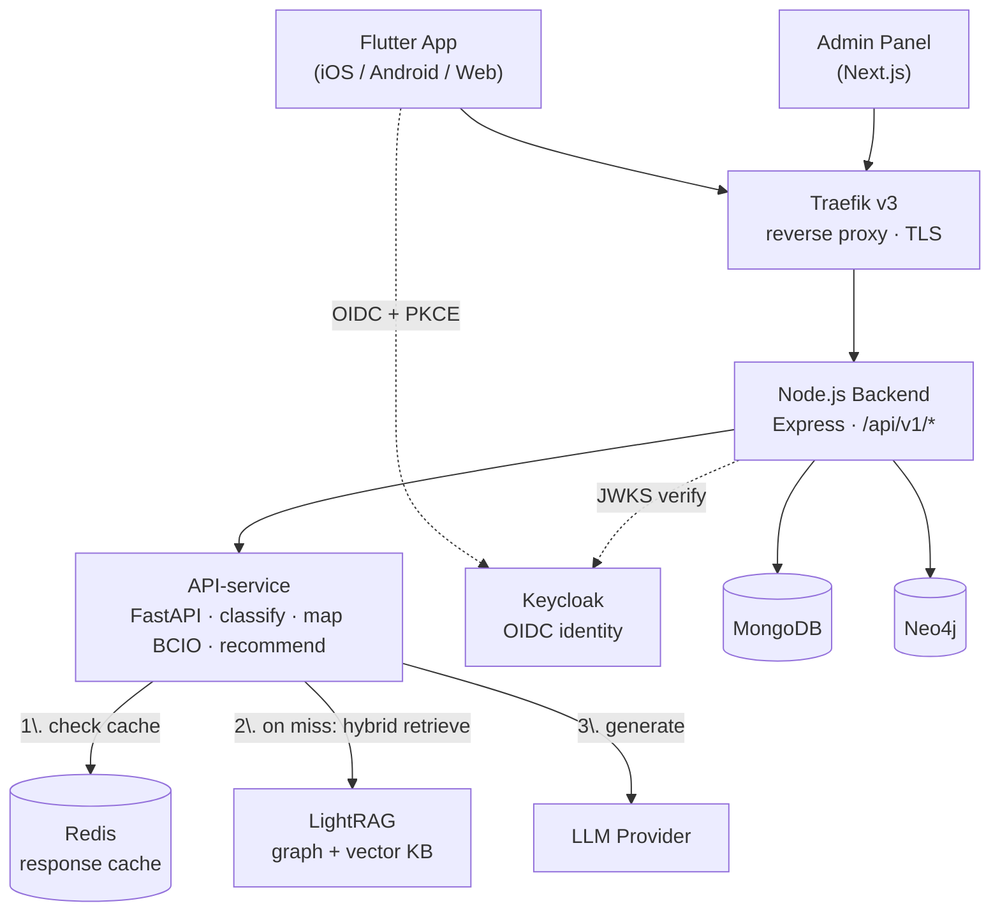

<div align="center">
  
  <h1>Health Habit Hub</h1>
  <p><strong>A research platform for studying health habits.</strong></p>

  <p>
    <a href="https://github.com/Bulgy404/health-habit-hub/actions/workflows/ci.yml">
      
    </a>
    
    
    
    
    
  </p>

  <p>
    <a href="https://habit.wiwi.tu-dresden.de"><strong>habit.wiwi.tu-dresden.de</strong></a>
    &nbsp;·&nbsp;
    <a href="DOCUMENTATION.md">Docs</a>
    &nbsp;·&nbsp;
    <a href="docs/diagrams/README.md">Diagrams</a>
    &nbsp;·&nbsp;
    <a href="DEPLOYMENT.md">Deployment</a>
    &nbsp;·&nbsp;
    <a href="CHANGELOG.md">Changelog</a>
  </p>
</div>

---

## Table of Contents

- [The Big Picture](#the-big-picture)
- [What it is](#what-it-is)
- [Roles](#roles)
- [Architecture](#architecture)
- [Use Cases](#use-cases)
- [Repository Layout](#repository-layout)
- [Quick Start](#quick-start)
  - [Common commands](#common-commands)
- [Tech Stack](#tech-stack)
- [Documentation](#documentation)
- [Contributing & Conventions](#contributing--conventions)

---

## The Big Picture

Health Habit Hub is fundamentally a **research data collection and analysis tool disguised as a personal health app**.

Participants donate their habits and health profile data. Researchers receive a structured, queryable graph of behaviours mapped to validated ontologies. The LLM layer turns that structured data into useful, evidence-grounded recommendations for the participant.

```
Better participation  →  Richer graph  →  Better recommendations  →  More participation
```

> Health Habit Hub combines mobile habit donation, questionnaire-based profiling, ontology-based semantic enrichment, graph-based research infrastructure, and RAG-supported recommendation generation into one integrated platform for studying and supporting health habit formation.

---

## What it is

Health Habit Hub is a research platform for studying health habits. Participants describe their personal health habits through a mobile app. The system stores, classifies, and organises those habits using a knowledge graph, then generates personalised recommendations using LLMs grounded in a researcher-curated knowledge base.

Researchers and admins manage studies, questionnaires, and the knowledge base through a web portal. The DFG study module adds a longitudinal protocol: implementation intentions, daily behaviour logging, and weekly SRHI check-ins.

---

## Roles

| Role | What they do |
|---|---|
| `user` | Mobile app participant — donates habits, fills questionnaires, receives recommendations, takes part in studies |
| `researcher` | Admin portal — studies, questionnaires, cue pools, analytics, exports, notification campaigns |
| `admin` | Admin portal — everything above plus participants, knowledge base, and platform settings |

The full actor/use-case mapping lives in the [use case overview](docs/diagrams/use-cases/use-case-overview.md).

---

## Architecture



Traefik sits in front of everything as the reverse proxy and TLS terminator; internally, services communicate by container name. Redis acts as the API-service's response cache — recommendation requests are answered from cache when possible, and only on a miss does the RAG pipeline (LightRAG retrieval + LLM generation) run. This is the condensed view — the **full system architecture diagram** (all containers including LibreTranslate, knowledge-mcp, backup service, monitoring, PostgreSQL, and FCM) is at [`docs/diagrams/architecture/system-architecture.mmd`](docs/diagrams/architecture/system-architecture.mmd), with a deep-dive in [`docs/architecture.md`](docs/architecture.md).

---

## Use Cases

The platform covers **34 use cases** across five actors. Each one is specified with its own sequence diagram.

| | |
|---|---|
| 📋 Structured catalogue (actors, endpoints, stores, traceability to code) | [`docs/diagrams/use-cases/use-case-overview.md`](docs/diagrams/use-cases/use-case-overview.md) |
| 🎭 UML use case diagram | [`docs/diagrams/use-cases/use-case-diagram.puml`](docs/diagrams/use-cases/use-case-diagram.puml) |
| 🔁 Sequence diagrams UC-01 … UC-34 (one per use case) | [`docs/diagrams/sequences/`](docs/diagrams/sequences/) |
| 🧩 Domain class diagram (MongoDB + Neo4j + domain classes) | [`docs/diagrams/classes/class-diagram.mmd`](docs/diagrams/classes/class-diagram.mmd) |

Highlights: the [habit donation pipeline](docs/diagrams/sequences/UC-03-donate-habit.mmd) (translate → LLM classify → BCIO map → Neo4j), the [RAG recommendation flow](docs/diagrams/sequences/UC-07-request-recommendations.mmd), and the [DFG study flows](docs/diagrams/sequences/UC-11-create-intention.mmd) (UC-09 – UC-13).

---

## Repository Layout

| Path | Contents |
|---|---|
| `mobile/` | Flutter app (iOS / Android / Web) — Riverpod, GoRouter, Firebase |
| `app/` | Node.js/Express backend — REST API `/api/v1/*`, routes → services → models |
| `admin/` | Next.js 14 admin portal — NextAuth + Keycloak |
| `API-service/` | Python FastAPI — LLM classification, BCIO mapping, RAG recommendations |
| `lightrag/` | LightRAG knowledge base (graph + vector) |
| `knowledge-mcp/` | MCP server exposing the KB to AI agents (SSE) |
| `keycloak/` | Realm config and init scripts |
| `mongo/`, `neo4j/` | Data store seeds and init data |
| `backup-service/` | Daily cron backups of all stores |
| `monitoring/` | Monitoring stack configuration |
| `scripts/` | Seeding, migration, and ops scripts |
| `docs/` | All documentation — see [Documentation](#documentation) |

---

## Quick Start

**Prerequisites:** Docker, Flutter SDK, Node.js 22, Python 3.11+

```bash
# 1. Clone and configure
git clone https://github.com/Bulgy404/health-habit-hub.git
cd health-habit-hub
cp .env.example .env          # fill in secrets — see .env.example for reference

# 2. Start all backend services
make dev

# 3. Seed MongoDB, Neo4j, and Keycloak with dev data
make seed

# 4. Run the Flutter app
make ios          # iPhone Simulator
# or open mobile/ in Android Studio for Android / web
```

Local service URLs after `make dev`:

| Service | URL |
|---|---|
| Flutter web | http://localhost |
| Backend API | http://localhost:3000 |
| API docs (Swagger UI) | http://localhost:3000/api/v1/docs |
| Admin UI | http://admin.localhost |
| Keycloak | http://localhost:8080 |
| Neo4j Browser | http://localhost:7474 |
| LightRAG (graph UI) | http://localhost:9621 |
| LibreTranslate | http://localhost:5001 |
| Python AI service | http://localhost:8001 |
| Prometheus | http://prometheus.localhost |
| Grafana | http://grafana.localhost (admin / `KEYCLOAK_ADMIN_PASSWORD`) |
| Traefik dashboard | http://localhost:8888 |

Step-by-step setup: [docs/guides/local-dev.md](docs/guides/local-dev.md) · new to the codebase? [docs/guides/developer-onboarding.md](docs/guides/developer-onboarding.md)

### Common commands

| Command | Description |
|---|---|
| `make dev` | Start all services |
| `make stop` | Stop all services |
| `make seed` | Seed databases |
| `make reset` | Wipe volumes, restart, re-seed |
| `make logs` | Tail backend logs |
| `make test` | Run all test suites |
| `make monitoring` | Start Prometheus + Grafana |

---

## Tech Stack

| Layer | Technology |
|---|---|
| Mobile / Web | Flutter 3, Dart, Riverpod, GoRouter, Firebase |
| Backend | Node.js 22, Express, ES modules |
| Admin | Next.js 14, NextAuth.js, TypeScript, Recharts |
| AI service | Python 3.11, FastAPI, OpenAI-compatible LLM API |
| Knowledge RAG | LightRAG 1.5 (graph + vector), FastMCP |
| Databases | MongoDB 7, Neo4j 5, PostgreSQL 16 (Keycloak) — *Fuseki/RDF retired, see [docs/migration.md](docs/migration.md)* |
| Cache / locks | Redis 7 |
| Identity | Keycloak 26 |
| Translation | LibreTranslate |
| Proxy / SSL | Traefik v3, Let's Encrypt |
| Infrastructure | Docker Compose, Portainer |

---

## Documentation

**Core**

| Document | Description |
|---|---|
| [DOCUMENTATION.md](DOCUMENTATION.md) | Architecture deep-dive, environment variables, testing, troubleshooting |
| [DEPLOYMENT.md](DEPLOYMENT.md) | Production deployment guide |
| [CHANGELOG.md](CHANGELOG.md) | Version history (Keep a Changelog / SemVer) |
| [SECURITY.md](SECURITY.md) | Security policy and vulnerability reporting |
| [AUDIT.md](AUDIT.md) | Security audit log |
| [docs/app-store/review-information.md](docs/app-store/review-information.md) | App Store review notes, demo access, privacy labels |

**Diagrams** (diagrams-as-code — Mermaid + PlantUML, see [docs/diagrams/README.md](docs/diagrams/README.md) for rendering/export)

| Diagram | Source |
|---|---|
| System architecture | [docs/diagrams/architecture/](docs/diagrams/architecture/) |
| Use cases (diagram + catalogue) | [docs/diagrams/use-cases/](docs/diagrams/use-cases/) |
| Sequence diagrams (UC-01 … UC-30) | [docs/diagrams/sequences/](docs/diagrams/sequences/) |
| Domain class diagram | [docs/diagrams/classes/](docs/diagrams/classes/) |

**Reference**

| Document | Description |
|---|---|
| [docs/architecture.md](docs/architecture.md) | Per-service reference, pipelines, auth flows, data storage rationale |
| [docs/data-model.md](docs/data-model.md) | Neo4j / Fuseki / MongoDB schemas with annotated queries |
| [docs/api/openapi.yaml](docs/api/openapi.yaml) | OpenAPI 3.1 spec ([Postman collection](docs/api/hhh-postman-collection.json)) |
| [docs/migration.md](docs/migration.md) | Neo4j schema migration plan |
| [docs/runbook.md](docs/runbook.md) | Operations runbook |

**Guides & manuals**

| Document | Audience |
|---|---|
| [docs/guides/local-dev.md](docs/guides/local-dev.md) | Developers — local setup |
| [docs/guides/developer-onboarding.md](docs/guides/developer-onboarding.md) | Developers — codebase tour |
| [docs/guides/flutter-architecture.md](docs/guides/flutter-architecture.md) | Developers — mobile app internals |
| [docs/guides/admin-guide.md](docs/guides/admin-guide.md) ([DE](docs/guides/admin-guide-de.md)) | Researchers / admins |
| [docs/guides/participant-guide.md](docs/guides/participant-guide.md) ([DE](docs/guides/participant-guide-de.md)) | Study participants |
| [docs/MANUAL-en.md](docs/MANUAL-en.md) ([DE](docs/MANUAL-de.md) · [JA](docs/MANUAL-ja.md)) | *Legacy* manual of the retired web experiment site (historical reference) |

---

## Contributing & Conventions

- **Branching & releases** — changes are documented in [CHANGELOG.md](CHANGELOG.md) following [Keep a Changelog](https://keepachangelog.com/en/1.1.0/) and [SemVer](https://semver.org).
- **Code style** — Prettier (`.prettierrc`) for JS/TS, JSDoc on exported functions; Google-style docstrings and concrete type hints in Python; `make test` must pass before merging.
- **Diagrams stay current** — when you change a flow, update the matching diagram in `docs/diagrams/` in the same PR; the [traceability table](docs/diagrams/use-cases/use-case-overview.md#traceability) maps use cases to code.
- **Security** — report vulnerabilities as described in [SECURITY.md](SECURITY.md); never commit secrets (`.env` is git-ignored, use `.env.example` as reference).

---

**Contact:** felix.reinsch@tu-dresden.de &nbsp;·&nbsp; **Issues:** https://github.com/Bulgy404/health-habit-hub/issues &nbsp;·&nbsp; Proprietary — research use at TU Dresden
