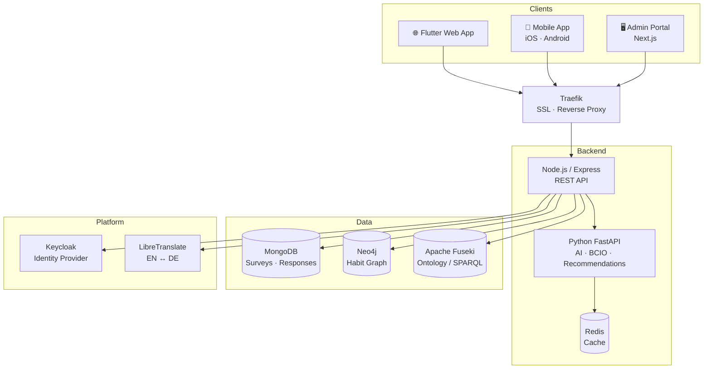

# Health Habit Hub


**Live**: https://habit.wiwi.tu-dresden.de

A research platform for collecting and analysing health habit data. Participants use a **web or mobile app** to donate habits and complete questionnaires; researchers manage studies and analyse results via a dedicated admin portal; an AI service classifies habits, maps them to BCIO behaviour change techniques, and generates personalised recommendations.

---

## Architecture



| Component | Location | Tech |
|---|---|---|
| Web / Mobile app | `mobile/` | Flutter 3 — iOS, Android, web |
| Backend API | `app/` | Node.js 22, Express, ES modules |
| Admin portal | `admin/` | Next.js 14, NextAuth, Keycloak |
| AI service | `API-service/` | Python, FastAPI, OpenAI-compatible LLM |
| Identity | — | Keycloak 26 |
| Proxy / SSL | — | Traefik v3, Let's Encrypt |

---

## Quick Start (local dev)

**Prerequisites**: Docker, Flutter SDK, Node.js 22, Python 3.11+.

```bash
# 1. Clone and configure
git clone https://github.com/Bulgy404/health-habit-hub.git
cd health-habit-hub
cp .env.example .env          # fill in secrets (see Env Vars below)

# 2. Start all backend services
make dev

# 3. Seed MongoDB, Neo4j, and Keycloak with dev data
make seed

# 4a. Open the Flutter web app in a browser
make web

# 4b. Or run the native iOS app
make ios
```

Local service URLs after `make dev`:

| Service | URL |
|---|---|
| Flutter web app | http://localhost:4000 |
| Backend API | http://localhost:3000 |
| Admin portal | http://admin.localhost |
| Keycloak | http://localhost:8080 |
| Neo4j Browser | http://localhost:7474 |
| Fuseki | http://localhost:3030 |
| LibreTranslate | http://localhost:5001 |
| Python AI service | http://localhost:8001 |
| Traefik dashboard | http://localhost:8888 |

---

## Common `make` Commands

| Command | Description |
|---|---|
| `make dev` | Start all local services via Docker Compose |
| `make stop` | Stop all local services |
| `make seed` | Seed MongoDB, Neo4j, and Keycloak with dev data |
| `make logs` | Tail backend app logs |
| `make logs-all` | Tail all service logs |
| `make web` | Run Flutter web app in browser |
| `make ios` | Run Flutter app on iPhone Simulator |
| `make reset` | Wipe volumes, restart, and re-seed |
| `make test` | Run all test suites (no Docker required) |

---

## Testing

```bash
make test          # run all suites
make test-backend  # Node.js: lint + unit + integration tests
make test-flutter  # Flutter: analyze + widget/unit tests
make test-python   # Python AI service: pytest
make test-admin    # Admin portal: typecheck + Jest/RTL tests
```

---

## Key Environment Variables

Copy `.env.example` for local dev; `stack.env` for production. Required overrides:

| Variable | Description |
|---|---|
| `NEO4J_PASSWORD` | Neo4j database password |
| `MONGO_PASSWORD` | MongoDB root password |
| `KEYCLOAK_ADMIN_PASSWORD` | Keycloak admin console password |
| `KC_DB_PASSWORD` | Keycloak's PostgreSQL password |
| `KEYCLOAK_ADMIN_CLIENT_SECRET` | Secret for the `hhh-backend` Keycloak client |
| `API_SERVICE_SECRET` | Shared secret between Node.js backend and Python AI service |
| `LLM_API_KEY` | API key for the LLM provider |
| `LLM_API_BASE` | LLM base URL (defaults to OpenAI; e.g. `https://llm.scads.ai/v1`) |
| `LLM_MODEL` | Model name or alias (e.g. `gpt-4o-mini`) |
| `REDIS_URL` | Redis connection URL (default `redis://localhost:6379`) |
| `RECAPTCHA_SITEKEY` / `RECAPTCHA_SECRETKEY` | Google reCAPTCHA keys |
| `MAIL_USER` / `MAIL_PASS` | Mailjet API credentials |

---

## Production Deployment

See [DOCUMENTATION.md](DOCUMENTATION.md) for the full guide.

1. Point DNS to the server IP and open ports 80 and 443.
2. Set all secrets in Portainer's environment variables.
3. Deploy via Portainer using the production Docker Compose file.
4. Traefik obtains a Let's Encrypt certificate automatically.

Production routes (all behind Traefik HTTPS):

| Path | Service |
|---|---|
| `/` | Flutter web app |
| `/api/v1/` | Node.js backend |
| `/admin` | Next.js admin portal |
| `/fuseki` | Apache Fuseki SPARQL |

---

## Tech Stack

| Layer | Technology |
|---|---|
| Web / Mobile | Flutter 3, Dart, Keycloak PKCE |
| Backend | Node.js 22, Express, ES modules |
| Admin | Next.js 14, NextAuth.js |
| AI service | Python, FastAPI, OpenAI-compatible API |
| Databases | MongoDB 7, Neo4j 5, Apache Jena Fuseki |
| Cache | Redis 7 |
| Identity | Keycloak 26 |
| Translation | LibreTranslate |
| Proxy / SSL | Traefik v3, Let's Encrypt |
| Infrastructure | Docker Compose, Portainer |

---

## Documentation

- [DOCUMENTATION.md](DOCUMENTATION.md) — architecture deep-dive, deployment, backup, troubleshooting
- [docs/guides/local-dev.md](docs/guides/local-dev.md) — step-by-step local dev setup
- [DEPLOYMENT.md](DEPLOYMENT.md) — production deployment details

---

## Support

**Issues**: https://github.com/Bulgy404/health-habit-hub/issues  
**Contact**: felix.reinsch@tu-dresden.de

---

## License

Proprietary — research software, TU Dresden.
