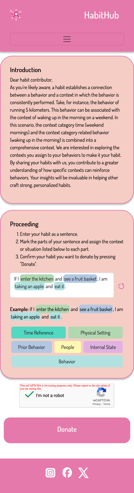
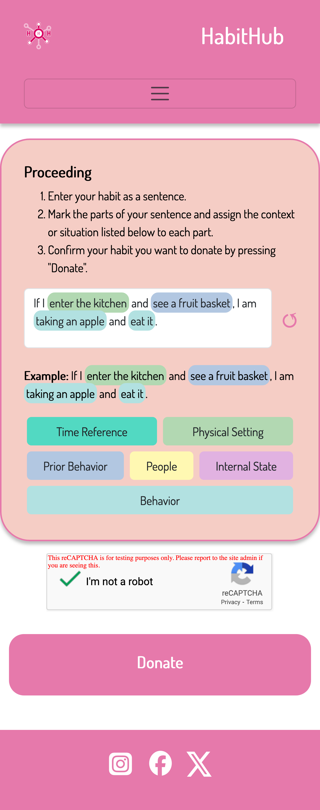
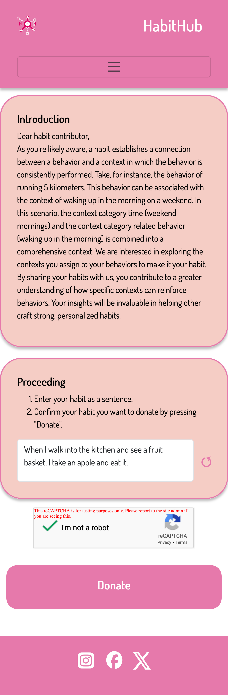
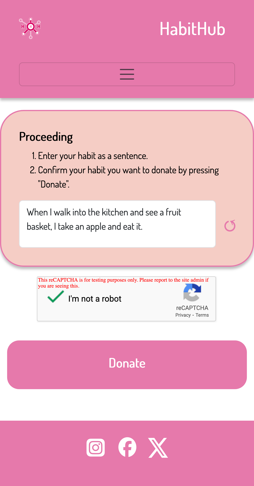
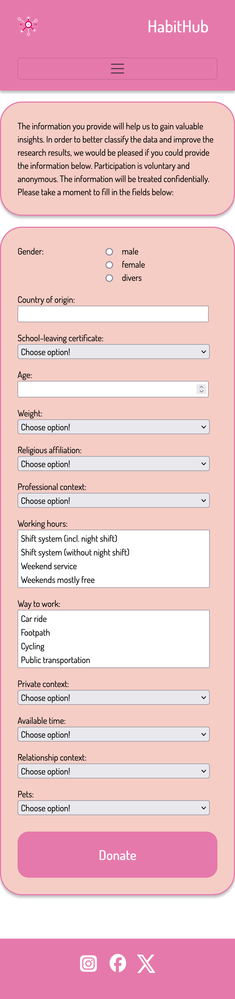
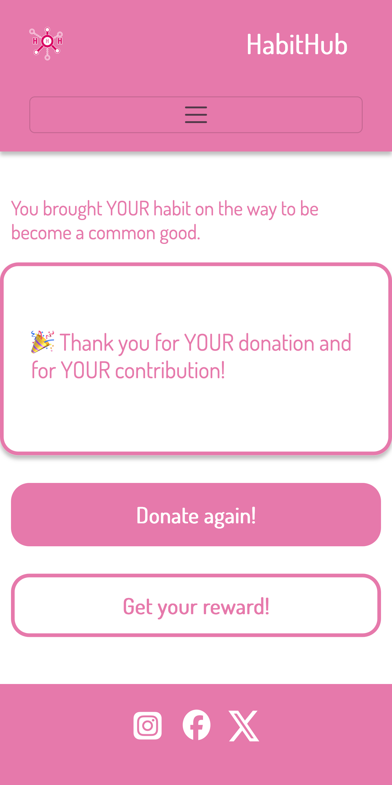

> **⚠️ Veraltetes Dokument.** Dieses Handbuch beschreibt die eingestellte browserbasierte Experiment-Website (G1–G4-Webseiten, reCAPTCHA), die im Juni 2026 entfernt wurde. Aktuelle Teilnehmende nutzen die Flutter-App — siehe [guides/participant-guide-de.md](guides/participant-guide-de.md). Zu historischen Referenzzwecken des ursprünglichen Studiendesigns aufbewahrt.

<!-- MASCHINELL ÜBERSETZT aus der englischen Quelle — vor Veröffentlichung bitte durch Muttersprachler prüfen -->
# Benutzerhandbuch

## Einführung

### Zweck der Anwendung

Vielen Dank für dein Interesse am Health-Habit-Hub (HHH) und dafür, dass du dich für seine Nutzung entschieden hast! Der Health-Habit-Hub wurde entwickelt, um alltägliche Gewohnheiten von Menschen unterschiedlicher Herkunft und Kultur zu erfassen. Eine Gewohnheit verbindet typischerweise ein Verhalten (z. B. Zähneputzen) mit einem Kontext (z. B. nach dem Aufwachen am Morgen) und wird oft unbewusst ausgeführt, wobei nur minimaler kognitiver Aufwand erforderlich ist.

Die Teilnahme an der Erhebung ist vollständig freiwillig und anonym, da es sich um eine Datenspende zur Unterstützung der Forschung handelt. Die gesammelten Daten sollen eine umfassende Datenbasis zu Gewohnheitselementen aufbauen, etwa zu Verhaltensweisen und den damit verbundenen Kontexten. Diese Datenbasis soll die Forschung fördern, zum Beispiel bei der Identifikation optimaler Kontexte zur Etablierung förderlicher Gewohnheiten, bei der Stärkung von Gewohnheiten oder bei der Untersuchung kultureller Unterschiede in gewohnheitsmäßigen Verhaltensweisen. Mit einem besseren Verständnis wirksamer Kontexte für Gewohnheiten wird es leichter, positive Gewohnheiten zu definieren und zu fördern und damit ihre Festigung zu unterstützen.

Mit deiner Datenspende trägst du dazu bei, die Gewohnheiten unserer Gesellschaft besser zu verstehen und Einfluss auf die Entwicklung förderlicher Gewohnheiten zu nehmen.

Der Health-Habit-Hub wird in internationaler Zusammenarbeit von renommierten japanischen, kanadischen und deutschen Forschungseinrichtungen entwickelt, bereitgestellt und beforscht.

### Anwendung des Benutzerhandbuchs

Das Benutzerhandbuch hilft dir dabei, den Health-Habit-Hub zu bedienen und besser zu verstehen. Dazu werden die wesentlichen Bereiche des Health-Habit-Hub vorgestellt. Die Vorstellung folgt den wesentlichen Seiten des Health-Habit-Hub. Bildschirmfotos des Health-Habit-Hub oder von Bereichen daraus sowie zugehörige Erklärungen helfen dir beim Verständnis der App.

## Erste Schritte

Um den Health-Habit-Hub nutzen zu können, benötigst du lediglich einen gängigen Browser, z. B. Firefox oder Chrome, sowie eine funktionierende Internetverbindung, z. B. per WLAN oder mobile Daten. Nutze den Health-Habit-Hub am besten mit einem Tablet oder Smartphone. Eine Installation ist nicht erforderlich.

Wenn dir die Idee hinter dem Health-Habit-Hub gefällt und du das Forschungsvorhaben über längere Zeit unterstützen möchtest, erstelle dir ein Lesezeichen auf deinem Startbildschirm für einen schnellen Zugriff.

## Spenden einer Gewohnheit

### Hintergrundinformationen

Da das Verständnis davon, was genau eine Gewohnheit ist, in unterschiedlichen sozialen und kulturellen Umgebungen variieren kann, wurde eine an diese Situation angepasste Methode zur Erhebung von Gewohnheiten entwickelt und im Health-Habit-Hub umgesetzt. Die Methode beruht auf der Annahme, dass Aufklärung und Hinweise zur Definition des Begriffs Gewohnheit die Qualität der Datenspende beeinflussen. Nach dieser Annahme wirken sich folgende Faktoren auf die Erhebung aus:

- **Allgemeine Instruktionen**: Die allgemeinen Instruktionen umfassen eine Begrüßung und eine Definition des Begriffs Gewohnheit. Die Bestandteile einer Gewohnheit werden erläutert und mindestens ein konkretes Beispiel für eine Gewohnheit gegeben. Der Beitrag der Datenspende zur weiterführenden Forschung wird erklärt.
- **Aufgabenbeschreibung**: Die Aufgabenbeschreibung enthält eine genaue Beschreibung der Schrittfolge von der Eingabe der Gewohnheit bis zum Absenden der Datenspende.

Durch das Vorgeben oder Weglassen dieser Faktoren in Kombination ergeben sich verschiedene Möglichkeiten zur Erhebung einer Gewohnheit. Diese Kombinationen werden in vier Experimentgruppen unterteilt und durch den Health-Habit-Hub umgesetzt. Die Experimentgruppen setzen sich wie folgt zusammen:

**Experimentgruppe 1** – Den HHH-Nutzenden wird eine umfangreiche Anleitung gegeben, indem die allgemeinen Instruktionen und die Aufgabenbeschreibung angezeigt werden. Die Erhebung einer Gewohnheit erfolgt nach einem vorgegebenen Schema.

**Experimentgruppe 2** – Den HHH-Nutzenden wird eine teilweise Anleitung gegeben, indem die Aufgabenbeschreibung angezeigt wird. Die Gewohnheit wird in eigenen Worten ohne weitere Vorgaben erfasst.

**Experimentgruppe 3** – Den HHH-Nutzenden wird eine teilweise Anleitung gegeben, indem die allgemeinen Instruktionen angezeigt werden. Die Erhebung einer Gewohnheit erfolgt nach einem vorgegebenen Schema.

**Experimentgruppe 4** – Den HHH-Nutzenden wird keine Anleitung gegeben. Die Gewohnheit wird in eigenen Worten ohne weitere Vorgaben erfasst.

### Schritt-für-Schritt-Anleitung

#### Schritt 1: Aufrufen des Health-Habit-Hub

Der Health-Habit-Hub wird durch Aufrufen des Links im Browser geöffnet. Wurde ein Lesezeichen für den Health-Habit-Hub auf dem Startbildschirm erstellt, lässt er sich darüber ebenso öffnen.

#### Schritt 2: Spenden einer Gewohnheit

Beim Öffnen des Health-Habit-Hub erfolgt im Hintergrund die Bestimmung und Auswahl einer der vier möglichen Experimentgruppen (siehe Abschnitt „Spenden einer Gewohnheit"). Wurde der Health-Habit-Hub in einer neuen Browser-Sitzung geöffnet, wird eine der vier Experimentgruppen zufällig bestimmt und ausgewählt. Wurde jedoch zuvor bereits eine Gewohnheit über eine bestehende Browser-Sitzung gespendet, wird diese Experimentgruppe beibehalten.

Die Auswahl der Experimentgruppe hat Einfluss darauf, welche Inhalte im Health-Habit-Hub zu sehen sind und in welchem Umfang eine Anleitung zur Spende einer Gewohnheit erfolgt. Beim Aufrufen des Health-Habit-Hub wird der Inhalt der Startseite daher durch die Experimentgruppe bestimmt (siehe Abschnitt „Verhalten der Startseite").

**Experimentgruppe 1**

  

    
  

  

    Die Seite ist in einen Kopf-, Haupt- und Fußbereich aufgeteilt. Im Kopfbereich befinden sich das Navigationsmenü und Möglichkeiten zur Spracheinstellung. Im Fußbereich befinden sich Verlinkungen auf soziale Medien, die im Zusammenhang mit dem Health-Habit-Hub stehen.
      
    Der Hauptbereich der Seite ist in drei Unterbereiche aufgeteilt – den <em>oberen Bereich</em> mit den allgemeinen Instruktionen, den <em>mittleren Bereich</em> mit der Aufgabenbeschreibung und der Möglichkeit zur Erfassung der Gewohnheit sowie den <em>unteren Bereich</em> zum Absenden der Spende. Die Möglichkeiten zur Erfassung der Gewohnheiten im mittleren Bereich unterteilen sich in einen Bereich zur <em>Eingabe der Gewohnheit</em> und einen Bereich zur <em>Markierung von Kontext und Verhalten</em>. Nachdem eine Gewohnheit eingegeben wurde, können im Eingabefeld einzelne Wörter oder zusammenhängende Wortgruppen ausgewählt werden, die einen Kontext oder das Verhalten darstellen. Danach kann die zuvor getroffene Auswahl als Kontext oder Verhalten markiert werden, indem die jeweilige Schaltfläche unterhalb des Eingabefeldes betätigt wird. Die vorgenommenen Markierungen lassen sich durch Betätigung der Schaltfläche ↺ rechts neben dem Eingabefeld vollständig zurücksetzen.
      
    Bei der Bestätigung (reCAPTCHA), dass der HHH-Nutzende ein Mensch und kein Roboter ist, handelt es sich um eine Sicherheitsvorkehrung.
      
    Wurde die Gewohnheit im Eingabefeld eingegeben und markiert, kann sie durch Betätigung der Schaltfläche im unteren Bereich gespendet werden.
  

**Experimentgruppe 2**

  

    
  

  

    Die Seite ist in einen Kopf-, Haupt- und Fußbereich aufgeteilt. Im Kopfbereich befinden sich das Navigationsmenü und Möglichkeiten zur Spracheinstellung. Im Fußbereich befinden sich Verlinkungen auf soziale Medien, die im Zusammenhang mit dem Health-Habit-Hub stehen.
      
    Der Hauptbereich der Seite ist in zwei Unterbereiche aufgeteilt – den <em>oberen Bereich</em> mit der Aufgabenbeschreibung und der Möglichkeit zur Erfassung der Gewohnheit sowie den <em>unteren Bereich</em> zum Absenden der Spende. Die Möglichkeiten zur Erfassung der Gewohnheiten im mittleren Bereich unterteilen sich in einen Bereich zur <em>Eingabe der Gewohnheit</em> und einen Bereich zur <em>Markierung von Kontext und Verhalten</em>. Nachdem eine Gewohnheit eingegeben wurde, können im Eingabefeld einzelne Wörter oder zusammenhängende Wortgruppen ausgewählt werden, die einen Kontext oder das Verhalten darstellen. Danach kann die zuvor getroffene Auswahl als Kontext oder Verhalten markiert werden, indem die jeweilige Schaltfläche unterhalb des Eingabefeldes betätigt wird. Die vorgenommenen Markierungen lassen sich durch Betätigung der Schaltfläche ↺ rechts neben dem Eingabefeld vollständig zurücksetzen.
      
    Bei der Bestätigung (reCAPTCHA), dass der HHH-Nutzende ein Mensch und kein Roboter ist, handelt es sich um eine Sicherheitsvorkehrung.
      
    Wurde die Gewohnheit im Eingabefeld eingegeben und markiert, kann sie durch Betätigung der Schaltfläche im unteren Bereich gespendet werden.
  

**Experimentgruppe 3**

  

    
  

  

    Die Seite ist in einen Kopf-, Haupt- und Fußbereich aufgeteilt. Im Kopfbereich befinden sich das Navigationsmenü und Möglichkeiten zur Spracheinstellung. Im Fußbereich befinden sich Verlinkungen auf soziale Medien, die im Zusammenhang mit dem Health-Habit-Hub stehen.
      
    Der Hauptbereich der Seite ist in drei Unterbereiche aufgeteilt – den <em>oberen Bereich</em> mit den allgemeinen Instruktionen, den <em>mittleren Bereich</em> mit der Aufgabenbeschreibung und der Möglichkeit zur Erfassung der Gewohnheit sowie den <em>unteren Bereich</em> zum Absenden der Spende. Die Gewohnheit wird als einzelner Satz in das Eingabefeld eingegeben.
      
    Bei der Bestätigung (reCAPTCHA), dass der HHH-Nutzende ein Mensch und kein Roboter ist, handelt es sich um eine Sicherheitsvorkehrung.
      
    Wurde die Gewohnheit im Eingabefeld eingegeben, kann sie durch Betätigung der Schaltfläche im unteren Bereich gespendet werden.
  

**Experimentgruppe 4**

  

    
  

  

    Die Seite ist in einen Kopf-, Haupt- und Fußbereich aufgeteilt. Im Kopfbereich befinden sich das Navigationsmenü und Möglichkeiten zur Spracheinstellung. Im Fußbereich befinden sich Verlinkungen auf soziale Medien, die im Zusammenhang mit dem Health-Habit-Hub stehen.
      
    Der Hauptbereich der Seite ist in zwei Unterbereiche aufgeteilt – den <em>oberen Bereich</em> mit der Aufgabenbeschreibung und der Möglichkeit zur Erfassung der Gewohnheit sowie den <em>unteren Bereich</em> zum Absenden der Spende. Die Gewohnheit wird als einzelner Satz in das Eingabefeld eingegeben.
      
    Bei der Bestätigung (reCAPTCHA), dass der HHH-Nutzende ein Mensch und kein Roboter ist, handelt es sich um eine Sicherheitsvorkehrung.
      
    Wurde die Gewohnheit im Eingabefeld eingegeben, kann sie durch Betätigung der Schaltfläche im unteren Bereich gespendet werden.
  

#### Schritt 3: Weitere freiwillige Angaben

Nachdem die Gewohnheit erfasst wurde, hat der HHH-Nutzende die Möglichkeit, weitere freiwillige Angaben zu machen, bevor die Gewohnheit abschließend gespendet wird.

Bei den abgefragten freiwilligen Angaben handelt es sich um folgende demografische Informationen zur HHH-nutzenden Person:

- Geschlecht
- Alter
- Körpergewicht
- Religionszugehörigkeit
- Beziehungsstatus
- Kinder und Haustiere
- Herkunftsland
- Freizeitgestaltung
- Bildungshintergrund
- Beruf und Berufsalltag

Durch die zusätzliche Erfassung der freiwilligen Angaben kann eine gespendete Gewohnheit besser eingeordnet werden, was ihren Wert für die Forschung weiter erhöht.

Beim Spenden mehrerer Gewohnheiten hintereinander oder innerhalb einer Browser-Sitzung werden die weiteren freiwilligen Angaben nicht mehrmals abgefragt, sondern nur bei der ersten Datenspende.

  

    
  

  

    Die Seite ist in einen Kopf-, Haupt- und Fußbereich aufgeteilt. Im Kopfbereich befinden sich das Navigationsmenü und Möglichkeiten zur Spracheinstellung. Im Fußbereich befinden sich Verlinkungen auf soziale Medien, die im Zusammenhang mit dem Health-Habit-Hub stehen.
      
    Der Hauptbereich der Seite ist in zwei Unterbereiche aufgeteilt – den <em>oberen Bereich</em> mit einer kurzen Erläuterung zu den zusätzlichen freiwilligen Angaben sowie den <em>unteren Bereich</em> zur Eingabe der freiwilligen Angaben und zum abschließenden Absenden der Spende.
  

#### Schritt 4: Bedankung

  

    
  

  

    Die Seite ist in einen Kopf-, Haupt- und Fußbereich aufgeteilt. Im Kopfbereich befinden sich das Navigationsmenü und Möglichkeiten zur Spracheinstellung. Im Fußbereich befinden sich Verlinkungen auf soziale Medien, die im Zusammenhang mit dem Health-Habit-Hub stehen.
      
    Der Hauptbereich der Seite ist in zwei Unterbereiche aufgeteilt – den <em>oberen Bereich</em> mit einer Bedankung sowie den <em>unteren Bereich</em>, über den eine weitere Gewohnheit gespendet oder eine Belohnung abgeholt werden kann. Bei Auswahl der erneuten Spende einer Gewohnheit wird die Startseite des Health-Habit-Hub aufgerufen.
  

#### Schritt 5: Belohnung und Visualisierung

Nach dem Absenden einer Gewohnheitsspende präsentiert die App eine Visualisierung, die die eigene Datenspende mit der Gesamtheit aller Datenspenden in Beziehung setzt. So bekommst du ein Gefühl dafür, wie dein Beitrag in das größere Forschungsvorhaben eingebettet ist.

## Einstellungen

### Sprache

Die Health Habit Hub App unterstützt **Englisch**, **Deutsch**, **Französisch**, **Japanisch** und **Niederländisch**. Die Anzeigesprache kann jederzeit über den Bildschirm **Einstellungen** geändert werden, der über die untere Navigationsleiste (Zahnrad-Symbol) erreichbar ist.

**So änderst du die Sprache:**

1. Tippe auf das Symbol **Einstellungen** in der unteren Navigationsleiste.
2. Tippe auf das Dropdown-Menü **Sprache**.
3. Wähle **English** oder **Deutsch**.
4. Die App wechselt sofort zur gewählten Sprache. Am unteren Bildschirmrand erscheint eine Bestätigungsmeldung.

Die gewählte Sprache wird in deinem Konto gespeichert und beim nächsten Öffnen der App automatisch wiederhergestellt. Sie bestimmt außerdem die Sprache des Gewohnheits-Erhebungsformulars im Bereich Spenden.

### Rechtliches

Der Einstellungen-Bildschirm bietet auch Zugang zum Bildschirm **Rechtliches**. Tippe auf **Rechtliches** im Einstellungen-Bildschirm, um die aktuellen Nutzungsbedingungen, die Datenschutzerklärung und das Impressum einzusehen. Durch die weitere Nutzung der App stimmst du den im Bildschirm Rechtliches angezeigten Bedingungen zu.

## Datenschutz und Informationssicherheit

### Freiwillige Teilnahme und pseudonyme Daten

Die Teilnahme am Health-Habit-Hub ist vollständig freiwillig. Du kannst die Teilnahme jederzeit beenden, indem du die App einfach nicht mehr verwendest. Eine formelle Abmeldung oder ein Löschantrag ist nicht erforderlich, da von vornherein keine personenbezogenen Daten erhoben werden.

Alle Gewohnheitsspenden werden pseudonym gespeichert. Jede Spende ist mit einer Teilnehmer-ID verknüpft, nicht mit deinem Namen oder anderen direkt identifizierenden Informationen. Es ist daher nicht möglich, eine bestimmte Spende einer einzelnen Person zuzuordnen.

### Zugangsdaten und Anmeldung

Zur Anmeldung in der App verwendest du einen **Benutzernamen** und ein **Einmaltoken**, das auf der Token-Karte aufgedruckt ist, die du von deiner Studienkoordination erhalten hast. Die Token-Karte enthält außerdem einen **QR-Code**, den du für eine schnelle Anmeldung scannen kannst. Für die Erstellung oder Nutzung eines Kontos sind keine E-Mail-Adresse, Telefonnummer oder sonstige persönliche Kontaktinformationen erforderlich.

### Datenspeicherung und -übertragung

Alle vom Health-Habit-Hub erfassten Daten werden auf Servern der TU Dresden gespeichert. Die gesamte Kommunikation zwischen der App und den Servern ist per **HTTPS** verschlüsselt, sodass deine Daten bei der Übertragung geschützt sind.

### Zusammenfassung

- Die Teilnahme ist freiwillig – du kannst jederzeit aufhören, indem du die App einfach nicht mehr nutzt.
- Es werden keine personenbezogenen Daten benötigt.
- Die Anmeldung erfolgt mit Benutzername und Einmaltoken (QR-Code auf einer Karte) – keine E-Mail-Adresse erforderlich.
- Gewohnheitsspenden werden pseudonym gespeichert und mit einer Teilnehmer-ID statt einem Namen verknüpft.
- Die Daten werden auf Servern der TU Dresden gespeichert.
- Die gesamte Kommunikation ist per HTTPS verschlüsselt.

## Hilfe und Support

### Fragen zur Studie

Bei Fragen zur Studie selbst – etwa zu deren Zweck, zur Verwendung deiner Daten oder zum weiteren Vorgehen nach Abschluss der Studie – wende dich bitte an deine **Studienkoordination**. Das ist die Person, die dir die Token-Karte ausgehändigt und dich in die App eingeführt hat. Deine Koordination ist deine erste Anlaufstelle für alle studienbezogenen Fragen.

### Technische Probleme

**Die App kann keine Verbindung zum Server herstellen**
Überprüfe, ob dein Gerät über eine funktionierende Internetverbindung verfügt, entweder per WLAN oder über mobile Daten. Wenn die Verbindung zu funktionieren scheint, die App aber trotzdem keine Verbindung herstellen kann, versuche, die App zu schließen und neu zu öffnen. Besteht das Problem weiterhin, informiere bitte deine Studienkoordination.

**Die QR-Code-Anmeldung funktioniert nicht**
Wenn das Scannen des QR-Codes auf deiner Token-Karte fehlschlägt, kannst du dich manuell anmelden, indem du deinen Benutzernamen und das auf der Karte aufgedruckte Token (Passwort) direkt in die Anmeldefelder auf dem Anmeldebildschirm eingibst.

**Andere technische Probleme**
Die App verfügt nicht über einen integrierten Hilfe-Chat. Wenn du ein technisches Problem erlebst, das durch die oben genannten Schritte nicht behoben wird, beschreibe das Problem deiner Studienkoordination, damit es an das technische Team weitergeleitet werden kann.

## Glossar

### Erläuterung der Kontexte

#### Zeit

**Markierung**: Zeitbezug

**Beschreibung**: Die Zeit ist eine der wichtigsten Kontextvariablen, die die Bildung von Gewohnheiten beeinflusst. Sie dient als konsistenter und vorhersehbarer Anker, der es leichter macht, bestimmte Verhaltensweisen mit bestimmten Momenten oder Zeiträumen zu verknüpfen. Zeitliche Anhaltspunkte schaffen einen natürlichen Rhythmus für die Wiederholung von Gewohnheiten und verringern die Abhängigkeit von bewussten Entscheidungen.

**Beispiel**: „Um 6:00 Uhr morgens gehe ich joggen, bevor ich meinen Arbeitstag beginne.", wenn die Uhrzeit explizit angegeben ist, oder „Morgens gehe ich schnell joggen", wenn die Uhrzeit nicht explizit angegeben ist. Hier fungiert die Tageszeit als Auslöser, der sicherstellt, dass die Gewohnheit regelmäßig ausgeführt wird und sich nahtlos in den Tagesablauf der Person einfügt.

#### Physische Umgebung

**Markierung**: Physische Umgebung

**Beschreibung**: Die physische Umgebung bezieht sich auf den spezifischen Ort, an dem eine Gewohnheit stattfindet. Die Umgebung spielt eine entscheidende Rolle bei der Verstärkung von Verhaltensweisen, da sie visuelle oder sensorische Anhaltspunkte liefert, die gewohnheitsmäßige Handlungen auslösen. Eine gut gestaltete physische Umgebung kann Gewohnheiten stärken, indem sie Barrieren und Ablenkungen minimiert.

**Beispiel**: „In der Küche trinke ich jedes Mal ein Glas Wasser, wenn ich meine Wasserflasche auf der Arbeitsfläche sehe." Die Küche und die sichtbare Wasserflasche wirken zusammen als räumliche und visuelle Auslöser für das Verhalten.

### Sozialer Kontext

**Markierung**: Menschen

**Beschreibung**: Der soziale Kontext umfasst die Menschen oder das soziale Umfeld, das während einer gewohnheitsmäßigen Handlung anwesend ist. Interaktionen mit anderen können Gewohnheiten erheblich beeinflussen, indem sie beispielsweise Verantwortlichkeit fördern, Zusammenarbeit begünstigen oder Verhalten vorleben. Soziale Anhaltspunkte können Gewohnheiten je nach Dynamik positiv oder negativ verstärken.

**Beispiel**: „Immer wenn meine Kolleginnen und Kollegen eine Kaffeepause machen, schließe ich mich ihnen für ein kurzes Gespräch an." Die Anwesenheit anderer schafft ein soziales Signal, das die Gewohnheit verstärkt, an der Gruppenaktivität teilzunehmen.

### Vorheriges Verhalten

**Markierung**: Vorheriges Verhalten

**Beschreibung**: Das vorherige Verhalten verdeutlicht die sequenzielle oder verkettete Natur vieler Gewohnheiten. Oft führt eine Handlung auf natürliche Weise zur nächsten und erzeugt so einen Fluss miteinander verbundener Aktivitäten. Dieser Verkettungseffekt reduziert den kognitiven Aufwand und stärkt Routinen im Laufe der Zeit.

**Beispiel**: „Nachdem ich mir die Zähne geputzt habe, verwende ich jeden Abend Zahnseide." Der Akt des Zähneputzens dient als natürlicher Vorläufer und Auslöser für die Verwendung von Zahnseide und erleichtert so die Beibehaltung des Verhaltens als Teil einer Routine.

### Interner Zustand

**Markierung**: Interner Zustand

**Beschreibung**: Der interne Zustand bezieht sich auf die emotionalen oder physiologischen Bedingungen, die gewohnheitsmäßige Verhaltensweisen auslösen. Gefühle wie Stress, Ruhe, Hunger oder Müdigkeit können bestimmte Handlungen anstoßen, da Menschen versuchen, ihre inneren Erfahrungen zu regulieren oder darauf zu reagieren.

**Beispiel**: „Wenn ich mich gestresst fühle, praktiziere ich 10 Minuten lang Achtsamkeitsmeditation, um wieder zur Ruhe zu kommen und mich zu fokussieren." Der emotionale Zustand des Stresses dient als Auslöser für eine beruhigende und erholsame Gewohnheit.

## Rechtliche Informationen

### Bildschirm „Rechtliches" in der App

Die App enthält einen eigenen Bildschirm **Rechtliches**, der über **Einstellungen → Rechtliches** erreichbar ist. Dieser Bildschirm zeigt die aktuellen Versionen der folgenden Dokumente an:

- **Nutzungsbedingungen** – die Bedingungen, unter denen du den Health-Habit-Hub nutzen darfst.
- **Datenschutzerklärung** – eine Beschreibung, wie mit den Daten der Teilnehmenden umgegangen wird.
- **Impressum** – die gesetzlich vorgeschriebenen Angaben zum Anbieter.

Alle rechtlichen Dokumente werden von der TU Dresden bereitgestellt. Durch die Nutzung der App stimmst du den im Bildschirm Rechtliches angezeigten Bedingungen zu. Werden die Dokumente aktualisiert, sind die neuen Versionen beim nächsten Öffnen des Bildschirms Rechtliches verfügbar.

### Aufrufen der rechtlichen Dokumente

1. Tippe auf das Symbol **Einstellungen** in der unteren Navigationsleiste.
2. Tippe auf **Rechtliches**.
3. Der Bildschirm Rechtliches öffnet sich und zeigt die aktuellen Nutzungsbedingungen, die Datenschutzerklärung und das Impressum an.
