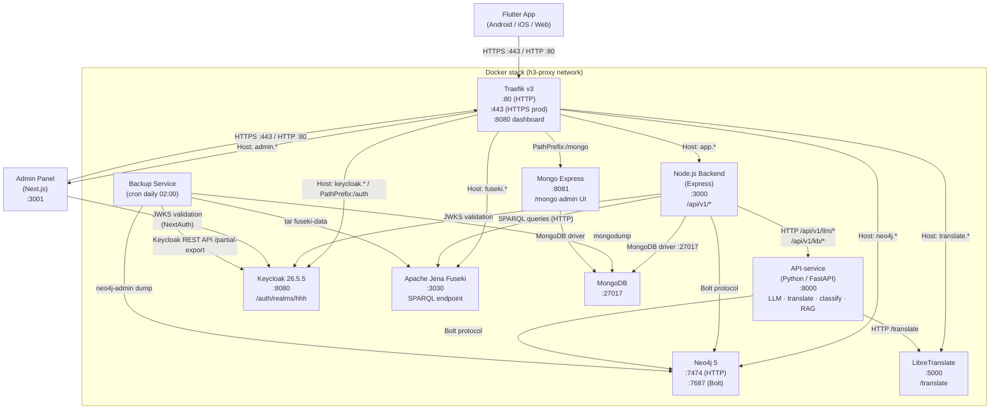
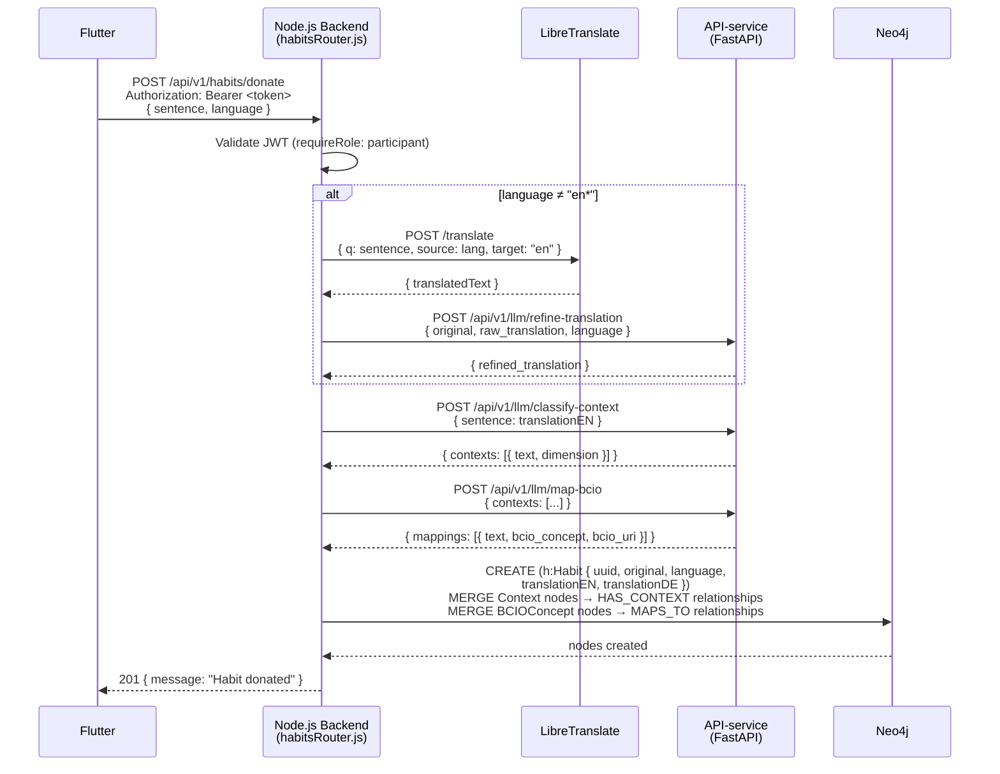
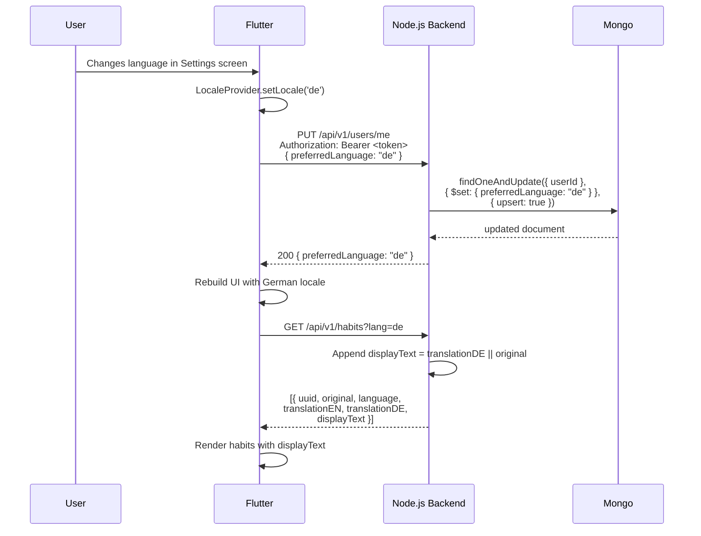
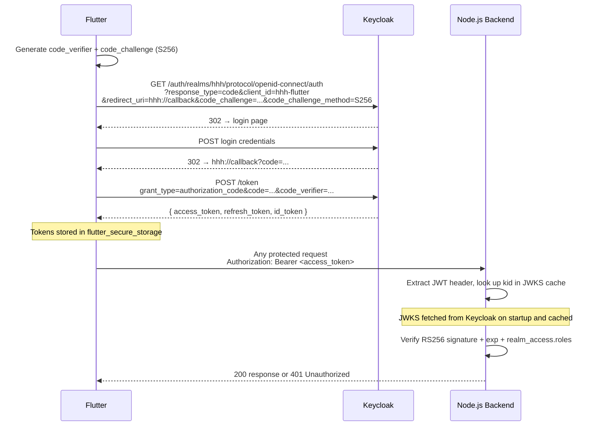

# Health Habit Hub — System Architecture

## Overview

Health Habit Hub (HHH) is a research platform for collecting, annotating, and recommending behavioural habits. It consists of eleven Docker services orchestrated via `docker-compose`, a Flutter mobile/web app, a Next.js admin panel, and a Python-based recommender/enrichment microservice. All HTTP traffic is routed through a Traefik reverse proxy.

---

## Component Diagram



---

## Per-Service Reference Table

| Service | Technology | Purpose | Internal Port | External URL (dev) | Key Env Vars |
|---|---|---|---|---|---|
| **proxy** | Traefik v3.0 | Reverse proxy, TLS termination, routing | 8080 (dashboard) | `proxy.localhost:8888` | `TRAEFIK_HOST_PORT80`, `TRAEFIK_HOST_PORT8080`, `PATH_SUFFIX`, `ACME_EMAIL` (prod) |
| **app** | Node.js 20 + Express | REST API `/api/v1/*` | 3000 | `app.localhost:3000` | `MONGO_HOST`, `MONGO_USER`, `MONGO_PASSWORD`, `MONGO_DB`, `NEO4J_URI`, `NEO4J_USER`, `NEO4J_PASSWORD`, `KEYCLOAK_JWKS_URL`, `API_SERVICE_URL`, `LIBRE_TRANSLATE_URL` |
| **api-service** | Python 3.11 + FastAPI | LLM inference (context classification, BCIO mapping, translation refinement, RAG recommendations), knowledge base management | 8000 | `localhost:8000` | `NEO4J_URI`, `NEO4J_USER`, `NEO4J_PASSWORD`, `OLLAMA_BASE_URL`, `REDIS_URL` |
| **keycloak** | Keycloak 26.5.5 | OIDC/OAuth2 identity provider; manages realms, users, roles | 8080 | `localhost:8080` | `KEYCLOAK_ADMIN`, `KEYCLOAK_ADMIN_PASSWORD`, `KC_DB`, `KC_HTTP_RELATIVE_PATH` (prod) |
| **admin** | Next.js 14 (App Router) | Researcher/admin web panel: questionnaire management, settings | 3001 | `admin.localhost:3001` | `NEXTAUTH_URL`, `NEXTAUTH_SECRET`, `KEYCLOAK_ID`, `KEYCLOAK_SECRET`, `KEYCLOAK_ISSUER` |
| **fuseki** | Apache Jena Fuseki | SPARQL triplestore; stores HHH + BCIO ontology | 3030 | `fuseki.localhost:3030` | `ADMIN_PASSWORD` |
| **neo4j** | Neo4j 5 (n10s plugin) | Graph database; stores habit graph with BCIO alignment | 7474 (HTTP), 7687 (Bolt) | `neo4j.localhost:7474` | `NEO4J_AUTH` (`user/password`), `NEO4J_PLUGINS` |
| **mongo** | MongoDB (latest) | Document store; holds questionnaires, form responses, recommendations, user preferences | 27017 | Internal only | `MONGO_INITDB_ROOT_USERNAME`, `MONGO_INITDB_ROOT_PASSWORD`, `MONGO_INITDB_DATABASE` |
| **mongo-express** | Mongo Express | MongoDB admin web UI | 8081 | `localhost/mongo` | `ME_CONFIG_MONGODB_URL`, `ME_CONFIG_BASICAUTH_USERNAME`, `ME_CONFIG_BASICAUTH_PASSWORD` |
| **translate** | LibreTranslate | Self-hosted machine translation API (en/de) | 5000 | `translate.localhost:5000` | `LT_LOAD_ONLY`, `LT_REQ_LIMIT` |
| **backup** | Custom Alpine + cron | Daily backups of MongoDB, Fuseki, Neo4j, Keycloak; 30-day retention | — | Internal only | `BACKUP_RETENTION_DAYS`, `ALERT_WEBHOOK_URL`, `BACKUP_EMAIL`, `MONGO_USER`, `MONGO_PASSWORD` |

> **Flutter mobile/web**: Not a separate Docker container. Flutter runs natively on Android/iOS or as a compiled web app. In dev the backend is reached directly; in production the compiled web bundle may be hosted on the `app` service.
>
> **Admin panel**: Runs as a separate Docker container (`h3-admin`) on port 3001. Uses NextAuth v4 + Keycloak for authentication and enforces `admin` or `researcher` realm roles at the middleware layer.

---

## Node.js Backend — Internal Module Structure

The `app/` service is internally organized into the following layers (as of the v1.2.0 clean-code refactor):

| Directory | Purpose |
|---|---|
| `app/routes/` | Thin Express routers — parameter extraction, auth middleware, delegating to services |
| `app/services/` | Business logic: `habitDonationService.js`, `adminParticipantService.js`, `adminHabitService.js`, `adminStatsService.js`, `keycloakAdminClient.js` |
| `app/db/` | Named Cypher query modules: `habitQueries.js`, `adminQueries.js` |
| `app/models/` | Domain model classes: `donation.js` (Donor, Label, Donation, ExperimentalSetting) |
| `app/middleware/` | Express middleware: `auth.js` (JWT/JWKS), `roles.js` (ROLES constants, isPrivileged) |
| `app/utils/` | Infrastructure helpers: `Neo4jDatabase.js`, `SparqlDatabase.js`, `getDb.js`, `translate.js`, `constants.js` |

---

## End-to-End Donation Pipeline

The donation pipeline ingests a habit sentence from the Flutter app, enriches it with BCIO context classifications and machine translations, and persists everything to Neo4j.



### Pipeline Stages

| Stage | Service | Input | Output | Notes |
|---|---|---|---|---|
| Auth | Node.js Backend | JWT Bearer token | `req.user` with roles | JWKS fetched from Keycloak |
| Translation | LibreTranslate | `sentence` (non-English) | Raw English draft | Only runs when `language` does not start with `en` |
| Translation Refinement | API-service LLM | Raw English draft + original | Natural English | Falls back to raw draft on LLM timeout (10 s) |
| Context Classification | API-service LLM | `translationEN` | `[{ text, dimension }]` | Uses `classify-context` prompt |
| BCIO Mapping | API-service LLM | Context phrases | `[{ bcio_concept, bcio_uri }]` | Uses `map-bcio` prompt + RAG over `bcio.owl` |
| Graph Persistence | Neo4j | Enriched habit data | `Habit`, `Context`, `BCIOConcept` nodes | MERGE ensures idempotency |

---

## Language / Locale Flow



### Language Conventions

| Concern | Convention |
|---|---|
| Locale codes | ISO 639-1 two-letter: `"en"`, `"de"` (consistent across Flutter, backend, MongoDB) |
| `preferredLanguage` field | Stored in MongoDB `users` collection, keyed by Keycloak `sub` |
| `?lang=` query parameter | Supported on `GET /api/v1/habits`; triggers `displayText` field in response |
| Donation language detection | Flutter sends `language` field in POST body; backend uses it to decide whether to translate |
| `translationEN` | Stored on all non-English `Habit` nodes; `null` for English habits |
| `translationDE` | Stored on `Habit` nodes when German translation is available |
| Fallback | `displayText = translationXX || original` — `||` handles both `null` and `undefined` |

---

## Auth Flow



### Realm Roles

| Role | Granted to | Permissions |
|---|---|---|
| `participant` | Study participants | Donate habits, view recommendations, submit questionnaires |
| `researcher` | Research staff | All participant permissions + admin panel read access, questionnaire management |
| `admin` | Platform administrators | All researcher permissions + full admin panel access, settings |

### Admin Panel Auth

The Next.js admin panel uses NextAuth v4 with the Keycloak provider. On each request, `src/middleware.ts` calls `getToken()` to validate the session JWT. If the decoded token's `realm_access.roles` array does not include `admin` or `researcher`, the user is redirected to `/access-denied`. The Keycloak client used is `hhh-admin` (confidential client with client secret).

---

## Data Storage Rationale

| Store | Technology | What is stored | Why |
|---|---|---|---|
| **Graph DB** | Neo4j 5 | `Habit`, `Context`, `BCIOConcept` nodes and `HAS_CONTEXT`, `MAPS_TO` relationships | Graph traversal for habit similarity, BCIO alignment queries, and recommender reads |
| **Document DB** | MongoDB | `users` (preferences), `questionnaires`, `form_responses`, `recommendations`, `recommendation_feedback` | Flexible schema for survey/form data; no strong relational joins required |
| **Triplestore** | Apache Jena Fuseki | BCIO ontology (`Ontology.ttl`, `schema.ttl`, `data.ttl`) | SPARQL queries over RDF graph; stores formal OWL ontology that the LLM uses for BCIO mapping |
| **Vector search** | In-process (API-service) | Embedded BCIO concept descriptions | Fast similarity search during `map-bcio` pipeline step; no separate vector DB needed at current scale |

### Neo4j Schema (Current — `ralph/hhh-platform-unified`)

```
(:Habit { uuid, original, language, translationEN, translationDE })
  -[:HAS_CONTEXT]->(:Context { text, dimension })
  -[:MAPS_TO]->(:BCIOConcept { name, uri })
```

> **Note:** The legacy `hhh__Habit`, `hhh__Donor`, `hhh__hasBehavior` schema from the old n10s/RDF pipeline co-exists in the same Neo4j instance. Stats endpoints and the `/public` habit list query the old schema (`hhh__Habit`), which is disjoint from newly donated habits. See `docs/migration.md` for the schema migration plan.

---

## Ontology

### Namespaces

| Prefix | URI | Description |
|---|---|---|
| `hhh:` | `http://example.com/hhh#` | HHH domain ontology (habits, donors, groups) |
| `bcio:` | `http://humanbehaviourchange.org/ontology/BCIO#` | Behaviour Change Intervention Ontology |
| `owl:` | `http://www.w3.org/2002/07/owl#` | OWL 2 Web Ontology Language |
| `rdfs:` | `http://www.w3.org/2000/01/rdf-schema#` | RDF Schema |
| `xsd:` | `http://www.w3.org/2001/XMLSchema#` | XML Schema Datatypes |

### HHH Core Classes

| Class | URI | Description |
|---|---|---|
| `hhh:Donor` | `hhh:Donor` | A study participant who donates habits |
| `hhh:Habit` | `hhh:Habit` | A donated habit instance |
| `hhh:Behavior` | `hhh:Behavior` | The action component of a habit |
| `hhh:Context` | `hhh:Context` | The situational trigger for a habit |
| `hhh:InternalState` | subclass of `Context` | Self-reported psychological state |
| `hhh:PhysicalSetting` | subclass of `Context` | Physical environment where habit occurs |
| `hhh:TimeReference` | subclass of `Context` | Time-based trigger |
| `hhh:People` | subclass of `Context` | Social context |
| `hhh:PriorBehavior` | subclass of `Context` | Preceding behaviour trigger |
| `hhh:Reasoning` | subclass of `Context` | Cognitive reasoning trigger |
| `hhh:ExperimentalSetting` | `hhh:ExperimentalSetting` | Study arm superclass (G1–G4) |

### BCIO Integration Point

The BCIO is merged inline into `fuseki/init/Ontology.ttl`. Key alignment points:

- `hhh:Behavior` → partial alignment with `bcio:BehaviourChangeTechnique`
- `hhh:Context` → partial alignment with `bcio:Setting`
- `hhh:InternalState` → possible alignment with `bcio:MechanismOfAction`

All alignments are marked `TODO: domain-review` in the ontology and should be validated by a domain expert before formal publication.

### G1–G4 Experimental Group Encoding

| Class | rdfs:comment | Description |
|---|---|---|
| `hhh:Group1` | Closed-Ended | Both task + general sections are closed-ended |
| `hhh:Group2` | Closed-Ended Task, Opened-Ended General | Structured task section; free-text general section |
| `hhh:Group3` | Opened-Ended Task, Closed-Ended General | Free-text task section; structured general section |
| `hhh:Group4` | Opened-Ended | Both sections are free-text |

---

*Updated: 2026-03-21 | Branch: ralph/hhh-platform-unified*
