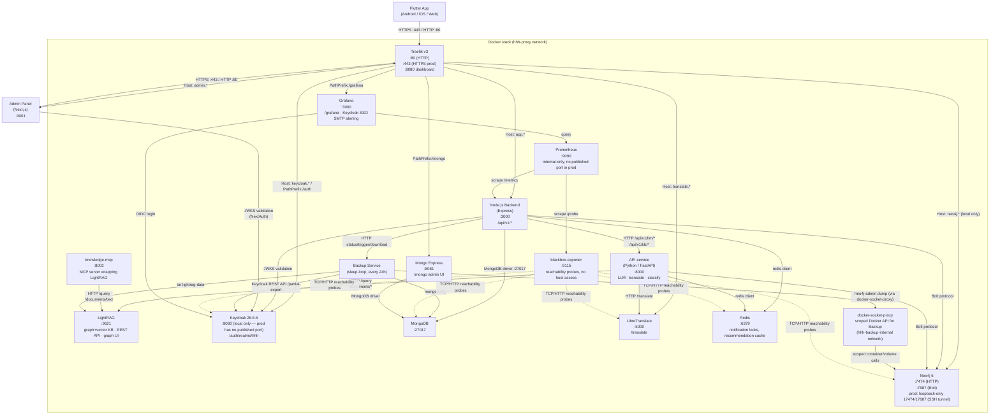
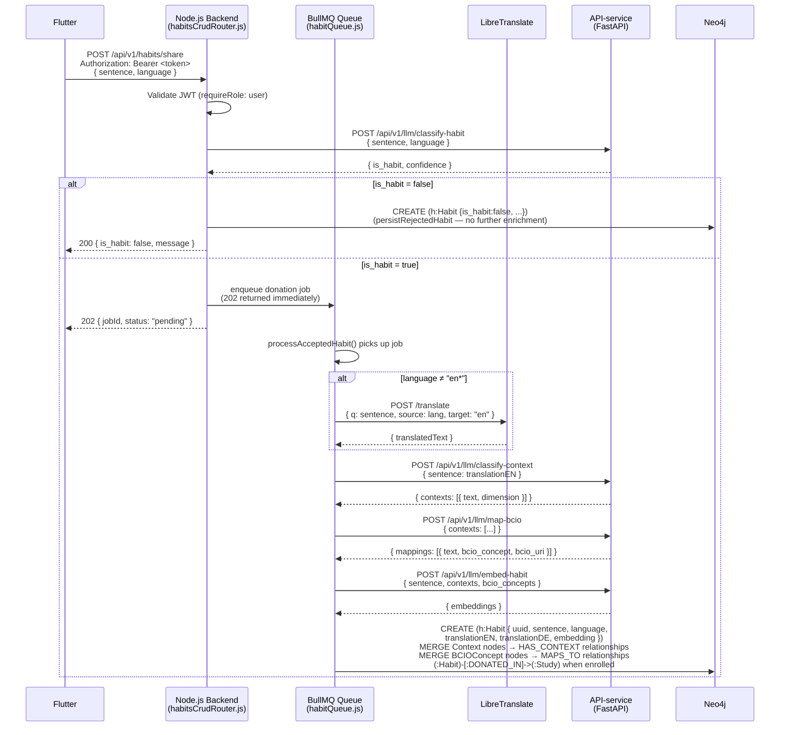
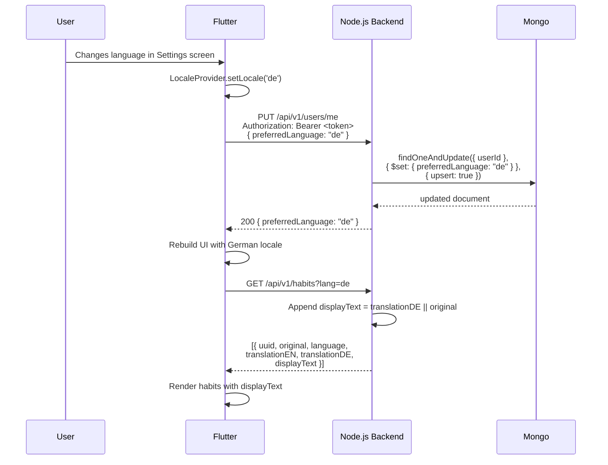
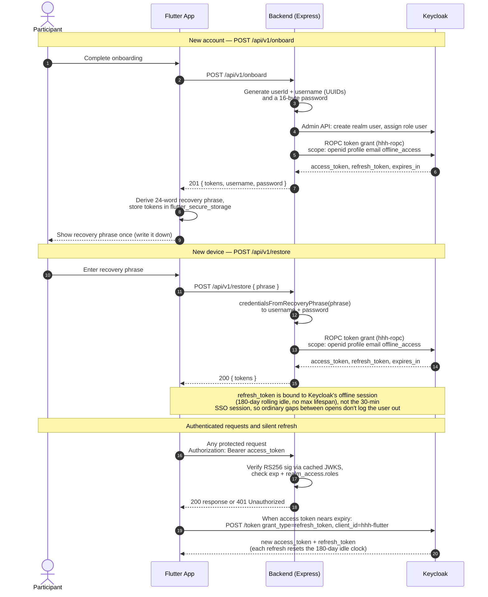
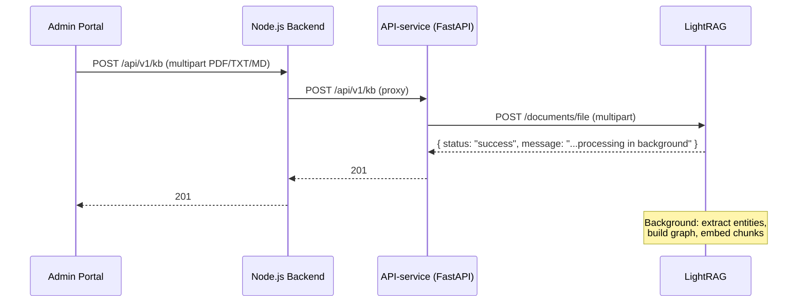

# Health Habit Hub — System Architecture

> **Related:** the full diagram suite (system architecture, UML use case diagram, 39 per-use-case sequence diagrams, domain class diagram) lives in [`docs/diagrams/`](diagrams/README.md) as renderable Mermaid/PlantUML sources. The use case catalogue with code traceability is in [`diagrams/use-cases/use-case-overview.md`](diagrams/use-cases/use-case-overview.md).

## Overview

Health Habit Hub (HHH) is a research platform for collecting, annotating, and recommending behavioural habits. It consists of nineteen Docker services orchestrated via `docker-compose` (including monitoring — Prometheus/Grafana/blackbox-exporter — and a scoped Docker socket proxy for the backup service), a Flutter mobile/web app, a Next.js admin panel, and a Python-based recommender/enrichment microservice. All HTTP traffic is routed through a Traefik reverse proxy.

---

## Component Diagram



---

## Per-Service Reference Table

| Service                 | Technology                                                                               | Purpose                                                                                                                                                                                                                                                                                                                                                                                                                                                            | Internal Port                         | External URL (dev)                                                                                                                                                        | Key Env Vars                                                                                                                                                                                                                               |
| ----------------------- | ---------------------------------------------------------------------------------------- | ------------------------------------------------------------------------------------------------------------------------------------------------------------------------------------------------------------------------------------------------------------------------------------------------------------------------------------------------------------------------------------------------------------------------------------------------------------------ | ------------------------------------- | ------------------------------------------------------------------------------------------------------------------------------------------------------------------------- | ------------------------------------------------------------------------------------------------------------------------------------------------------------------------------------------------------------------------------------------ |
| **proxy**               | Traefik v3.0                                                                             | Reverse proxy, TLS termination, routing                                                                                                                                                                                                                                                                                                                                                                                                                            | 8080 (dashboard)                      | `proxy.localhost:8888`                                                                                                                                                    | `TRAEFIK_HOST_PORT80`, `TRAEFIK_HOST_PORT8080`, `PATH_SUFFIX`, `ACME_EMAIL` (prod)                                                                                                                                                         |
| **app**                 | Node.js 22 + Express                                                                     | REST API `/api/v1/*`                                                                                                                                                                                                                                                                                                                                                                                                                                               | 3000                                  | `app.localhost:3000`                                                                                                                                                      | `MONGO_HOST`, `MONGO_USER`, `MONGO_PASSWORD`, `MONGO_DB`, `NEO4J_URI`, `NEO4J_USER`, `NEO4J_PASSWORD`, `KEYCLOAK_JWKS_URL`, `API_SERVICE_URL`, `LIBRE_TRANSLATE_URL`, `ALLOWED_ORIGINS`                                                    |
| **api-service**         | Python 3.11 + FastAPI                                                                    | LLM inference (context classification, BCIO mapping, translation refinement, RAG recommendations); KB CRUD proxied to LightRAG. `llm_client.py`'s circuit breaker (`_mark_down`/`_in_cooldown`) sends an `ALERT_EMAIL` alert via `alerting.py` when the primary model — or both primary and `LLM_FALLBACK_MODEL` — become unavailable                                                                                                                              | 8000                                  | `localhost:8001`                                                                                                                                                          | `NEO4J_URI`, `NEO4J_USER`, `NEO4J_PASSWORD`, `REDIS_URL`, `LIGHTRAG_URL`, `LIGHTRAG_API_KEY`, `SMTP_HOST`/`SMTP_USER`/`SMTP_PASS`/`SMTP_FROM`, `ALERT_EMAIL`                                                                               |
| **lightrag**            | LightRAG 1.5.0 (Python)                                                                  | Graph+vector knowledge base; builds entity graph from uploaded documents; exposes REST query API and built-in graph visualization UI                                                                                                                                                                                                                                                                                                                               | 9621                                  | `localhost:9622`                                                                                                                                                          | `LLM_API_BASE`, `LLM_API_KEY`, `LLM_MODEL`, `EMBEDDING_API_BASE`, `EMBEDDING_API_KEY`, `EMBEDDING_MODEL`, `LIGHTRAG_API_KEY`                                                                                                               |
| **knowledge-mcp**       | FastMCP (Python)                                                                         | MCP server wrapping LightRAG; exposes `search_knowledge` and `ingest_document` tools for AI agent use via SSE transport                                                                                                                                                                                                                                                                                                                                            | 8002                                  | `localhost:8002`                                                                                                                                                          | `LIGHTRAG_URL`, `LIGHTRAG_API_KEY`                                                                                                                                                                                                         |
| **keycloak**            | Keycloak 26.5.5                                                                          | OIDC/OAuth2 identity provider; manages realms, users, roles                                                                                                                                                                                                                                                                                                                                                                                                        | 8080                                  | `localhost:8080` (local only — prod has no published port, routed at `/auth` via Traefik)                                                                                 | `KEYCLOAK_ADMIN`, `KEYCLOAK_ADMIN_PASSWORD`, `KC_DB`, `KC_HTTP_RELATIVE_PATH` (prod)                                                                                                                                                       |
| **admin**               | Next.js 15 (App Router), React 18, MUI (Material UI) v7 + Emotion, CSS Modules, Recharts | Researcher/admin web panel: study management, merged Analytics/Insights dashboard with tab navigation (Recharts, study filter, KPI cards, SRHI/active-rate/dropout/questionnaire charts, participant table), questionnaire management, cue pools, knowledge base, notification campaigns, backups (progress bar + download), System health / Tools pages, settings                                                                                                 | 3001                                  | `admin.localhost:3001`                                                                                                                                                    | `NEXTAUTH_URL`, `NEXTAUTH_SECRET`, `KEYCLOAK_ID`, `KEYCLOAK_SECRET`, `KEYCLOAK_ISSUER`, `KEYCLOAK_BROWSER_URL`, `KEYCLOAK_INTERNAL_URL`, `HHH_ADMIN_USER`, `NEXT_PUBLIC_GRAFANA_URL`                                                       |
| **neo4j**               | Neo4j 5                                                                                  | Graph database; stores habit graph with BCIO alignment                                                                                                                                                                                                                                                                                                                                                                                                             | 7474 (HTTP), 7687 (Bolt)              | `neo4j.localhost:7474` (local); prod publishes loopback-only `127.0.0.1:17474`/`17687` for SSH-tunnel admin access, or `docker exec -it hhh-neo4j cypher-shell` — see [`docs/runbook.md`](runbook.md) | `NEO4J_AUTH` (`user/password`)                                                                                                                                                                                                             |
| **mongo**               | MongoDB (latest)                                                                         | Document store; holds questionnaires, form responses, recommendations, user preferences                                                                                                                                                                                                                                                                                                                                                                            | 27017                                 | Internal only                                                                                                                                                             | `MONGO_INITDB_ROOT_USERNAME`, `MONGO_INITDB_ROOT_PASSWORD`, `MONGO_INITDB_DATABASE`                                                                                                                                                        |
| **mongo-express**       | Mongo Express                                                                            | MongoDB admin web UI (production only — not in docker-compose.local.yml)                                                                                                                                                                                                                                                                                                                                                                                           | 8081                                  | `https://<DOMAIN>/mongo` (prod only)                                                                                                                                      | `ME_CONFIG_MONGODB_URL`, `ME_CONFIG_BASICAUTH_USERNAME`, `ME_CONFIG_BASICAUTH_PASSWORD`                                                                                                                                                    |
| **translate**           | LibreTranslate                                                                           | Self-hosted machine translation API (en/de/ja/fr/nl)                                                                                                                                                                                                                                                                                                                                                                                                               | 5000                                  | `http://translate.localhost` (via Traefik) or `localhost:5001` (direct)                                                                                                   | `LT_LOAD_ONLY`, `LT_REQ_LIMIT`                                                                                                                                                                                                             |
| **redis**               | Redis                                                                                    | Notification-dedup locks and recommendation response cache; not backed up (short-lived, repopulates automatically)                                                                                                                                                                                                                                                                                                                                                 | 6379                                  | Internal only                                                                                                                                                             | —                                                                                                                                                                                                                                          |
| **prometheus**          | Prometheus v3.4.1                                                                        | Scrapes `app:9091/metrics` (app HTTP/BullMQ metrics) and `blackbox-exporter:9115/probe` (reachability probes), 30-day retention                                                                                                                                                                                                                                                                                                                                    | 9090                                  | `prometheus.localhost` (local); internal-only in prod (no published/routed port)                                                                                          | —                                                                                                                                                                                                                                          |
| **blackbox-exporter**   | prom/blackbox-exporter v0.25.0                                                           | TCP-connect/HTTP-GET reachability probes against every long-running service without its own Prometheus metrics (mongo, redis, neo4j, keycloak, translate, lightrag, knowledge-mcp, recommender, prometheus, grafana, backup, proxy); no host mounts/elevated privileges                                                                                                                                                                                            | 9115 (internal only)                  | Internal only                                                                                                                                                             | —                                                                                                                                                                                                                                          |
| **grafana**             | Grafana OSS 12.0.1                                                                       | Dashboards over Prometheus data; Keycloak SSO (OIDC), realm role → Grafana role mapping; unified alerting (BullMQ failures, service reachability, 5xx spikes) emails `ALERT_EMAIL` via SMTP                                                                                                                                                                                                                                                                        | 3000                                  | `grafana.localhost` (local); `https://<DOMAIN>/grafana` (prod, via Traefik)                                                                                               | `GRAFANA_ADMIN_USER`, `GRAFANA_ADMIN_PASSWORD`, `GRAFANA_CLIENT_SECRET`, `NEXT_PUBLIC_GRAFANA_URL` (admin-panel link), `GF_SMTP_*`/`HHH_ALERT_EMAIL` (from `SMTP_*`/`ALERT_EMAIL`)                                                         |
| **backup**              | Custom Alpine + sleep-loop                                                               | Backs up MongoDB, LightRAG, Neo4j, Keycloak. Starts 2 min after container boot, then repeats every 24h (not a real cron — drifts on container restart). Time-based retention plus a hard cap on scheduled-trigger backups; also runs the internal `backup-api` HTTP server (status/trigger/restore/upload/download) the admin panel's Backups page talks to; success/failure alerts sent directly via SMTP (`lib.sh`'s `send_smtp_mail()`), independent of Grafana | — (backup-api on 4100, internal only) | Internal only                                                                                                                                                             | `BACKUP_RETENTION_DAYS` (default 14), `BACKUP_SCHEDULED_LIMIT` (default 10, caps scheduled backups regardless of age), `ALERT_WEBHOOK_URL`, `ALERT_EMAIL`, `SMTP_HOST`/`SMTP_USER`/`SMTP_PASS`/`SMTP_FROM`, `MONGO_USER`, `MONGO_PASSWORD` |
| **docker-socket-proxy** | tecnativa/docker-socket-proxy                                                            | Scoped Docker API in front of the real `docker.sock`, reachable only by `backup` over the internal `hhh-backup-internal` network; exposes only the container/volume/image calls `backup.sh`/`restore.sh` need (no EXEC, NETWORKS, SECRETS, etc.) instead of a raw socket mount                                                                                                                                                                                     | 2375 (internal only)                  | Internal only                                                                                                                                                             | —                                                                                                                                                                                                                                          |

> **Flutter mobile/web**: Not a separate Docker container. Flutter runs natively on Android/iOS or as a compiled web app. In dev the backend is reached directly; in production the compiled web bundle may be hosted on the `app` service.
>
> **Admin panel**: Runs as a separate Docker container (`hhh-admin`) on port 3001. Uses NextAuth v4 + Keycloak for authentication and enforces `admin` or `researcher` realm roles at the middleware layer.

---

## Node.js Backend — Internal Module Structure

The `app/` service is internally organized into the following layers (as of the v1.2.0 clean-code refactor):

| Directory         | Purpose                                                                                                                                                                                                                                                                                                                                                              |
| ----------------- | -------------------------------------------------------------------------------------------------------------------------------------------------------------------------------------------------------------------------------------------------------------------------------------------------------------------------------------------------------------------- |
| `app/routes/`     | Thin Express routers — parameter extraction, auth middleware, delegating to services                                                                                                                                                                                                                                                                                 |
| `app/services/`   | Business logic: `habitDonationService.js`, `adminParticipantService.js`, `adminHabitService.js`, `adminStatsService.js`, `keycloakAdminClient.js`; DFG study services: `habitConfigService.js`, `intentionService.js`, `dailyLogService.js`, `srhiService.js`, `cuePoolService.js`, `exportService.js`, `notificationCampaignService.js`, `studyAnalyticsService.js` |
| `app/db/`         | Named Cypher query modules: `habitQueries.js`, `adminQueries.js`                                                                                                                                                                                                                                                                                                     |
| `app/models/`     | MongoDB collection validators and domain models (`study.js`, `enrollment.js`, `implementationIntention.js`, …)                                                                                                                                                                                                                                                       |
| `app/middleware/` | Express middleware: `auth.js` (JWT/JWKS), `roles.js` (ROLES constants, isPrivileged)                                                                                                                                                                                                                                                                                 |
| `app/utils/`      | Infrastructure helpers: `getDb.js`, `healthCheck.js`, `translate.js`, `localization.js`, `constants.js`                                                                                                                                                                                                                                                              |

---

## End-to-End Donation Pipeline

The donation pipeline ingests a habit sentence from the Flutter app, enriches it with BCIO context classifications and machine translations, and persists everything to Neo4j.



The synchronous `shareHabit()` path (no queue configured — test mode) runs the same
stages inline instead of enqueuing them; the classify step and the fork on
`is_habit` are identical either way.

### Pipeline Stages

**Optional voice input, ahead of this pipeline.** A participant may speak a
habit instead of typing it: `POST /habits/share/transcribe` (Node) proxies
the recorded clip to `POST /api/v1/llm/transcribe-audio` (API-service),
which calls the `alias-stt` (openai/whisper-large-v3-turbo) model alias via
the same OpenAI-compatible client/credentials already used for
`chat_complete()` — just a different `LLM_STT_MODEL` alias, no separate
credential wiring. This step is stateless (nothing is persisted) and
produces a plain transcript string that the participant reviews/edits before
it becomes `sentence` below — from that point on, the pipeline is completely
unaware of whether the sentence originated from typing or speech; only the
`habit_donations` Mongo record (see `docs/data-model.md`) tracks `inputMode`.

| Stage                  | Service         | Input                               | Output                                                                                  | Notes                                                                                                                                                                                                                                                                                                                                                                                                                                           |
| ---------------------- | --------------- | ----------------------------------- | --------------------------------------------------------------------------------------- | ----------------------------------------------------------------------------------------------------------------------------------------------------------------------------------------------------------------------------------------------------------------------------------------------------------------------------------------------------------------------------------------------------------------------------------------------- |
| Auth                   | Node.js Backend | JWT Bearer token                    | `req.user` with roles                                                                   | JWKS fetched from Keycloak                                                                                                                                                                                                                                                                                                                                                                                                                      |
| Habit Classification   | API-service LLM | `sentence`, `language`              | `{ is_habit, confidence }`                                                              | Uses `classify_habit` prompt. **The prompt explicitly accepts cue-based "when/after X, I will Y" implementation-intention phrasing as a valid recurring habit** (not just free-text descriptions) — this covers both the guided habit-creation flow and habits shared from a recommendation, which submit sentences in exactly that shape. Rejected sentences (`is_habit:false`) stop here with a bare `Habit` node and skip every stage below. |
| Translation            | LibreTranslate  | `sentence` (non-English)            | Raw English draft                                                                       | Only runs when `language` does not start with `en`                                                                                                                                                                                                                                                                                                                                                                                              |
| Context Classification | API-service LLM | `translationEN`                     | `[{ text, dimension }]`                                                                 | Uses `classify-context` prompt                                                                                                                                                                                                                                                                                                                                                                                                                  |
| BCIO Mapping           | API-service LLM | Context phrases                     | `[{ bcio_concept, bcio_uri }]`                                                          | Uses `map-bcio` prompt + RAG over `bcio.owl`                                                                                                                                                                                                                                                                                                                                                                                                    |
| Embedding              | API-service LLM | Sentence + contexts + BCIO concepts | Vector embeddings                                                                       | Powers the community habit vector search used by the recommender (M3 pipeline below)                                                                                                                                                                                                                                                                                                                                                            |
| Graph Persistence      | Neo4j           | Enriched habit data                 | `Habit`, `Context`, `BCIOConcept` nodes, `DONATED_IN` edge (study-enrolled donors only) | MERGE ensures idempotency; `studyId` is stamped on the `Habit` node from the donor's enrollment **at donation time** and is never rewritten afterwards — see _Study Enrollment, Switching & Leaving_ below                                                                                                                                                                                                                                      |

---

## Language / Locale Flow



### Language Conventions

| Concern                     | Convention                                                                                  |
| --------------------------- | ------------------------------------------------------------------------------------------- |
| Locale codes                | ISO 639-1 two-letter: `"en"`, `"de"` (consistent across Flutter, backend, MongoDB)          |
| `preferredLanguage` field   | Stored in MongoDB `users` collection, keyed by Keycloak `sub`                               |
| `?lang=` query parameter    | Supported on `GET /api/v1/habits`; triggers `displayText` field in response                 |
| Donation language detection | Flutter sends `language` field in POST body; backend uses it to decide whether to translate |
| `translationEN`             | Stored on all non-English `Habit` nodes; `null` for English habits                          |
| `translationDE`             | Stored on `Habit` nodes when German translation is available                                |
| Fallback                    | `displayText = translationXX                                                                |     | original`—` |     | `handles both`null`and`undefined` |

---

## Auth Flow

The participant **never sees a Keycloak login page**. Authentication is built on a 24-word
recovery passphrase (a pure re-encoding of the account's username UUID + 16-byte password,
no server secret). The **backend** exchanges those credentials for a token pair via the
confidential `hhh-ropc` client — the mobile app never performs the password grant itself,
which is why the public `hhh-flutter` client has direct-access grants disabled. The three
minting entry points (`/onboard`, `/restore`, `/users/me/rotate-credentials`) all route
through `app/services/keycloakRopcClient.js`, which requests the `offline_access` scope.



> **Dormant alternative:** a PKCE authorization-code flow (`AuthService.login()`, public
> `hhh-flutter` client) still exists in the mobile codebase but has no current call site. It
> requests the same `offline_access` scope, so token-lifetime behaviour would be identical
> if it were ever wired up. See also the sequence diagrams
> [UC-02 onboard](diagrams/sequences/UC-02-onboard.mmd) and
> [UC-39 recover](diagrams/sequences/UC-39-recover-account-passphrase.mmd).

### Session & token lifetime

The mobile session is deliberately long-lived because the app is a habit tracker opened a
few times a day, not a continuously-used website. Requesting the `offline_access` scope
binds the refresh token to Keycloak's **offline session** instead of the regular SSO
session:

| Setting | Keycloak default | This realm (`keycloak/hhh-realm.json`) |
| --- | --- | --- |
| SSO session idle (regular tokens, no `offline_access`) | 30 min | unused by the mobile app |
| `offlineSessionIdleTimeout` | 30 days | **180 days** |
| `offlineSessionMaxLifespanEnabled` | `false` (no cap) | `false` (no cap) |

It is a **rolling window, not a fixed expiry**: every silent refresh resets the 180-day
idle timer and there is no absolute maximum, so a participant who opens the app at least
once every six months stays signed in indefinitely (the "always signed in" model apps like
WhatsApp use). Explicit sign-out still revokes the token via `/protocol/openid-connect/revoke`.
Full rationale, the four token-minting call sites, and how to add a hard session cap later
are in [DOCUMENTATION.md §11 → Session & Token Lifetime](../DOCUMENTATION.md).

### Realm Roles

| Role         | Granted to                                        | Permissions                                                                                                 |
| ------------ | ------------------------------------------------- | ----------------------------------------------------------------------------------------------------------- |
| `user`       | Study participants (end users of the Flutter app) | Donate habits, view recommendations, submit questionnaires                                                  |
| `researcher` | Research staff                                    | All `user` permissions + admin panel access (excluding KB and Settings), questionnaire and study management |
| `admin`      | Platform administrators                           | All `researcher` permissions + full admin panel access including Knowledge Base and Settings                |

> **Note:** The `user` role was previously named `participant`. It was renamed across `app/middleware/roles.js`, `keycloak/hhh-realm.json`, and `scripts/seed-local.js` to align with Keycloak terminology and to avoid clashing with the domain term "participant" used in study admin contexts.

### Admin Panel UI Stack

The admin panel is a **Next.js 15** (App Router) / **React 18** application written in TypeScript. Its UI is built from three layers that coexist:

- **MUI (Material UI) v7** with the **Emotion** styling engine — the component library (switches, form controls, etc.). MUI is wired in `admin/src/components/providers.tsx` via `AppRouterCacheProvider` (SSR-safe style injection) and a `ThemeProvider` fed by `admin/src/lib/mui-theme.ts`.
- **CSS Modules** (`*.module.css`) — the primary styling mechanism for bespoke layout and components (e.g. `cue-config-form.module.css`), driven by CSS custom properties in `globals.css`.
- **Recharts** — analytics/insights charts (see the Analytics page section below).

**Theming note:** the app's light/dark toggle flips a `[data-theme]` attribute on `<html>` (stamped pre-hydration by an inline bootstrap script — hence `suppressHydrationWarning` on the `<html>` element in `layout.tsx`), _not_ a React `palette.mode`. Because `createTheme()` derives shades and contrast text at import time and cannot parse `var(...)` strings (MUI error #9), `mui-theme.ts` uses static light-theme hex values for the palette, and defers anything that must follow the runtime toggle to `var(...)` in CSS-output positions (`styleOverrides` and component `sx` props). See `admin/src/__tests__/mui-theme.test.tsx` for the guard against reintroducing `var(...)` palette values.

### Admin Panel Auth

The Next.js admin panel uses NextAuth v4 with the Keycloak provider. On each request, `src/middleware.ts` calls `getToken()` to validate the session JWT and additionally logs method, path, user `sub`, roles, and request latency (visible in `docker logs hhh-admin`). If the decoded token's `realm_access.roles` array does not include `admin` or `researcher`, the user is redirected to `/access-denied`. The Keycloak client used is `hhh-admin` (confidential client with client secret).

#### Sub-path routing behind the reverse proxy (production)

In production the admin panel is **not** on its own subdomain — Traefik serves it under a path prefix on the shared host: `https://${DOMAIN}/admin`. The Next.js app is built with `basePath: /admin` (`admin/next.config.mjs`), so its routes — including the NextAuth API at `/admin/api/auth/*` — all live under that prefix. Three things must line up for sign-in to work, and all three are required together:

1. **`NEXTAUTH_URL` must be the full path to the NextAuth API, including `/api/auth`:** `https://${DOMAIN}/admin/api/auth`. NextAuth v4 derives the base path for its sign-in/callback/CSRF links from this value. If it is set to just `https://${DOMAIN}/admin`, NextAuth emits links at `/admin/*` instead of `/admin/api/auth/*`; the sign-in POST then misses the handler and the browser silently loops on `/admin/signin?csrf=true` without ever reaching Keycloak. (`NEXT_PUBLIC_NEXTAUTH_URL` stays the app base `https://${DOMAIN}/admin` — it is used only for the post-logout redirect, not NextAuth routing.)
2. **The NextAuth React client must know the base path:** `<SessionProvider basePath="/admin/api/auth">` (`admin/src/components/providers.tsx`), or the client-side `signIn()` / `useSession()` / CSRF calls hit the root `/api/auth/*`, which Traefik routes to the **backend API** service instead of the admin app.
3. **Traefik must not shadow `/api`:** the Traefik dashboard/`api@internal` router must **not** be exposed under `PathPrefix(/api)`. It previously was, behind basic-auth, which shadowed both the mobile app's `/api/v1/*` and the admin panel's `/admin/api/auth/*` — producing a browser basic-auth popup instead of the Keycloak login. If the Traefik dashboard is needed, expose it on a dedicated host (`traefik.${DOMAIN}`), never under `/api`.

The Keycloak `hhh-admin` client's **Valid Redirect URIs** must include `https://${DOMAIN}/admin/*` so the callback `https://${DOMAIN}/admin/api/auth/callback/keycloak` is accepted. This is seeded from `keycloak/hhh-realm.json` (`${DOMAIN}` is substituted on import) — but note the realm import is **skipped when the realm already exists**, so on an upgrade you may need to update the redirect URIs on the running client directly (see `DEPLOYMENT.md`).

#### Inside the JWT callback

`realm_access.roles` is present on **access tokens** but absent from ID tokens (Keycloak default). The JWT callback in `admin/src/lib/auth.ts` therefore decodes roles from `account.access_token` directly rather than from the OIDC `profile` (ID token claims).

#### Docker-aware OIDC endpoints

Because Keycloak runs inside Docker but the browser runs on the host, the admin panel cannot rely on OIDC discovery (`wellKnown`) — the discovery document returns the internal Docker hostname (`http://keycloak:8080/...`) for the authorization endpoint, which browsers cannot resolve. The NextAuth provider instead sets endpoints explicitly:

| Endpoint                 | Local dev                          | Production                                     | Env var                 |
| ------------------------ | ---------------------------------- | ---------------------------------------------- | ----------------------- |
| `authorization.url`      | `http://localhost:8080`            | `https://<domain>/auth`                        | `KEYCLOAK_BROWSER_URL`  |
| `token`                  | `http://keycloak:8080` (internal)  | `http://keycloak:8080/auth` (internal)         | `KEYCLOAK_INTERNAL_URL` |
| `userinfo`               | `http://keycloak:8080` (internal)  | `http://keycloak:8080/auth` (internal)         | `KEYCLOAK_INTERNAL_URL` |
| `jwks_endpoint`          | `http://keycloak:8080` (internal)  | `http://keycloak:8080/auth` (internal)         | `KEYCLOAK_INTERNAL_URL` |
| Issuer (`iss` validator) | `http://localhost:8080/realms/hhh` | `https://<domain>/auth/realms/hhh` (**public**) | `KEYCLOAK_ISSUER`       |

Two production-only traps, both of which surface as `error=OAuthCallback` *after* Keycloak has already authenticated the user:

1. **The `/auth` prefix.** Production sets `KC_HTTP_RELATIVE_PATH=/auth`, so every realm endpoint — including the server-to-server token/userinfo/JWKS calls made over the internal Docker hostname — lives under `/auth`. Omitting it makes the token exchange 404. Local dev sets no relative path, which is why its values legitimately differ.
2. **The issuer must be the PUBLIC URL**, even though token/JWKS are fetched internally. Keycloak stamps `iss` from the frontend request context (the browser flow through the proxy), not from the endpoint that mints the token. Using the internal form fails openid-client validation with:
   `iss mismatch, expected http://keycloak:8080/auth/realms/hhh, got: https://<domain>/auth/realms/hhh`

> **Do not trust the internal discovery document to resolve trap 2.** Fetching `/auth/realms/hhh/.well-known/openid-configuration` over the internal hostname advertises `issuer: http://keycloak:8080/auth/realms/hhh`, which contradicts what issued tokens carry. Production now sets `KC_HOSTNAME=https://<domain>` so discovery and the `iss` claim agree; the issued token is authoritative either way.

#### Page-level role guards

Beyond the middleware allow-list, the admin panel enforces fine-grained access control at the page level (`admin/src/lib/useAdminGuard.ts`):

- `/studies`, `/analytics`, `/cue-pools`, `/questionnaires`, and `/help` are accessible to both `admin` and `researcher`
- Every other page is admin-only — `researcher` users are redirected to `/access-denied`: `/participants`, `/devices`, `/donations`, `/comments`, `/profile-fields`, `/knowledge-base`, `/system`, `/backups`, `/audit-log`, `/restore-attempts`, `/team`
- The sidebar groups navigation into five labelled sections — **Research** (Studies, Analytics), **Operations** (Participants, Devices, Donations, Comments), **Configuration** (Cue Pools, Questionnaires, Profile Fields, Knowledge Base), **Monitoring** (System, Backups, Audit Log, Restore Attempts, Team), and **Support** (Help) — and hides every admin-only entry for `researcher` users so the navigation reflects what they can actually open
- Flutter admin routes (when the admin Flutter UI is in use) are restricted to `admin` only

#### Analytics page (`/analytics`)

The standalone analytics dashboard (`admin/src/app/(admin)/analytics/page.tsx`) is the primary research-monitoring interface. It is accessible to both `admin` and `researcher` roles. Key features:

- **Study selector** — dropdown populated from `GET /admin/studies`; defaults to the first active study; switching reloads all data
- **KPI cards** — total enrolled, active last 7 days (%), dropout count + rate (colour-coded amber/red above 10%/20%), mean SRHI at the latest week, mean questionnaire completion rate
- **Charts (Recharts)** — vertical BarChart for per-group weekly active rate; LineChart for SRHI trajectory per group with a habit-threshold reference line at score 4; step-after LineChart for cumulative dropout; horizontal BarChart for per-questionnaire completion rates
- **Participant table** — all enrolled participants for the selected study with username, group, enrolled date, last-active date, inline survey-completion mini-bar, and active/inactive/dropped-out status badge
- **Participant detail drawer** — clicking any participant row opens a slide-over panel showing: summary stats (habits, surveys, recommendations, profile completion, last active), a **Reminders** section (see below), completed surveys list, and a chronological activity timeline

Data sources: `GET /admin/studies/:id/analytics` (analytics), `GET /admin/studies/:id/participants` (participant table), `GET /admin/participants/:id/progress` (drawer summary + timeline), `GET /admin/participants/:id/reminder-plans` (drawer Reminders section).

#### Local admin user provisioning

In local development, the `keycloak-init` container automatically creates a user in the `hhh` realm with both `admin` and `researcher` roles, using `HHH_ADMIN_USER` (default `admin`) as the username and `KEYCLOAK_ADMIN_PASSWORD` as the password. Demo users (`demo-admin`, `demo-researcher`) have been removed from `keycloak/hhh-realm.json`.

---

## M3 Recommendation Pipeline

The recommendation pipeline runs entirely inside the **API-service** (Python / FastAPI). It is triggered by `POST /api/v1/recommend/generate` on the Node.js backend, which proxies the request (with a service token) to `POST /api/v1/llm/recommend`.

The full data-flow diagram is at [`docs/diagrams/architecture/recommendation-pipeline.mmd`](diagrams/architecture/recommendation-pipeline.mmd). The per-step sequence diagram is at [`docs/diagrams/sequences/UC-07-request-recommendations.mmd`](diagrams/sequences/UC-07-request-recommendations.mmd).

### Pipeline stages

**Step 0 — Goal guarding (before any pipeline work)**
The `goal` field is untrusted end-user input and is screened twice:

1. **Heuristic screen** — a regex (English + German) rejects obvious prompt-injection phrases ("forget all previous instructions", "ignoriere alle vorherigen Anweisungen", "system prompt", "jailbreak", …) instantly with **HTTP 422** and a friendly message — no LLM call is spent.
2. **LLM backstop** — the final LLM call carries a system message that treats the goal strictly as data. If the goal is not a legitimate health/behaviour goal (injection, harmful, illegal, or off-topic requests), the model returns `{"refused": true, "reason": …}`, which the API converts to **HTTP 422** with the reason as `detail`. The Flutter app displays this reason verbatim.

Refusals are logged (with the offending goal) and never cached.

**Step 1 — Cache check**
Redis `GET recommend:{sha256(user_id‖goal)}`. On a hit the cached `RecommendResponse` is returned immediately without any LLM or Neo4j calls.

**Stage 1 — 7-way parallel data fetch** (`asyncio.gather`, zero LLM calls)

| Fetch                   | Source                       | What happens                                                                                                                                                                                   |
| ----------------------- | ---------------------------- | ---------------------------------------------------------------------------------------------------------------------------------------------------------------------------------------------- |
| Personal habits         | Neo4j (1 session, ≤200 rows) | `MATCH (h:Habit {userID, is_habit:true})` with stored embeddings; cosine-ranked in Python vs the goal embedding; top `USER_HABITS_LIMIT` kept                                                  |
| Community habits        | Neo4j (3 parallel sessions)  | 3-index fan-out — `habit_embedding_idx` (sentence), `context_embedding_idx` (situational), `bcio_embedding_idx` (behaviour-change concept); merged by max score → top `COMMUNITY_HABITS_LIMIT` |
| Questionnaire responses | Node.js service endpoint     | `GET /questionnaire-responses/service/{userId}` — enrollment → study → questionnaire slugs → latest responses (adapts to any study config)                                                     |
| User profile            | Node.js service endpoint     | `GET /user-profile/service/{userId}`                                                                                                                                                           |
| Annotated habits        | MongoDB + Neo4j              | `habit_annotations.find({userId, type:{$in:['helpful','iDoThis','like']}})` → matching Habit nodes fetched from Neo4j with context                                                             |
| Prior feedback          | MongoDB                      | Last 10 `recommendation_feedback` comments for this user + goal                                                                                                                                |
| Previous titles         | MongoDB                      | Titles from the user's last 5 recommendation sets (≤15 titles, deduplicated) — fed back so consecutive generations do not repeat themselves                                                    |

**Stage 2 — deterministic processing** (zero LLM calls)
`build_profile()` template-assembles `profile_summary`, `profile_detailed`, and `rag_query` from questionnaire responses + demographics _(replaces the former LLM-2 call)_. GDS FastRP re-ranking scores each community habit `0.5 × semantic + 0.3 × graph-topology (cosine vs user centroid) + 0.2 × log-normalised likes` _(replaces the former LLM-1 selection call)_.

**Stage 3 — parallel enrichment** (2-way `asyncio.gather`)
BCIO concepts per candidate habit (Neo4j `MAPS_TO` traversal) and LightRAG hybrid retrieval (`POST /query`, `mode=hybrid`, `only_need_context=true`, 90 s timeout). The retrieval step also extracts **per-document provenance**: the distinct source-document filenames found in the LightRAG context identify which academic papers ground this response (see _Paper citations_ below).

**Stage 4 — single LLM call** (`recommend.txt`)
Model `LLM_RECOMMEND_MODEL` (falls back to `LLM_MODEL`), temperature 0.2, optional completion cap `LLM_RECOMMEND_MAX_TOKENS`. The LightRAG context pasted into the prompt is capped at `RECOMMEND_MAX_CONTEXT_CHARS`. The prompt instructs the model to:

- write `title`, `body`, `rationale`, and `suggested_cue` **in the language of the goal** (German goal → German output),
- propose a concrete `suggested_cue` ("when/where" trigger phrase) per recommendation for the implementation-intention flow,
- not repeat habits the user already practises or was previously recommended,
- cite papers per recommendation via `sources` — `{filename, quote}` pairs, `filename` validated server-side against the actually retrieved documents and `quote` validated as a verbatim (whitespace-normalised) substring of the retrieved context, dropped otherwise,
- keep rationales in plain language — no UUIDs, BCIO codes, or other internal identifiers.

**Stage 5 — response shaping, persist, cache**
Cited filenames are resolved to user-facing citations via `citations.py`. `selected_habit_uuids` (graph provenance) is **logged and stored in MongoDB for debugging but stripped from the client response**. The full result is stored in MongoDB `recommendations` and cached in Redis (24 h TTL).

### Paper citations

Knowledge-base PDFs follow the Zotero export pattern `Authors - Year - Title.pdf`. For every cited document, `API-service/citations.py` produces `{filename, title, authors, year, url, citation}`, which the endpoint merges with the LLM-supplied `quote` (the paper's own wording backing the recommendation, or `""` if none was grounded) into the client-facing `SourceRef`:

- If `API-service/data/references.json` has a curated entry for the filename, its `url` (ideally a DOI link) and optional metadata are used → the app renders a **tappable citation**.
- Otherwise the citation is shown as plain `Author (Year) — Title` text, parsed from the filename. **No links are guessed or fabricated.**

To add a link for a new paper, add its DOI to `data/references.json`:

```json
{
  "Wood and Rünger - 2016 - Psychology of Habit.pdf": {
    "url": "https://doi.org/10.1146/annurev-psych-122414-033417"
  }
}
```

If the LLM cites a hallucinated filename (or none), the response falls back to attaching all retrieved papers, so evidence links are never lost.

**LightRAG never supplies a URL/DOI itself** — it only returns document filenames as part of the retrieved context (`extract_document_filenames()` regexes `file_path` out of the raw chunk/entity text). The link is entirely a manual overlay: `data/references.json` is curated by hand, one entry per paper, and as of this writing it contains exactly **one** entry (Wood & Rünger, 2016). Any other cited paper — curated or not — renders as plain unlinked text until someone adds its DOI to `references.json`. This overlay is also scoped to the RAG recommendation pipeline only; static in-app copy that cites research (e.g. the implementation-intention onboarding screen's "Gollwitzer & Sheeran, 2006" text in `mobile/lib/features/my_habits/habit_onboarding_widgets.dart`) is hardcoded and unrelated to this mechanism — it has no `url`/`doi` field and is never linked.

### Pipeline input reference

Every data source queried during a single recommendation run:

| Stage                       | Source                                | Query / call                                                                                                                                                                                                                                                                   |
| --------------------------- | ------------------------------------- | ------------------------------------------------------------------------------------------------------------------------------------------------------------------------------------------------------------------------------------------------------------------------------ |
| **Entry point**             | Node.js backend proxy                 | `POST /api/v1/llm/recommend {user_id, goal, session_id}` with `X-Service-Auth-Token` header                                                                                                                                                                                    |
| **Goal guard**              | in-process regex + LLM system message | Injection/off-topic goals → HTTP 422 with user-facing reason                                                                                                                                                                                                                   |
| **Cache check**             | Redis                                 | `GET recommend:{sha256(user_id‖goal)}` — hit returns cached response; miss continues pipeline                                                                                                                                                                                  |
| **Personal habits**         | Neo4j (1 session, ≤200 rows)          | `MATCH (h:Habit {userID: $user_id, is_habit: true}) OPTIONAL MATCH (h)-[:HAS_CONTEXT]->(c:Context) RETURN h.uuid, coalesce(h.translationEN, h.sentence), collect({dimension: c.dimension, text: c.text}), h.embedding` — cosine-ranked in Python, top `USER_HABITS_LIMIT` kept |
| **Community — sentence**    | Neo4j `habit_embedding_idx`           | `CALL db.index.vector.queryNodes('habit_embedding_idx', $limit, $embedding)` … excluding the requesting user                                                                                                                                                                   |
| **Community — context**     | Neo4j `context_embedding_idx`         | `CALL db.index.vector.queryNodes('context_embedding_idx', $limit, $embedding)` … situational / `INTERNAL_STATE` match                                                                                                                                                          |
| **Community — BCIO**        | Neo4j `bcio_embedding_idx`            | `CALL db.index.vector.queryNodes('bcio_embedding_idx', $limit, $embedding)` … behaviour-change concept match                                                                                                                                                                   |
| **Annotated habits**        | MongoDB `habit_annotations` + Neo4j   | `db.habit_annotations.find({userId, type: {$in: ["helpful","iDoThis","like"]}}, {habitId:1, _id:0})` → fetch matching Habit nodes from Neo4j with context                                                                                                                      |
| **Questionnaire responses** | Node.js service endpoint              | `GET /api/v1/questionnaire-responses/service/{userId}` with `X-Service-Auth-Token` (all slugs of the user's enrolled study)                                                                                                                                                    |
| **User profile**            | Node.js service endpoint              | `GET /api/v1/user-profile/service/{userId}` with `X-Service-Auth-Token`                                                                                                                                                                                                        |
| **Profile build**           | deterministic (`_profile_builder.py`) | `build_profile()` → `profile_summary`, `profile_detailed`, `rag_query` — no LLM call                                                                                                                                                                                           |
| **GDS re-ranking**          | Neo4j GDS FastRP                      | user centroid from `fastrp_embedding` vectors → hybrid score per community habit — no LLM call                                                                                                                                                                                 |
| **BCIO concepts**           | Neo4j                                 | `MATCH (h)-[:HAS_CONTEXT]->(c)-[:MAPS_TO]->(b:BCIOConcept) WHERE h.uuid IN $uuids RETURN h.uuid, collect(DISTINCT b.label)`                                                                                                                                                    |
| **RAG retrieval**           | LightRAG (timeout 90 s)               | `POST /query {query: rag_query, mode: "hybrid", only_need_context: true}` — context capped at `RECOMMEND_MAX_CONTEXT_CHARS`; distinct document filenames extracted for citations                                                                                               |
| **Prior feedback**          | MongoDB `recommendation_feedback`     | `db.recommendation_feedback.find({userId, goal}, {comment: 1, _id: 0}).sort({created_at: -1}).limit(10)`                                                                                                                                                                       |
| **Previous titles**         | MongoDB `recommendations`             | Titles of the user's last 5 recommendation sets (≤15, deduplicated) — anti-repetition context                                                                                                                                                                                  |
| **Cache write**             | Redis                                 | `SETEX recommend:{sha256} 86400 <serialised RecommendResponse>`                                                                                                                                                                                                                |
| **Persist result**          | MongoDB `recommendations`             | `db.recommendations.insertOne({recommendation_id, userId, goal, session_id, recommendations, generated_at})` — includes `selected_habit_uuids` for debugging                                                                                                                   |

**Final LLM prompt** (`recommend.txt`, temperature 0.2, model `LLM_RECOMMEND_MODEL`) receives these variables:

| Variable                  | Populated from                                                                                     |
| ------------------------- | -------------------------------------------------------------------------------------------------- |
| `{goal}`                  | Entry point request body — delimited `<<<…>>>` and marked untrusted                                |
| `{profile_summary}`       | `build_profile()` (deterministic)                                                                  |
| `{profile_detailed}`      | `build_profile()` (deterministic)                                                                  |
| `{personal_habits_json}`  | Cosine-ranked personal habits — `[{uuid, sentence, context, bcio_concepts, likes}]` (compact JSON) |
| `{annotated_habits_json}` | Habits the user liked/saved — MongoDB `habit_annotations` → Neo4j                                  |
| `{community_habits_json}` | GDS FastRP re-ranked community habits                                                              |
| `{sources_json}`          | LightRAG hybrid context (capped at `RECOMMEND_MAX_CONTEXT_CHARS`)                                  |
| `{source_documents_json}` | `[{filename, citation}]` — papers the model may cite in `sources`                                  |
| `{prior_feedback}`        | MongoDB `recommendation_feedback` comments, one per line (or `"None"`)                             |
| `{previous_titles}`       | Titles previously recommended to this user (or `"None"`)                                           |

The LLM returns `{recommendations: [{title, body, rationale, suggested_cue, selected_habit_uuids, sources: [{filename, quote}]}]}` — or `{"refused": true, "reason": …}` when the goal guard triggers. The client response exposes `title · body · rationale · suggested_cue · sources` (citations with optional links and an optional verbatim `quote`); `selected_habit_uuids` stays server-side.

The detailed data-flow with all queries is rendered in [`docs/diagrams/architecture/recommendation-pipeline.mmd`](diagrams/architecture/recommendation-pipeline.mmd). The LLM call structure and final prompt composition are shown in [`docs/diagrams/sequences/UC-recommend-llm-prompt.mmd`](diagrams/sequences/UC-recommend-llm-prompt.mmd).

### Configurable limits

| Env var                             | Default                                 | Effect                                                                                                      |
| ----------------------------------- | --------------------------------------- | ----------------------------------------------------------------------------------------------------------- |
| `USER_HABITS_LIMIT`                 | `10`                                    | Max personal habits passed to LLM                                                                           |
| `COMMUNITY_HABITS_LIMIT`            | `10`                                    | Max community habits from vector search                                                                     |
| `REDIS_TTL_SECONDS`                 | `86400`                                 | Cache TTL in seconds                                                                                        |
| `RECOMMENDER_TIMEOUT_MS`            | `180000`                                | Proxy timeout on Node.js side                                                                               |
| `LLM_RECOMMEND_MODEL`               | _(unset → `LLM_MODEL`)_                 | Model used only for the final recommendation-writing call (e.g. a fast non-thinking model)                  |
| `RECOMMEND_MAX_CONTEXT_CHARS`       | `0` (unlimited; `.env` sets `30000`)    | Cap on the LightRAG context pasted into the prompt — main latency lever                                     |
| `LLM_RECOMMEND_MAX_TOKENS`          | `0` (model default; `.env` sets `2000`) | Hard cap on the completion length                                                                           |
| `LLM_TIMEOUT_S`                     | `120`                                   | Per-attempt timeout for all API-service LLM calls                                                           |
| `LLM_MAX_RETRIES`                   | `0`                                     | OpenAI-client retries; kept at 0 so a slow LLM fails fast instead of 504ing through the proxy               |
| `MONGO_SERVER_SELECTION_TIMEOUT_MS` | `5000`                                  | MongoDB server-selection/connect timeout — failed Mongo fetches degrade gracefully instead of blocking 30 s |
| `MONGO_SOCKET_TIMEOUT_MS`           | `5000`                                  | MongoDB socket timeout                                                                                      |

### Seeding test data

The community vector search requires `Habit` nodes in Neo4j with stored embeddings. To seed the graph with the 100 test habits run:

```bash
python3 scripts/seed-habits.py [--mode seed] [--concurrency 5] [--dry-run]
```

This bypasses the habit classifier (all 100 sentences are pre-verified habits), calls `classify-context` → `map-bcio` → `embed-batch` for each, and writes Habit + Context + BCIOConcept nodes directly to Neo4j. Habits are distributed across 10 synthetic seed user IDs so the `exclude_user_id` filter works correctly. The script is idempotent — re-running skips habits that already have embeddings.

### Knowledge base & document ingestion

The knowledge base stores academic papers and documents that inform habit recommendations. Admins upload PDF, TXT, or MD files via the admin portal. LightRAG processes each document and builds two parallel indexes:

1. **Knowledge graph** — LightRAG extracts key concepts and relationships from the document text using the LLM. For example, from a sleep paper it might extract `sleep → improves → recovery` as a graph edge.
2. **Vector index** — The same document chunks are embedded and stored for dense similarity search.



### MCP server

The `knowledge-mcp` container exposes the knowledge base as Model Context Protocol tools over SSE at `http://localhost:8002/sse`. Claude Desktop or Claude Code can connect to it and call `search_knowledge` (queries LightRAG) or `ingest_document` (inserts text). Every tool call is logged to stdout with the query and LightRAG response status.

### Graph visualization

LightRAG's built-in web UI is served at `http://localhost:9622` (local) and can be reached via SSH tunnel on the server. The admin portal "View Graph" button links directly to this UI. It shows the entity graph built from all uploaded documents — useful for verifying that LightRAG has correctly extracted concepts.

---

## Data Storage Rationale

| Store                       | Technology                                                                                                                    | What is stored                                                                                                                                                                                                                        | Why                                                                                                                                                                                      |
| --------------------------- | ----------------------------------------------------------------------------------------------------------------------------- | ------------------------------------------------------------------------------------------------------------------------------------------------------------------------------------------------------------------------------------- | ---------------------------------------------------------------------------------------------------------------------------------------------------------------------------------------- |
| **Graph DB**                | Neo4j 5                                                                                                                       | `Habit`, `Context`, `BCIOConcept` nodes and `HAS_CONTEXT`, `MAPS_TO` relationships                                                                                                                                                    | Graph traversal for habit similarity, BCIO alignment queries, and recommender reads                                                                                                      |
| **Document DB**             | MongoDB                                                                                                                       | `users` (preferences), `questionnaires`, `form_responses`, `recommendations`, `recommendation_feedback`; DFG collections: `implementation_intentions`, `daily_behavior_logs`, `srhi_responses`, `cue_pools`, `notification_campaigns`, `habit_donations` | Flexible schema for survey/form data; no strong relational joins required                                                                                                                |
| **Filesystem volume**       | Docker named volume (`audio-recordings-data`, mounted at `AUDIO_STORAGE_DIR` in the `app` container)                        | Recorded habit-donation voice clips, named `{uuid}.{ext}`, referenced by `habit_donations.audioClip`                                                                                                                                 | Small binary blobs unrelated to Mongo's document workload; only written once a donation actually completes                                                                              |
| **Triplestore** _(retired)_ | Apache Jena Fuseki                                                                                                            | BCIO ontology (`Ontology.ttl`, `schema.ttl`, `data.ttl`)                                                                                                                                                                              | **Removed from the compose stack** — BCIO mapping now uses in-process embeddings in the API-service; ontology sections below are kept for historical reference (see `docs/migration.md`) |
| **Vector search**           | Neo4j vector indexes (`habit_embedding_idx`, `context_embedding_idx`, `bcio_embedding_idx`) + in-process cosine (API-service) | Habit sentence embeddings, context phrase embeddings, BCIO concept embeddings                                                                                                                                                         | Three-index fan-out for community habit retrieval in M3.1; in-process cosine for ranking a user's own habits against the goal                                                            |
| **Graph+vector KB**         | LightRAG (file-based)                                                                                                         | Knowledge graph of concepts/relationships extracted from uploaded documents + vector embeddings                                                                                                                                       | Hybrid retrieval for habit recommendations; graph captures semantic relationships, vector handles dense similarity                                                                       |

### Neo4j Schema (Current)

```
(:Habit {
    uuid, sentence, language, translationEN, translationDE,
    is_habit, habit_confidence, userID, created_at,
    embedding,              ← 2560-dim vector (habit_embedding_idx)
    annotations_like, annotations_helpful, annotations_iDoThis
})
  -[:HAS_CONTEXT {dimension}]->
(:Context {
    text, dimension,
    embedding               ← 2560-dim vector (context_embedding_idx)
})
  -[:MAPS_TO {phrase, dimension, mapping_confidence}]->
(:BCIOConcept {
    bcio_concept_id, bcio_concept_label,
    embedding               ← 2560-dim vector (bcio_embedding_idx)
})
```

**Vector indexes** (created at startup via `neo4j/init/constraints.cypher`):

| Index                   | Node property           | Used by                                      |
| ----------------------- | ----------------------- | -------------------------------------------- |
| `habit_embedding_idx`   | `Habit.embedding`       | Community sentence search in M3.1            |
| `context_embedding_idx` | `Context.embedding`     | Community situational search in M3.1         |
| `bcio_embedding_idx`    | `BCIOConcept.embedding` | Community behaviour-technique search in M3.1 |

All three indexes use cosine similarity with 2560 dimensions (configurable via `EMBEDDING_DIMENSIONS`).

> **Note:** The legacy n10s/RDF schema (`hhh__Habit`, `hhh__Donor`) was fully retired in 2026-06 — no legacy data existed, the writer code was removed, and the n10s plugin is no longer loaded. See `docs/migration.md`.

---

## Ontology

> **Note (2026-06):** the Fuseki triplestore has been removed from the deployment. The ontology reference below documents the RDF model used by the legacy pipeline and remains relevant for interpreting historical data and the BCIO concept space.

### Namespaces

| Prefix  | URI                                              | Description                                  |
| ------- | ------------------------------------------------ | -------------------------------------------- |
| `hhh:`  | `http://example.com/hhh#`                        | HHH domain ontology (habits, donors, groups) |
| `bcio:` | `http://humanbehaviourchange.org/ontology/BCIO#` | Behaviour Change Intervention Ontology       |
| `owl:`  | `http://www.w3.org/2002/07/owl#`                 | OWL 2 Web Ontology Language                  |
| `rdfs:` | `http://www.w3.org/2000/01/rdf-schema#`          | RDF Schema                                   |
| `xsd:`  | `http://www.w3.org/2001/XMLSchema#`              | XML Schema Datatypes                         |

### HHH Core Classes

| Class                     | URI                       | Description                             |
| ------------------------- | ------------------------- | --------------------------------------- |
| `hhh:Donor`               | `hhh:Donor`               | A study participant who donates habits  |
| `hhh:Habit`               | `hhh:Habit`               | A donated habit instance                |
| `hhh:Behavior`            | `hhh:Behavior`            | The action component of a habit         |
| `hhh:Context`             | `hhh:Context`             | The situational trigger for a habit     |
| `hhh:InternalState`       | subclass of `Context`     | Self-reported psychological state       |
| `hhh:PhysicalSetting`     | subclass of `Context`     | Physical environment where habit occurs |
| `hhh:TimeReference`       | subclass of `Context`     | Time-based trigger                      |
| `hhh:People`              | subclass of `Context`     | Social context                          |
| `hhh:PriorBehavior`       | subclass of `Context`     | Preceding behaviour trigger             |
| `hhh:Reasoning`           | subclass of `Context`     | Cognitive reasoning trigger             |
| `hhh:ExperimentalSetting` | `hhh:ExperimentalSetting` | Study arm superclass (G1–G4)            |

### BCIO Integration Point

The BCIO is merged inline into `fuseki/init/Ontology.ttl`. Key alignment points:

- `hhh:Behavior` → partial alignment with `bcio:BehaviourChangeTechnique`
- `hhh:Context` → partial alignment with `bcio:Setting`
- `hhh:InternalState` → possible alignment with `bcio:MechanismOfAction`

All alignments are marked `TODO: domain-review` in the ontology and should be validated by a domain expert before formal publication.

### G1–G4 Experimental Group Encoding

| Class        | rdfs:comment                            | Description                                        |
| ------------ | --------------------------------------- | -------------------------------------------------- |
| `hhh:Group1` | Closed-Ended                            | Both task + general sections are closed-ended      |
| `hhh:Group2` | Closed-Ended Task, Opened-Ended General | Structured task section; free-text general section |
| `hhh:Group3` | Opened-Ended Task, Closed-Ended General | Free-text task section; structured general section |
| `hhh:Group4` | Opened-Ended                            | Both sections are free-text                        |

---

## DFG Study Module

### Purpose

The DFG study module (DFG CuB — Contextual Cues for Habit Formation) extends the platform with a longitudinal research protocol. Participants form implementation intentions, log daily behaviour, and complete weekly SRHI (Self-Report Habit Index) check-ins. Researchers configure per-group cue pools and receive automated analytics and CSV exports.

### Architecture Overview

The module is layered on top of the existing Node.js backend and MongoDB. A single resolved-config endpoint (`GET /me/habit-config`) returns the cue configuration for the participant's study group (or the public default), together with pre-rated cues drawn randomly from the assigned pool and the SRHI item list. This drives the Flutter "My Habits" tab.

Data flow:

1. **Intention creation** — participant selects a behaviour, trigger cue, and time; `intentionService.js` persists the intention and enforces the per-study `maxHabits` cap.
2. **Daily logging** — participant marks habit done/not-done; `dailyLogService.js` performs an idempotent upsert keyed on `(intentionId, date)`.
3. **SRHI check-in** — `srhiService.js` computes the next due window per intention and accepts a 12-item response; scores are stored for trajectory analysis.
4. **Export** — `exportService.js` builds three CSVs (SRHI responses, daily logs, dropouts) bundled as a ZIP for researcher download.

### API Route Groups

| Route prefix                                    | Description                                                                                  |
| ----------------------------------------------- | -------------------------------------------------------------------------------------------- |
| `GET /me/habit-config`                          | Resolved cue config + assigned cues + SRHI items for the authenticated user                  |
| `/habits/intentions`                            | Implementation intention CRUD and status updates                                             |
| `/habits/intentions/:id/logs`                   | Daily behaviour log creation and history                                                     |
| `/srhi/*`                                       | SRHI due-window query, weekly submission, and trajectory history                             |
| `/admin/cue-pools`                              | Cue pool CRUD and bulk CSV import                                                            |
| `/admin/studies/:id/analytics`                  | Per-group weekly active rate, SRHI trajectory, dropout curve, questionnaire completion rates |
| `/admin/studies/:id/export`                     | Research data ZIP download (3 CSVs)                                                          |
| `/admin/notifications`                          | Researcher FCM notification campaign management                                              |
| `/admin/studies/:id/groups/:groupId/cue-config` | Per-group cue source, count, and behaviour config                                            |

### Study-Configurable Reminders (habit / questionnaire / end-of-study / study-update)

Four reminder types share one mode model, configurable per study and
per-group, from a single admin Studies → **Reminders** tab (the former
separate Notifications tab is merged into it — see below):

| Mode                 | Meaning                                                                                                                                                                     |
| -------------------- | --------------------------------------------------------------------------------------------------------------------------------------------------------------------------- |
| `off`                | No reminder; the participant has no input at all                                                                                                                            |
| `participant_choice` | The participant picks their own time. **Habit reminders only** — no participant-facing picker exists for the other 3 types, so their schema only allows `off`/`admin_fixed` |
| `admin_fixed`        | The admin locks the time; the participant has no input                                                                                                                      |

The admin UI renders this as switches, not a mode dropdown: habit reminders
get two cascading `ToggleSwitch`es ("Reminder enabled", then "Admin fixes the
time" once enabled — off leaves it as `participant_choice`); the other three
types get a single "Set a time" switch (off ↔ `admin_fixed`). Every type's
first control is a **scope switch** ("Configure per group"): off shows one
study-wide editor bound to `study.reminders[type]`; on shows one editor per
group bound to `group.reminders[type]`, with no inherit option — exactly one
of those is the active source of truth for a type at a time, and switching
scope back to study-wide clears every group's override for that type.

`app/services/reminderConfigService.js` is the single resolver:
`resolveEffectiveReminders({ study, group })` returns the effective `{ mode,
time }` per type — a non-null per-group override wins over the study-level
default, independently per type. `habitConfigService.js` (habit reminders,
consumed at intention-creation time and enforced server-side in
`intentionsRouter.js` so a direct API call can't bypass an `off`/`admin_fixed`
study condition) and `questionnaireScheduleService.js`'s
`getDueQuestionnaires` (questionnaire + end-of-study reminders, consumed via
`GET /api/v1/questionnaires/due`) both call it.

`studyUpdate` is architecturally different: `off`/`admin_fixed` only (a
coordinator broadcast has no "participant chooses" concept), and it's not a
value read at the right moment like the other three — it's backed by one or
more **recurring `notification_campaigns` documents**
(`recurrence: {intervalDays, until}` set), not a local notification: one
study-wide campaign (`targetType: 'all_enrolled'`) when scoped study-wide, or
one per group (`targetType: 'group'`) when scoped per-group. Saving the
section cancels every existing tracked campaign for the type and recreates
exactly the ones that should exist (campaigns have no update endpoint) via
`POST`/`DELETE /admin/notifications`. `notificationCampaignService.js`'s
`sendCampaign` reschedules a recurring campaign (`intervalDays` later)
instead of terminating after each send, so the same node-cron
`dispatchDueCampaigns` poll (see the `notification_campaigns` row in
`docs/data-model.md`) that dispatches one-off campaigns picks it up again
automatically. The study-update section also hosts the merged-in one-off
manual composer (individual/group/all target, send-now-or-schedule) and
campaign history, previously the standalone Notifications tab — kept as an
independent target selector rather than routed through the scope switch,
since "message whoever I pick right now" is a different targeting concept
than a scoped recurring reminder. Full field reference: `docs/data-model.md`'s
**Reminders** and `notification_campaigns` sections.

### Adaptive Reminder Fading (UC-33)

Participants creating a habit see an editable reminder-time picker unless the
study's `reminders.habit` mode is `off` (no picker) or `admin_fixed`
(read-only, locked to the admin's time) — see the section above. Whatever
time is stored on the intention (`reminderTime`, `HH:mm`), the backend then
computes a per-intention **reminder plan** that fades notification frequency
as the habit becomes
automatic — reminders are scaffolding (Lally et al. 2010), and keeping them
constant risks reminder blindness while removing them too early collapses
fragile habits.

**Autonomy score** (`app/services/reminderPlanService.js` — transparent and
pre-registerable by design; per-user samples are far too small for ML, and the
fading rule must be explainable to the ethics board):

```
autonomy = 0.5 · srhiNorm + 0.35 · adherence14d + 0.15 · streakNorm

srhiNorm     = (latest weekly SRHI − 1) / 6          // 1–7 scale → 0–1
adherence14d = enacted days in the past 14 days / 14  // today excluded
streakNorm   = min(current streak, 14) / 14
```

A missing SRHI score maps `srhiNorm` to `0` (worst case), not "excluded from
the sum" — so with the default weights, an intention with zero SRHI data can
never exceed `autonomy = 0.5`. Since SRHI became unconditional (every habit
now gets a real weekly SRHI trajectory from creation — see the DFG Study
Module section above), this ceiling is no longer hit in practice; previously,
any study that hadn't opted into the old SRHI toggle had every intention
permanently capped below the `weekly`/`off` tiers, regardless of how
consistent the participant was.

**Tier mapping** (score lower bounds): `daily` → ≥0.45 `every_2_days` →
≥0.60 `twice_weekly` → ≥0.75 `weekly` → ≥0.90 `off`.

Two stabilisers:

- **Hysteresis (fading is slow):** tiers beyond `every_2_days` additionally
  require the _previous_ week's SRHI to support the same tier — one good week
  is not yet automaticity.
- **Recovery (escalation is fast):** if 7-day adherence drops below 0.5, the
  plan snaps back to `daily` immediately, regardless of SRHI.

**Researcher tuning:** weights and the recovery threshold are read from
`admin_settings` keys `reminder_weight_srhi`, `reminder_weight_adherence`,
`reminder_weight_streak`, `reminder_recovery_adherence` — making reminder
fading itself an experimental factor (per the Prüfplan).

**Flow:** the app calls `GET /api/v1/habits/intentions/reminder-plans`
(plans include `autonomyScore` and all components for transparency) on app
start, after intention creation, and after each SRHI submission, then
cancels and reschedules local notifications for the next 14 days
(`mobile/lib/services/reminder_scheduler_service.dart`,
`flutter_local_notifications` + `timezone`), each carrying payload `/habits`
so tapping one deep-links straight into My Habits (wired via
`onDidReceiveNotificationResponse` for a running app and
`getNotificationAppLaunchDetails()` on cold start —
`push_notification_service.dart`). No server push is involved — reminders
fire on-device. See `docs/diagrams/sequences/UC-33-adaptive-reminders.mmd`.

**Admin visibility:** `GET /api/v1/admin/participants/:id/reminder-plans`
(admin/researcher roles) returns the same plan payload for any participant.
It is surfaced in the Analytics page participant detail drawer as the
**Reminders** section, showing: current frequency tier (colour-coded badge),
autonomy score with progress bar, and a per-component breakdown table
(SRHI ×0.50 / Adherence 14d ×0.35 / Streak ×0.15 with raw value and weighted
contribution). If the participant has no active intentions the section reads
"No active intentions".

### Community Signals: Likes & Comments (UC-34)

Participants can like and comment on habits in the explore graph. Likes are a
third annotation type (`POST /habits/:uuid/annotate {type: "like"}`,
deduplicated per user in `habit_annotations`, mirrored as `annotations_like`
on the `Habit` node). Comments are **anonymous** `(:Comment {id, text,
createdAt, flagged, approved, flagReason})-[:COMMENT_ON]->(:Habit)` nodes;
authorship is recorded only in MongoDB `habit_comments` so account deletion
can erase a participant's comments without de-anonymising the graph. Like
counts flow into the recommendation pipeline: the community-habit vector
search returns `community_likes` per habit and the LLM prompt instructs
preferring well-liked habits when they fit the user.

**Auto-moderation:** every comment is screened synchronously by
`commentModerationService.js` on `POST /habits/:id/comments` — a **local
wordlist + regex check** (`obscenity` for profanity/slurs, including common
leetspeak obfuscation, plus regex heuristics for links/emails/phone numbers
as spam/PII signals), not an LLM call. This was a deliberate choice over an
LLM-based screen: for short, anonymous community reactions a local check is
instant, free, and has no external service that can fail or add latency —
the tradeoff is it can't catch context-dependent harassment that uses no
flagged words, or nuanced misinformation, which is out of scope for a
wordlist by nature. Comments it flags are created with `approved:false` and
excluded from `getHabitComments()`'s public listing (and from the
`commentCount` shown on habits) until a researcher/admin reviews them in the
admin "Flagged for review" queue (`GET /admin/comments?status=flagged`) and
either approves (`POST /admin/comments/:id/approve` → `approved:true`) or
deletes them. Comments it doesn't flag are approved immediately, so
researchers only ever have to look at the minority that actually need a
judgment call. See `docs/diagrams/sequences/UC-34-comment-like-habits.mmd`.

### Account Recovery via Passphrase (UC-39)

At onboarding, `recoveryPhraseFromCredentials()` (`app/utils/recoveryPhrase.js`)
encodes the participant's Keycloak username (a UUID) and generated password
(16 random bytes) into a human-writable recovery phrase and shows it to the
participant once. There is no server-side secret or KDF involved — the phrase
is a pure re-encoding, so anyone who has it can restore the account, and its
brute-force resistance depends entirely on rate limiting rather than
cryptographic slowdown.

To restore access on a new device, `POST /api/v1/restore`
(`app/routes/restoreRouter.js`) decodes the phrase back into
`{username, password}` and exchanges them for a token pair via Keycloak's
Resource Owner Password Credentials grant (`app/services/keycloakRopcClient.js`,
the `hhh-ropc` confidential client — see `KEYCLOAK_ROPC_CLIENT_SECRET`). The
route is rate-limited to 5 attempts/hour per IP
(`express-rate-limit` + `ipKeyGenerator`), and every attempt — success,
malformed phrase, wrong credentials, rate-limited, or Keycloak unreachable —
is appended to the MongoDB `restore_attempts` collection
(`app/models/restoreAttempt.js`, 30-day TTL) regardless of outcome, since the
phrase's lack of a KDF means this log is the main signal against enumeration.
Admins review it via `GET /api/v1/admin/restore-attempts`
(`app/routes/admin/restoreAttemptsRouter.js`, admin panel **Restore
Attempts** page), which also flags any IP with 3+ non-success attempts in
the last hour. Rotating credentials (e.g. after a suspected leak) goes
through `POST /api/v1/users/me/rotate-credentials`, which mints a new
recovery phrase for the same account. See
`docs/diagrams/sequences/UC-39-recover-account-passphrase.mmd`.

### Study Enrollment, Switching & Leaving (UC-09)

A participant is enrolled via `POST /onboarding/redeem-code` (study code) or
`POST /onboarding/skip-code` (round-robin into the default study) during
onboarding, and can subsequently move between studies from the account
screen without losing any data:

- **`POST /onboarding/switch-study`** — redeems a new code and moves the
  participant to the study/group it targets.
- **`POST /onboarding/leave-study`** — moves the participant back to the
  default study (round-robin group assignment), the "leave study" action.
- **`GET /onboarding/enrollment`** — current study/group, for display.

**Data provenance is preserved across switches.** Habit nodes are stamped
with the donor's `studyId` **at donation time** (see the donation pipeline
above) and that property is never rewritten — so habits, logs, and
questionnaire answers submitted before a switch stay attributed to the study
that was active when they were created, regardless of which study the
participant is in now. Only activity from the point of the switch onward
counts toward the new study.

**Neo4j models enrollment history, not just current state:** a participant
can accumulate multiple `(:User)-[:ENROLLED_IN]->(:Study)` relationships over
their lifetime — switching/leaving sets `droppedOutAt` on the current
relationship (kept, not deleted, so `getDropoutCurve()` per-study analytics
still see it) and creates a fresh relationship to the new study. Reads
(`getEnrollment()`) always select the relationship with `droppedOutAt IS
NULL` — there is exactly one at a time by construction.

**MongoDB `enrollments`** mirrors the _current_ enrollment only (one document
per user, upserted on every enroll/switch/leave via
`_upsertMongoEnrollment()`), used by dropout CSV export, admin stats,
notification targeting, and questionnaire-window scheduling. This mirror was
previously never written by the real enrollment flow — only by the demo seed
script — which meant those downstream reads silently saw nothing for real
participants; this is now fixed as part of wiring up switch/leave.

**Boot-time default study/questionnaire safety net:** `skip-code` (and
therefore `leave-study`, which reuses the same default-study round-robin)
requires a default study to exist and the SLIQ/RAND-36 questionnaire library
to be seeded (as *definitions* — this does not pre-assign or activate either
for the study; an admin must explicitly turn each one on via the admin UI).
Two divergent, unwired manual seed scripts previously meant a fresh deploy
that skipped `make seed` had neither, and participants hit "failed to load
questionnaires" with no default study to fall back into.
`app/services/defaultStudySeedService.js` now runs idempotently on every
backend boot (from `adminRouter.js`'s existing self-seeding hook) to
guarantee both exist, self-healing any deploy regardless of whether the
manual seed script was ever run. The same boot hook also runs
`retireLegacySrhiLibraryEntry()`, which deletes any leftover `srhi`
questionnaire document/assignments — SRHI is no longer a library entry (see
below); it's unconditional and needs neither.

### New MongoDB Collections

| Collection                  | Purpose                                                                 |
| --------------------------- | ----------------------------------------------------------------------- |
| `implementation_intentions` | Participant intentions (behaviour, cue, time, status, cadence)          |
| `daily_behavior_logs`       | Idempotent daily done/not-done logs keyed on intention + date           |
| `srhi_responses`            | Weekly SRHI submissions with computed composite score                   |
| `cue_pools`                 | Named pools of pre-rated contextual cues; supports per-group assignment |
| `notification_campaigns`    | Researcher-authored FCM push campaigns with schedule and target group   |
| `habit_donations`           | One record per donation attempt (accepted or rejected) — input mode, transcript, audio-clip metadata, and post-donation questionnaire linkage, keyed by the same `uuid` as the Neo4j `Habit` node |

---

_Updated: 2026-07-12 | Documentation cleanup pass: added Account Recovery via Passphrase (UC-39) section, fixed admin page-level role-guard list, corrected Node.js version (22, not 20)_

_Updated: 2026-06-10 | Fuseki removed from architecture docs (service retired from compose stack); backup targets corrected_

_Updated: 2026-06-10 | Diagram suite added under `docs/diagrams/` (architecture, use cases, 39 sequence diagrams, class diagram)_

_Updated: 2026-06-03 | LightRAG upgraded to 1.5.0_

_Updated: 2026-06-02 | DFG study module added_

_Updated: 2026-05-09 | Branch: platform_unified — LightRAG knowledge base added_
