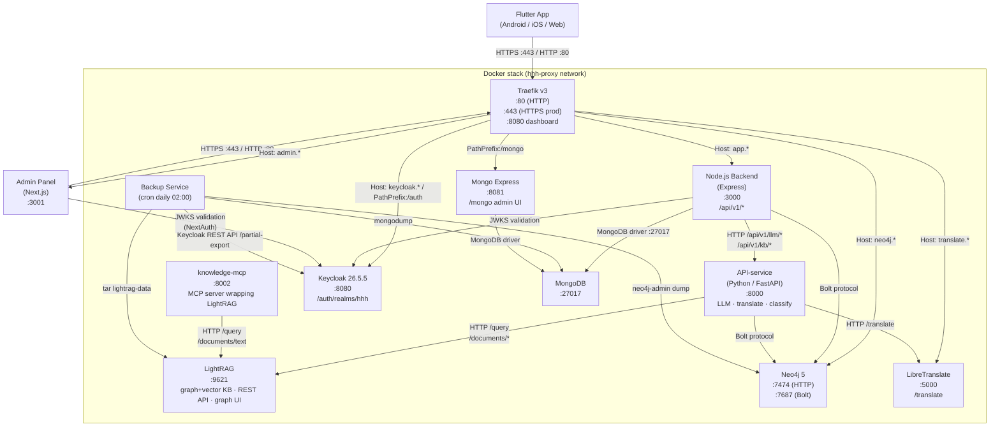
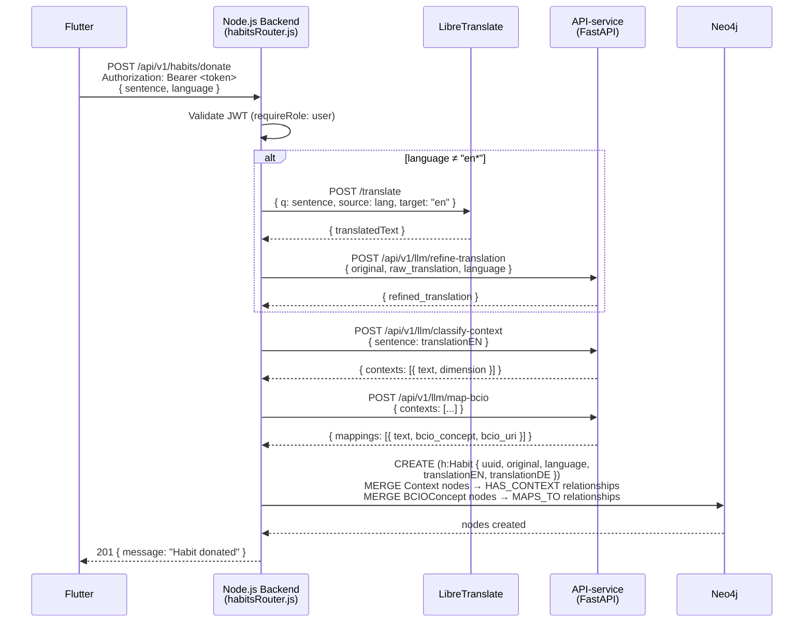
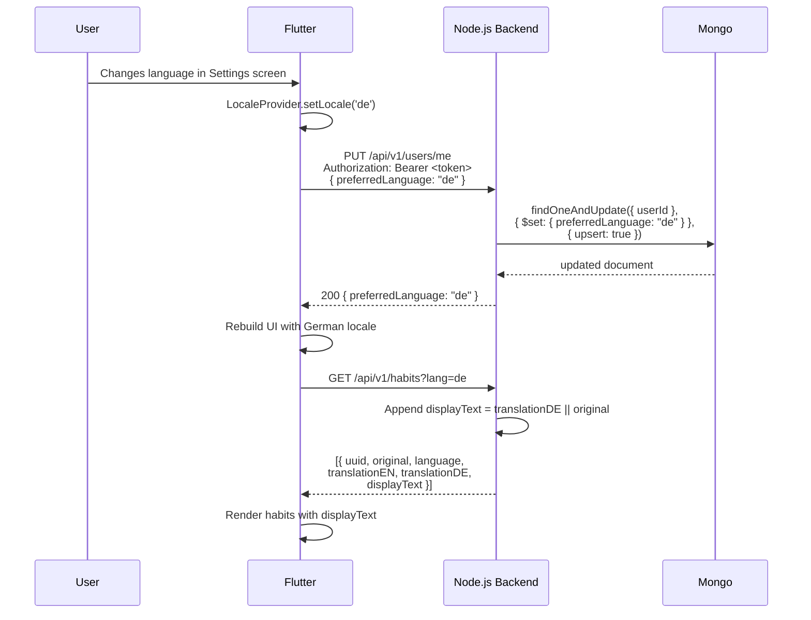
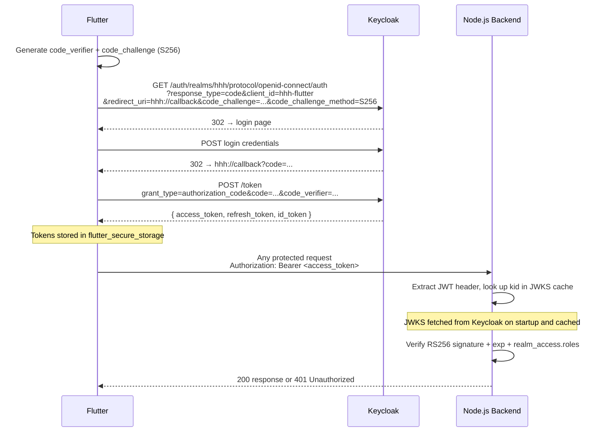
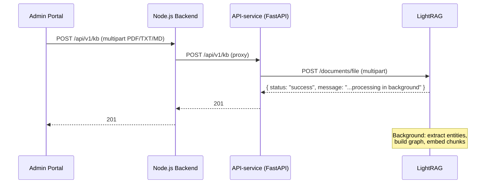

# Health Habit Hub — System Architecture

> **Related:** the full diagram suite (system architecture, UML use case diagram, 30 per-use-case sequence diagrams, domain class diagram) lives in [`docs/diagrams/`](diagrams/README.md) as renderable Mermaid/PlantUML sources. The use case catalogue with code traceability is in [`diagrams/use-cases/use-case-overview.md`](diagrams/use-cases/use-case-overview.md).

## Overview

Health Habit Hub (HHH) is a research platform for collecting, annotating, and recommending behavioural habits. It consists of thirteen Docker services orchestrated via `docker-compose`, a Flutter mobile/web app, a Next.js admin panel, and a Python-based recommender/enrichment microservice. All HTTP traffic is routed through a Traefik reverse proxy.

---

## Component Diagram



---

## Per-Service Reference Table

| Service | Technology | Purpose | Internal Port | External URL (dev) | Key Env Vars |
|---|---|---|---|---|---|
| **proxy** | Traefik v3.0 | Reverse proxy, TLS termination, routing | 8080 (dashboard) | `proxy.localhost:8888` | `TRAEFIK_HOST_PORT80`, `TRAEFIK_HOST_PORT8080`, `PATH_SUFFIX`, `ACME_EMAIL` (prod) |
| **app** | Node.js 20 + Express | REST API `/api/v1/*` | 3000 | `app.localhost:3000` | `MONGO_HOST`, `MONGO_USER`, `MONGO_PASSWORD`, `MONGO_DB`, `NEO4J_URI`, `NEO4J_USER`, `NEO4J_PASSWORD`, `KEYCLOAK_JWKS_URL`, `API_SERVICE_URL`, `LIBRE_TRANSLATE_URL`, `ALLOWED_ORIGINS` |
| **api-service** | Python 3.11 + FastAPI | LLM inference (context classification, BCIO mapping, translation refinement, RAG recommendations); KB CRUD proxied to LightRAG | 8000 | `localhost:8001` | `NEO4J_URI`, `NEO4J_USER`, `NEO4J_PASSWORD`, `REDIS_URL`, `LIGHTRAG_URL`, `LIGHTRAG_API_KEY` |
| **lightrag** | LightRAG 1.5.0 (Python) | Graph+vector knowledge base; builds entity graph from uploaded documents; exposes REST query API and built-in graph visualization UI | 9621 | `localhost:9622` | `LLM_API_BASE`, `LLM_API_KEY`, `LLM_MODEL`, `EMBEDDING_API_BASE`, `EMBEDDING_API_KEY`, `EMBEDDING_MODEL`, `LIGHTRAG_API_KEY` |
| **knowledge-mcp** | FastMCP (Python) | MCP server wrapping LightRAG; exposes `search_knowledge` and `ingest_document` tools for AI agent use via SSE transport | 8002 | `localhost:8002` | `LIGHTRAG_URL`, `LIGHTRAG_API_KEY` |
| **keycloak** | Keycloak 26.5.5 | OIDC/OAuth2 identity provider; manages realms, users, roles | 8080 | `localhost:8080` | `KEYCLOAK_ADMIN`, `KEYCLOAK_ADMIN_PASSWORD`, `KC_DB`, `KC_HTTP_RELATIVE_PATH` (prod) |
| **admin** | Next.js 14 (App Router), Recharts | Researcher/admin web panel: study management, dedicated analytics dashboard (Recharts, study filter, KPI cards, SRHI/active-rate/dropout/questionnaire charts, participant table), questionnaire management, cue pools, knowledge base, notification campaigns, settings | 3001 | `admin.localhost:3001` | `NEXTAUTH_URL`, `NEXTAUTH_SECRET`, `KEYCLOAK_ID`, `KEYCLOAK_SECRET`, `KEYCLOAK_ISSUER`, `KEYCLOAK_BROWSER_URL`, `KEYCLOAK_INTERNAL_URL`, `HHH_ADMIN_USER` |
| **neo4j** | Neo4j 5 | Graph database; stores habit graph with BCIO alignment | 7474 (HTTP), 7687 (Bolt) | `neo4j.localhost:7474` | `NEO4J_AUTH` (`user/password`) |
| **mongo** | MongoDB (latest) | Document store; holds questionnaires, form responses, recommendations, user preferences | 27017 | Internal only | `MONGO_INITDB_ROOT_USERNAME`, `MONGO_INITDB_ROOT_PASSWORD`, `MONGO_INITDB_DATABASE` |
| **mongo-express** | Mongo Express | MongoDB admin web UI (production only — not in docker-compose.local.yml) | 8081 | `https://<DOMAIN>/mongo` (prod only) | `ME_CONFIG_MONGODB_URL`, `ME_CONFIG_BASICAUTH_USERNAME`, `ME_CONFIG_BASICAUTH_PASSWORD` |
| **translate** | LibreTranslate | Self-hosted machine translation API (en/de/ja/fr/nl) | 5000 | `http://translate.localhost` (via Traefik) or `localhost:5001` (direct) | `LT_LOAD_ONLY`, `LT_REQ_LIMIT` |
| **backup** | Custom Alpine + daily loop | Daily backups of MongoDB, LightRAG, Neo4j, Keycloak; configurable retention (default 14 days) | — | Internal only | `BACKUP_RETENTION_DAYS`, `ALERT_WEBHOOK_URL`, `BACKUP_EMAIL`, `MONGO_USER`, `MONGO_PASSWORD` |

> **Flutter mobile/web**: Not a separate Docker container. Flutter runs natively on Android/iOS or as a compiled web app. In dev the backend is reached directly; in production the compiled web bundle may be hosted on the `app` service.
>
> **Admin panel**: Runs as a separate Docker container (`hhh-admin`) on port 3001. Uses NextAuth v4 + Keycloak for authentication and enforces `admin` or `researcher` realm roles at the middleware layer.

---

## Node.js Backend — Internal Module Structure

The `app/` service is internally organized into the following layers (as of the v1.2.0 clean-code refactor):

| Directory | Purpose |
|---|---|
| `app/routes/` | Thin Express routers — parameter extraction, auth middleware, delegating to services |
| `app/services/` | Business logic: `habitDonationService.js`, `adminParticipantService.js`, `adminHabitService.js`, `adminStatsService.js`, `keycloakAdminClient.js`; DFG study services: `habitConfigService.js`, `intentionService.js`, `dailyLogService.js`, `srhiService.js`, `cuePoolService.js`, `exportService.js`, `notificationCampaignService.js`, `studyAnalyticsService.js` |
| `app/db/` | Named Cypher query modules: `habitQueries.js`, `adminQueries.js` |
| `app/models/` | MongoDB collection validators and domain models (`study.js`, `enrollment.js`, `implementationIntention.js`, …) |
| `app/middleware/` | Express middleware: `auth.js` (JWT/JWKS), `roles.js` (ROLES constants, isPrivileged) |
| `app/utils/` | Infrastructure helpers: `getDb.js`, `healthCheck.js`, `translate.js`, `localization.js`, `constants.js` |

---

## End-to-End Donation Pipeline

The donation pipeline ingests a habit sentence from the Flutter app, enriches it with BCIO context classifications and machine translations, and persists everything to Neo4j.



### Pipeline Stages

| Stage | Service | Input | Output | Notes |
|---|---|---|---|---|
| Auth | Node.js Backend | JWT Bearer token | `req.user` with roles | JWKS fetched from Keycloak |
| Translation | LibreTranslate | `sentence` (non-English) | Raw English draft | Only runs when `language` does not start with `en` |
| Translation Refinement | API-service LLM | Raw English draft + original | Natural English | Falls back to raw draft on LLM timeout (10 s) |
| Context Classification | API-service LLM | `translationEN` | `[{ text, dimension }]` | Uses `classify-context` prompt |
| BCIO Mapping | API-service LLM | Context phrases | `[{ bcio_concept, bcio_uri }]` | Uses `map-bcio` prompt + RAG over `bcio.owl` |
| Graph Persistence | Neo4j | Enriched habit data | `Habit`, `Context`, `BCIOConcept` nodes | MERGE ensures idempotency |

---

## Language / Locale Flow



### Language Conventions

| Concern | Convention |
|---|---|
| Locale codes | ISO 639-1 two-letter: `"en"`, `"de"` (consistent across Flutter, backend, MongoDB) |
| `preferredLanguage` field | Stored in MongoDB `users` collection, keyed by Keycloak `sub` |
| `?lang=` query parameter | Supported on `GET /api/v1/habits`; triggers `displayText` field in response |
| Donation language detection | Flutter sends `language` field in POST body; backend uses it to decide whether to translate |
| `translationEN` | Stored on all non-English `Habit` nodes; `null` for English habits |
| `translationDE` | Stored on `Habit` nodes when German translation is available |
| Fallback | `displayText = translationXX || original` — `||` handles both `null` and `undefined` |

---

## Auth Flow



### Realm Roles

| Role | Granted to | Permissions |
|---|---|---|
| `user` | Study participants (end users of the Flutter app) | Donate habits, view recommendations, submit questionnaires |
| `researcher` | Research staff | All `user` permissions + admin panel access (excluding KB and Settings), questionnaire and study management |
| `admin` | Platform administrators | All `researcher` permissions + full admin panel access including Knowledge Base and Settings |

> **Note:** The `user` role was previously named `participant`. It was renamed across `app/middleware/roles.js`, `keycloak/hhh-realm.json`, and `scripts/seed-local.js` to align with Keycloak terminology and to avoid clashing with the domain term "participant" used in study admin contexts.

### Admin Panel Auth

The Next.js admin panel uses NextAuth v4 with the Keycloak provider. On each request, `src/middleware.ts` calls `getToken()` to validate the session JWT and additionally logs method, path, user `sub`, roles, and request latency (visible in `docker logs hhh-admin`). If the decoded token's `realm_access.roles` array does not include `admin` or `researcher`, the user is redirected to `/access-denied`. The Keycloak client used is `hhh-admin` (confidential client with client secret).

#### Inside the JWT callback

`realm_access.roles` is present on **access tokens** but absent from ID tokens (Keycloak default). The JWT callback in `admin/src/lib/auth.ts` therefore decodes roles from `account.access_token` directly rather than from the OIDC `profile` (ID token claims).

#### Docker-aware OIDC endpoints

Because Keycloak runs inside Docker but the browser runs on the host, the admin panel cannot rely on OIDC discovery (`wellKnown`) — the discovery document returns the internal Docker hostname (`http://keycloak:8080/...`) for the authorization endpoint, which browsers cannot resolve. The NextAuth provider instead sets endpoints explicitly:

| Endpoint | Resolves to | Env var |
|---|---|---|
| `authorization.url` | `http://localhost:8080` | `KEYCLOAK_BROWSER_URL` |
| `token` | `http://keycloak:8080` (internal) | `KEYCLOAK_INTERNAL_URL` |
| `userinfo` | `http://keycloak:8080` (internal) | `KEYCLOAK_INTERNAL_URL` |
| `jwks_endpoint` | `http://keycloak:8080` (internal) | `KEYCLOAK_INTERNAL_URL` |
| Issuer (`iss` validator) | `http://localhost:8080/realms/hhh` | `KEYCLOAK_ISSUER` |

Note that `KEYCLOAK_ISSUER` uses the **browser-facing** hostname even though token/JWKS calls go to the internal hostname. This is because Keycloak in `start-dev` mode stamps the `iss` claim on issued tokens from the browser-side Host header.

#### Page-level role guards

Beyond the middleware allow-list, the admin panel enforces fine-grained access control at the page level:

- `/knowledge-base` and `/settings` are admin-only — `researcher` users are redirected to `/access-denied`
- `/analytics`, `/studies`, `/cue-pools`, and `/questionnaires` are accessible to both `admin` and `researcher`
- The sidebar groups navigation into two labelled sections — **Research** (Studies, Analytics) and **Configuration** (Cue Pools, Questionnaires, Profile Fields, Knowledge Base, Settings) — and hides the admin-only Configuration entries for `researcher` users so the navigation reflects what they can actually open
- Flutter admin routes (when the admin Flutter UI is in use) are restricted to `admin` only

#### Analytics page (`/analytics`)

The standalone analytics dashboard (`admin/src/app/(admin)/analytics/page.tsx`) is the primary research-monitoring interface. It is accessible to both `admin` and `researcher` roles. Key features:

- **Study selector** — dropdown populated from `GET /admin/studies`; defaults to the first active study; switching reloads all data
- **KPI cards** — total enrolled, active last 7 days (%), dropout count + rate (colour-coded amber/red above 10%/20%), mean SRHI at the latest week, mean questionnaire completion rate
- **Charts (Recharts)** — vertical BarChart for per-group weekly active rate; LineChart for SRHI trajectory per group with a habit-threshold reference line at score 4; step-after LineChart for cumulative dropout; horizontal BarChart for per-questionnaire completion rates
- **Participant table** — all enrolled participants for the selected study with username, group, enrolled date, last-active date, inline survey-completion mini-bar, and active/inactive/dropped-out status badge
- **Participant detail drawer** — clicking any participant row opens a slide-over panel showing: summary stats (habits, surveys, recommendations, profile completion, last active), a **Reminders** section (see below), completed surveys list, and a chronological activity timeline

Data sources: `GET /admin/studies/:id/analytics` (analytics), `GET /admin/studies/:id/participants` (participant table), `GET /admin/participants/:id/progress` (drawer summary + timeline), `GET /admin/participants/:id/reminder-plans` (drawer Reminders section).

#### Local admin user provisioning

In local development, the `keycloak-init` container automatically creates a user in the `hhh` realm with both `admin` and `researcher` roles, using `HHH_ADMIN_USER` (default `admin`) as the username and `KEYCLOAK_ADMIN_PASSWORD` as the password. Demo users (`demo-admin`, `demo-researcher`) have been removed from `keycloak/hhh-realm.json`.

---

## M3 Recommendation Pipeline

The recommendation pipeline runs entirely inside the **API-service** (Python / FastAPI). It is triggered by `POST /api/v1/recommend/generate` on the Node.js backend, which proxies the request (with a service token) to `POST /api/v1/llm/recommend`.

The full data-flow diagram is at [`docs/diagrams/architecture/recommendation-pipeline.mmd`](diagrams/architecture/recommendation-pipeline.mmd). The per-step sequence diagram is at [`docs/diagrams/sequences/UC-07-request-recommendations.mmd`](diagrams/sequences/UC-07-request-recommendations.mmd).

### Pipeline stages

**Step 0 — Goal guarding (before any pipeline work)**
The `goal` field is untrusted end-user input and is screened twice:

1. **Heuristic screen** — a regex (English + German) rejects obvious prompt-injection phrases ("forget all previous instructions", "ignoriere alle vorherigen Anweisungen", "system prompt", "jailbreak", …) instantly with **HTTP 422** and a friendly message — no LLM call is spent.
2. **LLM backstop** — the final LLM call carries a system message that treats the goal strictly as data. If the goal is not a legitimate health/behaviour goal (injection, harmful, illegal, or off-topic requests), the model returns `{"refused": true, "reason": …}`, which the API converts to **HTTP 422** with the reason as `detail`. The Flutter app displays this reason verbatim.

Refusals are logged (with the offending goal) and never cached.

**Step 1 — Cache check**
Redis `GET recommend:{sha256(user_id‖goal)}`. On a hit the cached `RecommendResponse` is returned immediately without any LLM or Neo4j calls.

**Stage 1 — 7-way parallel data fetch** (`asyncio.gather`, zero LLM calls)

| Fetch | Source | What happens |
|---|---|---|
| Personal habits | Neo4j (1 session, ≤200 rows) | `MATCH (h:Habit {userID, is_habit:true})` with stored embeddings; cosine-ranked in Python vs the goal embedding; top `USER_HABITS_LIMIT` kept |
| Community habits | Neo4j (3 parallel sessions) | 3-index fan-out — `habit_embedding_idx` (sentence), `context_embedding_idx` (situational), `bcio_embedding_idx` (behaviour-change concept); merged by max score → top `COMMUNITY_HABITS_LIMIT` |
| Questionnaire responses | Node.js service endpoint | `GET /questionnaire-responses/service/{userId}` — enrollment → study → questionnaire slugs → latest responses (adapts to any study config) |
| User profile | Node.js service endpoint | `GET /user-profile/service/{userId}` |
| Annotated habits | MongoDB + Neo4j | `habit_annotations.find({userId, type:{$in:['helpful','iDoThis','like']}})` → matching Habit nodes fetched from Neo4j with context |
| Prior feedback | MongoDB | Last 10 `recommendation_feedback` comments for this user + goal |
| Previous titles | MongoDB | Titles from the user's last 5 recommendation sets (≤15 titles, deduplicated) — fed back so consecutive generations do not repeat themselves |

**Stage 2 — deterministic processing** (zero LLM calls)
`build_profile()` template-assembles `profile_summary`, `profile_detailed`, and `rag_query` from questionnaire responses + demographics *(replaces the former LLM-2 call)*. GDS FastRP re-ranking scores each community habit `0.5 × semantic + 0.3 × graph-topology (cosine vs user centroid) + 0.2 × log-normalised likes` *(replaces the former LLM-1 selection call)*.

**Stage 3 — parallel enrichment** (2-way `asyncio.gather`)
BCIO concepts per candidate habit (Neo4j `MAPS_TO` traversal) and LightRAG hybrid retrieval (`POST /query`, `mode=hybrid`, `only_need_context=true`, 90 s timeout). The retrieval step also extracts **per-document provenance**: the distinct source-document filenames found in the LightRAG context identify which academic papers ground this response (see *Paper citations* below).

**Stage 4 — single LLM call** (`recommend.txt`)
Model `LLM_RECOMMEND_MODEL` (falls back to `LLM_MODEL`), temperature 0.2, optional completion cap `LLM_RECOMMEND_MAX_TOKENS`. The LightRAG context pasted into the prompt is capped at `RECOMMEND_MAX_CONTEXT_CHARS`. The prompt instructs the model to:

- write `title`, `body`, `rationale`, and `suggested_cue` **in the language of the goal** (German goal → German output),
- propose a concrete `suggested_cue` ("when/where" trigger phrase) per recommendation for the implementation-intention flow,
- not repeat habits the user already practises or was previously recommended,
- cite papers per recommendation via `source_filenames` (validated server-side against the actually retrieved documents),
- keep rationales in plain language — no UUIDs, BCIO codes, or other internal identifiers.

**Stage 5 — response shaping, persist, cache**
Cited filenames are resolved to user-facing citations via `citations.py`. `selected_habit_uuids` (graph provenance) is **logged and stored in MongoDB for debugging but stripped from the client response**. The full result is stored in MongoDB `recommendations` and cached in Redis (24 h TTL).

### Paper citations

Knowledge-base PDFs follow the Zotero export pattern `Authors - Year - Title.pdf`. For every cited document, `API-service/citations.py` produces `{filename, title, authors, year, url, citation}`:

- If `API-service/data/references.json` has a curated entry for the filename, its `url` (ideally a DOI link) and optional metadata are used → the app renders a **tappable citation**.
- Otherwise the citation is shown as plain `Author (Year) — Title` text, parsed from the filename. **No links are guessed or fabricated.**

To add a link for a new paper, add its DOI to `data/references.json`:

```json
{
  "Wood and Rünger - 2016 - Psychology of Habit.pdf": {
    "url": "https://doi.org/10.1146/annurev-psych-122414-033417"
  }
}
```

If the LLM cites a hallucinated filename (or none), the response falls back to attaching all retrieved papers, so evidence links are never lost.

### Pipeline input reference

Every data source queried during a single recommendation run:

| Stage | Source | Query / call |
|---|---|---|
| **Entry point** | Node.js backend proxy | `POST /api/v1/llm/recommend {user_id, goal, session_id}` with `X-Service-Auth-Token` header |
| **Goal guard** | in-process regex + LLM system message | Injection/off-topic goals → HTTP 422 with user-facing reason |
| **Cache check** | Redis | `GET recommend:{sha256(user_id‖goal)}` — hit returns cached response; miss continues pipeline |
| **Personal habits** | Neo4j (1 session, ≤200 rows) | `MATCH (h:Habit {userID: $user_id, is_habit: true}) OPTIONAL MATCH (h)-[:HAS_CONTEXT]->(c:Context) RETURN h.uuid, coalesce(h.translationEN, h.sentence), collect({dimension: c.dimension, text: c.text}), h.embedding` — cosine-ranked in Python, top `USER_HABITS_LIMIT` kept |
| **Community — sentence** | Neo4j `habit_embedding_idx` | `CALL db.index.vector.queryNodes('habit_embedding_idx', $limit, $embedding)` … excluding the requesting user |
| **Community — context** | Neo4j `context_embedding_idx` | `CALL db.index.vector.queryNodes('context_embedding_idx', $limit, $embedding)` … situational / `INTERNAL_STATE` match |
| **Community — BCIO** | Neo4j `bcio_embedding_idx` | `CALL db.index.vector.queryNodes('bcio_embedding_idx', $limit, $embedding)` … behaviour-change concept match |
| **Annotated habits** | MongoDB `habit_annotations` + Neo4j | `db.habit_annotations.find({userId, type: {$in: ["helpful","iDoThis","like"]}}, {habitId:1, _id:0})` → fetch matching Habit nodes from Neo4j with context |
| **Questionnaire responses** | Node.js service endpoint | `GET /api/v1/questionnaire-responses/service/{userId}` with `X-Service-Auth-Token` (all slugs of the user's enrolled study) |
| **User profile** | Node.js service endpoint | `GET /api/v1/user-profile/service/{userId}` with `X-Service-Auth-Token` |
| **Profile build** | deterministic (`_profile_builder.py`) | `build_profile()` → `profile_summary`, `profile_detailed`, `rag_query` — no LLM call |
| **GDS re-ranking** | Neo4j GDS FastRP | user centroid from `fastrp_embedding` vectors → hybrid score per community habit — no LLM call |
| **BCIO concepts** | Neo4j | `MATCH (h)-[:HAS_CONTEXT]->(c)-[:MAPS_TO]->(b:BCIOConcept) WHERE h.uuid IN $uuids RETURN h.uuid, collect(DISTINCT b.label)` |
| **RAG retrieval** | LightRAG (timeout 90 s) | `POST /query {query: rag_query, mode: "hybrid", only_need_context: true}` — context capped at `RECOMMEND_MAX_CONTEXT_CHARS`; distinct document filenames extracted for citations |
| **Prior feedback** | MongoDB `recommendation_feedback` | `db.recommendation_feedback.find({userId, goal}, {comment: 1, _id: 0}).sort({created_at: -1}).limit(10)` |
| **Previous titles** | MongoDB `recommendations` | Titles of the user's last 5 recommendation sets (≤15, deduplicated) — anti-repetition context |
| **Cache write** | Redis | `SETEX recommend:{sha256} 86400 <serialised RecommendResponse>` |
| **Persist result** | MongoDB `recommendations` | `db.recommendations.insertOne({recommendation_id, userId, goal, session_id, recommendations, generated_at})` — includes `selected_habit_uuids` for debugging |

**Final LLM prompt** (`recommend.txt`, temperature 0.2, model `LLM_RECOMMEND_MODEL`) receives these variables:

| Variable | Populated from |
|---|---|
| `{goal}` | Entry point request body — delimited `<<<…>>>` and marked untrusted |
| `{profile_summary}` | `build_profile()` (deterministic) |
| `{profile_detailed}` | `build_profile()` (deterministic) |
| `{personal_habits_json}` | Cosine-ranked personal habits — `[{uuid, sentence, context, bcio_concepts, likes}]` (compact JSON) |
| `{annotated_habits_json}` | Habits the user liked/saved — MongoDB `habit_annotations` → Neo4j |
| `{community_habits_json}` | GDS FastRP re-ranked community habits |
| `{sources_json}` | LightRAG hybrid context (capped at `RECOMMEND_MAX_CONTEXT_CHARS`) |
| `{source_documents_json}` | `[{filename, citation}]` — papers the model may cite in `source_filenames` |
| `{prior_feedback}` | MongoDB `recommendation_feedback` comments, one per line (or `"None"`) |
| `{previous_titles}` | Titles previously recommended to this user (or `"None"`) |

The LLM returns `{recommendations: [{title, body, rationale, suggested_cue, selected_habit_uuids, source_filenames}]}` — or `{"refused": true, "reason": …}` when the goal guard triggers. The client response exposes `title · body · rationale · suggested_cue · sources` (citations with optional links); `selected_habit_uuids` stays server-side.

The detailed data-flow with all queries is rendered in [`docs/diagrams/architecture/recommendation-pipeline.mmd`](diagrams/architecture/recommendation-pipeline.mmd). The LLM call structure and final prompt composition are shown in [`docs/diagrams/sequences/UC-recommend-llm-prompt.mmd`](diagrams/sequences/UC-recommend-llm-prompt.mmd).

### Configurable limits

| Env var | Default | Effect |
|---|---|---|
| `USER_HABITS_LIMIT` | `10` | Max personal habits passed to LLM |
| `COMMUNITY_HABITS_LIMIT` | `10` | Max community habits from vector search |
| `REDIS_TTL_SECONDS` | `86400` | Cache TTL in seconds |
| `RECOMMENDER_TIMEOUT_MS` | `180000` | Proxy timeout on Node.js side |
| `LLM_RECOMMEND_MODEL` | *(unset → `LLM_MODEL`)* | Model used only for the final recommendation-writing call (e.g. a fast non-thinking model) |
| `RECOMMEND_MAX_CONTEXT_CHARS` | `0` (unlimited; `.env` sets `30000`) | Cap on the LightRAG context pasted into the prompt — main latency lever |
| `LLM_RECOMMEND_MAX_TOKENS` | `0` (model default; `.env` sets `2000`) | Hard cap on the completion length |
| `LLM_TIMEOUT_S` | `120` | Per-attempt timeout for all API-service LLM calls |
| `LLM_MAX_RETRIES` | `0` | OpenAI-client retries; kept at 0 so a slow LLM fails fast instead of 504ing through the proxy |
| `MONGO_SERVER_SELECTION_TIMEOUT_MS` | `5000` | MongoDB server-selection/connect timeout — failed Mongo fetches degrade gracefully instead of blocking 30 s |
| `MONGO_SOCKET_TIMEOUT_MS` | `5000` | MongoDB socket timeout |

### Seeding test data

The community vector search requires `Habit` nodes in Neo4j with stored embeddings. To seed the graph with the 100 test habits run:

```bash
python3 scripts/seed-habits.py [--mode seed] [--concurrency 5] [--dry-run]
```

This bypasses the habit classifier (all 100 sentences are pre-verified habits), calls `classify-context` → `map-bcio` → `embed-batch` for each, and writes Habit + Context + BCIOConcept nodes directly to Neo4j. Habits are distributed across 10 synthetic seed user IDs so the `exclude_user_id` filter works correctly. The script is idempotent — re-running skips habits that already have embeddings.

### Knowledge base & document ingestion

The knowledge base stores academic papers and documents that inform habit recommendations. Admins upload PDF, TXT, or MD files via the admin portal. LightRAG processes each document and builds two parallel indexes:

1. **Knowledge graph** — LightRAG extracts key concepts and relationships from the document text using the LLM. For example, from a sleep paper it might extract `sleep → improves → recovery` as a graph edge.
2. **Vector index** — The same document chunks are embedded and stored for dense similarity search.



### MCP server

The `knowledge-mcp` container exposes the knowledge base as Model Context Protocol tools over SSE at `http://localhost:8002/sse`. Claude Desktop or Claude Code can connect to it and call `search_knowledge` (queries LightRAG) or `ingest_document` (inserts text). Every tool call is logged to stdout with the query and LightRAG response status.

### Graph visualization

LightRAG's built-in web UI is served at `http://localhost:9622` (local) and can be reached via SSH tunnel on the server. The admin portal "View Graph" button links directly to this UI. It shows the entity graph built from all uploaded documents — useful for verifying that LightRAG has correctly extracted concepts.

---

## Data Storage Rationale

| Store | Technology | What is stored | Why |
|---|---|---|---|
| **Graph DB** | Neo4j 5 | `Habit`, `Context`, `BCIOConcept` nodes and `HAS_CONTEXT`, `MAPS_TO` relationships | Graph traversal for habit similarity, BCIO alignment queries, and recommender reads |
| **Document DB** | MongoDB | `users` (preferences), `questionnaires`, `form_responses`, `recommendations`, `recommendation_feedback`; DFG collections: `implementation_intentions`, `daily_behavior_logs`, `srhi_responses`, `cue_pools`, `notification_campaigns` | Flexible schema for survey/form data; no strong relational joins required |
| **Triplestore** *(retired)* | Apache Jena Fuseki | BCIO ontology (`Ontology.ttl`, `schema.ttl`, `data.ttl`) | **Removed from the compose stack** — BCIO mapping now uses in-process embeddings in the API-service; ontology sections below are kept for historical reference (see `docs/migration.md`) |
| **Vector search** | Neo4j vector indexes (`habit_embedding_idx`, `context_embedding_idx`, `bcio_embedding_idx`) + in-process cosine (API-service) | Habit sentence embeddings, context phrase embeddings, BCIO concept embeddings | Three-index fan-out for community habit retrieval in M3.1; in-process cosine for ranking a user's own habits against the goal |
| **Graph+vector KB** | LightRAG (file-based) | Knowledge graph of concepts/relationships extracted from uploaded documents + vector embeddings | Hybrid retrieval for habit recommendations; graph captures semantic relationships, vector handles dense similarity |

### Neo4j Schema (Current)

```
(:Habit {
    uuid, sentence, language, translationEN, translationDE,
    is_habit, habit_confidence, userID, created_at,
    embedding,              ← 2560-dim vector (habit_embedding_idx)
    annotations_like, annotations_helpful, annotations_iDoThis
})
  -[:HAS_CONTEXT {dimension}]->
(:Context {
    text, dimension,
    embedding               ← 2560-dim vector (context_embedding_idx)
})
  -[:MAPS_TO {phrase, dimension, mapping_confidence}]->
(:BCIOConcept {
    bcio_concept_id, bcio_concept_label,
    embedding               ← 2560-dim vector (bcio_embedding_idx)
})
```

**Vector indexes** (created at startup via `neo4j/init/constraints.cypher`):

| Index | Node property | Used by |
|---|---|---|
| `habit_embedding_idx` | `Habit.embedding` | Community sentence search in M3.1 |
| `context_embedding_idx` | `Context.embedding` | Community situational search in M3.1 |
| `bcio_embedding_idx` | `BCIOConcept.embedding` | Community behaviour-technique search in M3.1 |

All three indexes use cosine similarity with 2560 dimensions (configurable via `EMBEDDING_DIMENSIONS`).

> **Note:** The legacy n10s/RDF schema (`hhh__Habit`, `hhh__Donor`) was fully retired in 2026-06 — no legacy data existed, the writer code was removed, and the n10s plugin is no longer loaded. See `docs/migration.md`.

---

## Ontology

> **Note (2026-06):** the Fuseki triplestore has been removed from the deployment. The ontology reference below documents the RDF model used by the legacy pipeline and remains relevant for interpreting historical data and the BCIO concept space.

### Namespaces

| Prefix | URI | Description |
|---|---|---|
| `hhh:` | `http://example.com/hhh#` | HHH domain ontology (habits, donors, groups) |
| `bcio:` | `http://humanbehaviourchange.org/ontology/BCIO#` | Behaviour Change Intervention Ontology |
| `owl:` | `http://www.w3.org/2002/07/owl#` | OWL 2 Web Ontology Language |
| `rdfs:` | `http://www.w3.org/2000/01/rdf-schema#` | RDF Schema |
| `xsd:` | `http://www.w3.org/2001/XMLSchema#` | XML Schema Datatypes |

### HHH Core Classes

| Class | URI | Description |
|---|---|---|
| `hhh:Donor` | `hhh:Donor` | A study participant who donates habits |
| `hhh:Habit` | `hhh:Habit` | A donated habit instance |
| `hhh:Behavior` | `hhh:Behavior` | The action component of a habit |
| `hhh:Context` | `hhh:Context` | The situational trigger for a habit |
| `hhh:InternalState` | subclass of `Context` | Self-reported psychological state |
| `hhh:PhysicalSetting` | subclass of `Context` | Physical environment where habit occurs |
| `hhh:TimeReference` | subclass of `Context` | Time-based trigger |
| `hhh:People` | subclass of `Context` | Social context |
| `hhh:PriorBehavior` | subclass of `Context` | Preceding behaviour trigger |
| `hhh:Reasoning` | subclass of `Context` | Cognitive reasoning trigger |
| `hhh:ExperimentalSetting` | `hhh:ExperimentalSetting` | Study arm superclass (G1–G4) |

### BCIO Integration Point

The BCIO is merged inline into `fuseki/init/Ontology.ttl`. Key alignment points:

- `hhh:Behavior` → partial alignment with `bcio:BehaviourChangeTechnique`
- `hhh:Context` → partial alignment with `bcio:Setting`
- `hhh:InternalState` → possible alignment with `bcio:MechanismOfAction`

All alignments are marked `TODO: domain-review` in the ontology and should be validated by a domain expert before formal publication.

### G1–G4 Experimental Group Encoding

| Class | rdfs:comment | Description |
|---|---|---|
| `hhh:Group1` | Closed-Ended | Both task + general sections are closed-ended |
| `hhh:Group2` | Closed-Ended Task, Opened-Ended General | Structured task section; free-text general section |
| `hhh:Group3` | Opened-Ended Task, Closed-Ended General | Free-text task section; structured general section |
| `hhh:Group4` | Opened-Ended | Both sections are free-text |

---

## DFG Study Module

### Purpose

The DFG study module (DFG CuB — Contextual Cues for Habit Formation) extends the platform with a longitudinal research protocol. Participants form implementation intentions, log daily behaviour, and complete weekly SRHI (Self-Report Habit Index) check-ins. Researchers configure per-group cue pools and receive automated analytics and CSV exports.

### Architecture Overview

The module is layered on top of the existing Node.js backend and MongoDB. A single resolved-config endpoint (`GET /me/habit-config`) returns the cue configuration for the participant's study group (or the public default), together with pre-rated cues drawn randomly from the assigned pool and the SRHI item list. This drives the Flutter "My Habits" tab.

Data flow:

1. **Intention creation** — participant selects a behaviour, trigger cue, and time; `intentionService.js` persists the intention and enforces the per-study `maxHabits` cap.
2. **Daily logging** — participant marks habit done/not-done; `dailyLogService.js` performs an idempotent upsert keyed on `(intentionId, date)`.
3. **SRHI check-in** — `srhiService.js` computes the next due window per intention and accepts a 12-item response; scores are stored for trajectory analysis.
4. **Export** — `exportService.js` builds three CSVs (SRHI responses, daily logs, dropouts) bundled as a ZIP for researcher download.

### API Route Groups

| Route prefix | Description |
|---|---|
| `GET /me/habit-config` | Resolved cue config + assigned cues + SRHI items for the authenticated user |
| `/habits/intentions` | Implementation intention CRUD and status updates |
| `/habits/intentions/:id/logs` | Daily behaviour log creation and history |
| `/srhi/*` | SRHI due-window query, weekly submission, and trajectory history |
| `/admin/cue-pools` | Cue pool CRUD and bulk CSV import |
| `/admin/studies/:id/analytics` | Per-group weekly active rate, SRHI trajectory, dropout curve, questionnaire completion rates |
| `/admin/studies/:id/export` | Research data ZIP download (3 CSVs) |
| `/admin/notifications` | Researcher FCM notification campaign management |
| `/admin/studies/:id/groups/:groupId/cue-config` | Per-group cue source, count, and behaviour config |

### Adaptive Reminder Fading (UC-33)

Participants pick a daily reminder time (`reminderTime`, `HH:mm`) when
creating an implementation intention. The backend then computes a per-intention
**reminder plan** that fades notification frequency as the habit becomes
automatic — reminders are scaffolding (Lally et al. 2010), and keeping them
constant risks reminder blindness while removing them too early collapses
fragile habits.

**Autonomy score** (`app/services/reminderPlanService.js` — transparent and
pre-registerable by design; per-user samples are far too small for ML, and the
fading rule must be explainable to the ethics board):

```
autonomy = 0.5 · srhiNorm + 0.35 · adherence14d + 0.15 · streakNorm

srhiNorm     = (latest weekly SRHI − 1) / 6          // 1–7 scale → 0–1
adherence14d = enacted days in the past 14 days / 14  // today excluded
streakNorm   = min(current streak, 14) / 14
```

**Tier mapping** (score lower bounds): `daily` → ≥0.45 `every_2_days` →
≥0.60 `twice_weekly` → ≥0.75 `weekly` → ≥0.90 `off`.

Two stabilisers:

- **Hysteresis (fading is slow):** tiers beyond `every_2_days` additionally
  require the *previous* week's SRHI to support the same tier — one good week
  is not yet automaticity.
- **Recovery (escalation is fast):** if 7-day adherence drops below 0.5, the
  plan snaps back to `daily` immediately, regardless of SRHI.

**Researcher tuning:** weights and the recovery threshold are read from
`admin_settings` keys `reminder_weight_srhi`, `reminder_weight_adherence`,
`reminder_weight_streak`, `reminder_recovery_adherence` — making reminder
fading itself an experimental factor (per the Prüfplan).

**Flow:** the app calls `GET /api/v1/habits/intentions/reminder-plans`
(plans include `autonomyScore` and all components for transparency) on app
start, after intention creation, and after each SRHI submission, then
cancels and reschedules local notifications for the next 14 days
(`mobile/lib/services/reminder_scheduler_service.dart`,
`flutter_local_notifications` + `timezone`). No server push is involved —
reminders fire on-device. See `docs/diagrams/sequences/UC-33-adaptive-reminders.mmd`.

**Admin visibility:** `GET /api/v1/admin/participants/:id/reminder-plans`
(admin/researcher roles) returns the same plan payload for any participant.
It is surfaced in the Analytics page participant detail drawer as the
**Reminders** section, showing: current frequency tier (colour-coded badge),
autonomy score with progress bar, and a per-component breakdown table
(SRHI ×0.50 / Adherence 14d ×0.35 / Streak ×0.15 with raw value and weighted
contribution). If the participant has no active intentions the section reads
"No active intentions".

### Community Signals: Likes & Comments (UC-34)

Participants can like and comment on habits in the explore graph. Likes are a
third annotation type (`POST /habits/:uuid/annotate {type: "like"}`,
deduplicated per user in `habit_annotations`, mirrored as `annotations_like`
on the `Habit` node). Comments are **anonymous** `(:Comment {id, text,
createdAt})-[:COMMENT_ON]->(:Habit)` nodes; authorship is recorded only in
MongoDB `habit_comments` so account deletion can erase a participant's
comments without de-anonymising the graph. Like counts flow into the
recommendation pipeline: the community-habit vector search returns
`community_likes` per habit and the LLM prompt instructs preferring
well-liked habits when they fit the user.

### New MongoDB Collections

| Collection | Purpose |
|---|---|
| `implementation_intentions` | Participant intentions (behaviour, cue, time, status) |
| `daily_behavior_logs` | Idempotent daily done/not-done logs keyed on intention + date |
| `srhi_responses` | Weekly SRHI submissions with computed composite score |
| `cue_pools` | Named pools of pre-rated contextual cues; supports per-group assignment |
| `notification_campaigns` | Researcher-authored FCM push campaigns with schedule and target group |

---

*Updated: 2026-06-10 | Fuseki removed from architecture docs (service retired from compose stack); backup targets corrected*

*Updated: 2026-06-10 | Diagram suite added under `docs/diagrams/` (architecture, use cases, 30 sequence diagrams, class diagram)*

*Updated: 2026-06-03 | LightRAG upgraded to 1.5.0*

*Updated: 2026-06-02 | DFG study module added*

*Updated: 2026-05-09 | Branch: platform_unified — LightRAG knowledge base added*
