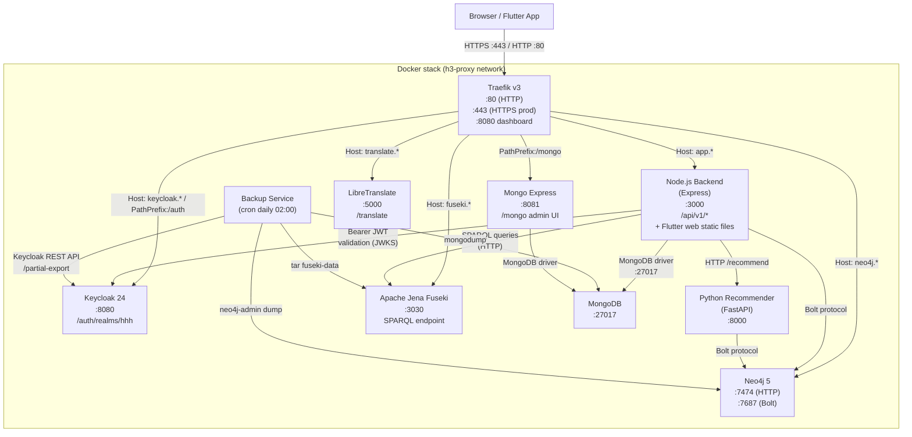
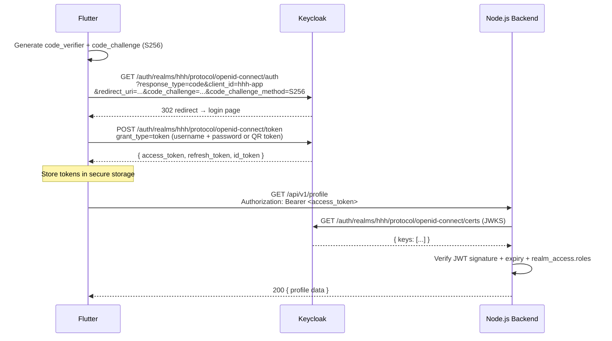
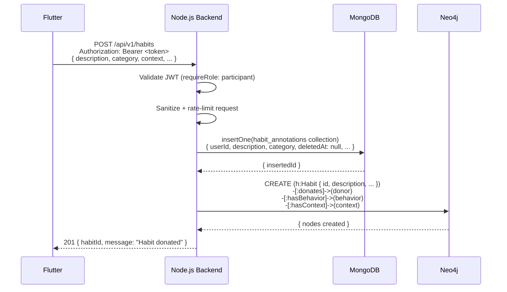
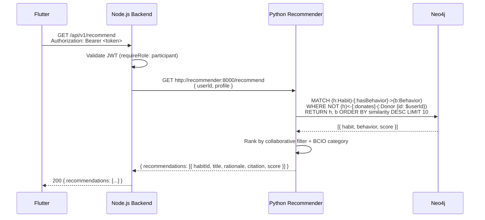

# Health Habit Hub — System Architecture

## Overview

Health Habit Hub (HHH) is a research platform for collecting, annotating, and recommending behavioural habits. It consists of ten Docker services orchestrated via `docker-compose`, a Flutter mobile/web app, and a Python-based recommender microservice. All HTTP traffic is routed through a Traefik reverse proxy.

---

## System Overview Diagram



---

## Per-Service Reference Table

| Service | Technology | Purpose | Internal Port | External URL (dev) | Key Env Vars |
|---|---|---|---|---|---|
| **proxy** | Traefik v3.0 | Reverse proxy, TLS termination, routing | 8080 (dashboard) | `proxy.localhost:8888` | `TRAEFIK_HOST_PORT80`, `TRAEFIK_HOST_PORT8080`, `PATH_SUFFIX`, `ACME_EMAIL` (prod) |
| **app** | Node.js 20 + Express | REST API `/api/v1/*`; serves Flutter web static files from `/public/flutter/` | 3000 | `app.localhost:3000` | `MONGO_HOST`, `MONGO_USER`, `MONGO_PASSWORD`, `MONGO_DB`, `NEO4J_URI`, `NEO4J_USER`, `NEO4J_PASSWORD`, `KEYCLOAK_URL`, `RECOMMENDER_URL`, `NODE_ENV` |
| **keycloak** | Keycloak 24 | OIDC/OAuth2 identity provider; manages realms, users, roles | 8080 | `localhost:8080` | `KEYCLOAK_ADMIN`, `KEYCLOAK_ADMIN_PASSWORD`, `KC_DB`, `KC_HTTP_RELATIVE_PATH` (prod) |
| **recommender** | Python + FastAPI | Habit recommendation engine; reads Neo4j graph | 8000 | `localhost:8000` | `NEO4J_URI`, `NEO4J_USER`, `NEO4J_PASSWORD` |
| **fuseki** | Apache Jena Fuseki | SPARQL triplestore; stores HHH + BCIO ontology | 3030 | `fuseki.localhost:3030` | `ADMIN_PASSWORD` |
| **neo4j** | Neo4j 5 (n10s plugin) | Graph database; stores habit graph with BCIO alignment | 7474 (HTTP), 7687 (Bolt) | `neo4j.localhost:7474` | `NEO4J_AUTH` (`user/password`), `NEO4J_PLUGINS` |
| **mongo** | MongoDB (latest) | Document store; holds survey results, profiles, annotations, admin settings | 27017 | Internal only | `MONGO_INITDB_ROOT_USERNAME`, `MONGO_INITDB_ROOT_PASSWORD`, `MONGO_INITDB_DATABASE` |
| **mongo-express** | Mongo Express | MongoDB admin web UI | 8081 | `localhost/mongo` | `ME_CONFIG_MONGODB_URL`, `ME_CONFIG_BASICAUTH_USERNAME`, `ME_CONFIG_BASICAUTH_PASSWORD` |
| **translate** | LibreTranslate | Self-hosted machine translation API (en/de/ja) | 5000 | `translate.localhost:5000` | `LT_LOAD_ONLY`, `LT_REQ_LIMIT` |
| **backup** | Custom Alpine + cron | Daily backups of MongoDB, Fuseki, Neo4j, Keycloak; 30-day retention | — | Internal only | `BACKUP_RETENTION_DAYS`, `ALERT_WEBHOOK_URL`, `BACKUP_EMAIL`, `MONGO_USER`, `MONGO_PASSWORD` |

> **Flutter web**: Not a separate Docker container. The Flutter app is compiled with `flutter build web` and the output is copied to `app/public/flutter/`. Traefik routes all traffic to the Node.js backend, which serves the static files.

---

## Sequence Diagrams

### 1. Keycloak PKCE Login Flow



### 2. Habit Donation Flow



### 3. Recommendation Request Flow



---

## Ontology

### Namespaces

| Prefix | URI | Description |
|---|---|---|
| `hhh:` | `http://example.com/hhh#` | HHH domain ontology (habits, donors, groups) |
| `bcio:` | `http://humanbehaviourchange.org/ontology/BCIO#` | Behaviour Change Intervention Ontology |
| `owl:` | `http://www.w3.org/2002/07/owl#` | OWL 2 Web Ontology Language |
| `rdfs:` | `http://www.w3.org/2000/01/rdf-schema#` | RDF Schema |
| `xsd:` | `http://www.w3.org/2001/XMLSchema#` | XML Schema Datatypes |

### HHH Core Classes

| Class | URI | Description |
|---|---|---|
| `hhh:Donor` | `hhh:Donor` | A study participant who donates habits |
| `hhh:Habit` | `hhh:Habit` | A donated habit instance |
| `hhh:Behavior` | `hhh:Behavior` | The action component of a habit |
| `hhh:Context` | `hhh:Context` | The situational trigger for a habit |
| `hhh:InternalState` | subclass of `Context` | Self-reported psychological state |
| `hhh:PhysicalSetting` | subclass of `Context` | Physical environment where habit occurs |
| `hhh:TimeReference` | subclass of `Context` | Time-based trigger |
| `hhh:People` | subclass of `Context` | Social context |
| `hhh:PriorBehavior` | subclass of `Context` | Preceding behaviour trigger |
| `hhh:Reasoning` | subclass of `Context` | Cognitive reasoning trigger |
| `hhh:ExperimentalSetting` | `hhh:ExperimentalSetting` | Study arm superclass (G1–G4) |

### BCIO Integration Point

The BCIO is merged inline into `fuseki/init/Ontology.ttl`. Key alignment points:

- `hhh:Behavior` → partial alignment with `bcio:BehaviourChangeTechnique` (HHH Behavior is user-reported action; BCIO BCT is an intervention technique)
- `hhh:Context` → partial alignment with `bcio:Setting` (HHH Context is the habit trigger; BCIO Setting is the intervention delivery environment)
- `hhh:InternalState` → possible alignment with `bcio:MechanismOfAction`

All alignments are marked `TODO: domain-review` in the ontology and should be validated by a domain expert before formal publication.

### G1–G4 Experimental Group Encoding

Participants are assigned to one of four study arms (ExperimentalSetting subclasses):

| Class | rdfs:comment | Description |
|---|---|---|
| `hhh:Group1` | Closed-Ended | Both task + general sections are closed-ended (structured questionnaire) |
| `hhh:Group2` | Closed-Ended Task, Opened-Ended General | Structured task section; free-text general section |
| `hhh:Group3` | Opened-Ended Task, Closed-Ended General | Free-text task section; structured general section |
| `hhh:Group4` | Opened-Ended | Both sections are free-text (minimal structure) |

After migration, query a specific group by label rather than comment:

### Example Cypher Queries (Neo4j)

**1. Find all habits donated by participants in Group 3:**

```cypher
MATCH (donor:Donor)-[:donates]->(habit:Habit)
WHERE donor.studyGroup = 'Group3'
RETURN donor.id AS donorId, habit.id AS habitId, habit.description AS description
ORDER BY donor.id, habit.id
```

**2. Find the top 5 most common behaviours across all habits:**

```cypher
MATCH (habit:Habit)-[:hasBehavior]->(behavior:Behavior)
RETURN behavior.label AS behaviour, count(habit) AS count
ORDER BY count DESC
LIMIT 5
```

### Example SPARQL Queries (Fuseki)

**1. List all HHH classes and their rdfs:comment:**

```sparql
PREFIX hhh: <http://example.com/hhh#>
PREFIX rdfs: <http://www.w3.org/2000/01/rdf-schema#>
PREFIX owl:  <http://www.w3.org/2002/07/owl#>

SELECT ?class ?label ?comment
WHERE {
  ?class a owl:Class .
  FILTER(STRSTARTS(STR(?class), "http://example.com/hhh#"))
  OPTIONAL { ?class rdfs:label ?label }
  OPTIONAL { ?class rdfs:comment ?comment }
}
ORDER BY ?class
```

**2. Find all BCIO classes included in the ontology:**

```sparql
PREFIX bcio: <http://humanbehaviourchange.org/ontology/BCIO#>
PREFIX owl:  <http://www.w3.org/2002/07/owl#>
PREFIX rdfs: <http://www.w3.org/2000/01/rdf-schema#>

SELECT ?class ?label
WHERE {
  ?class a owl:Class .
  FILTER(STRSTARTS(STR(?class), "http://humanbehaviourchange.org/ontology/BCIO#"))
  OPTIONAL { ?class rdfs:label ?label }
}
ORDER BY ?class
```

---

*Generated: 2026-03-15 | Branch: ralph/hhh-platform-unified*
