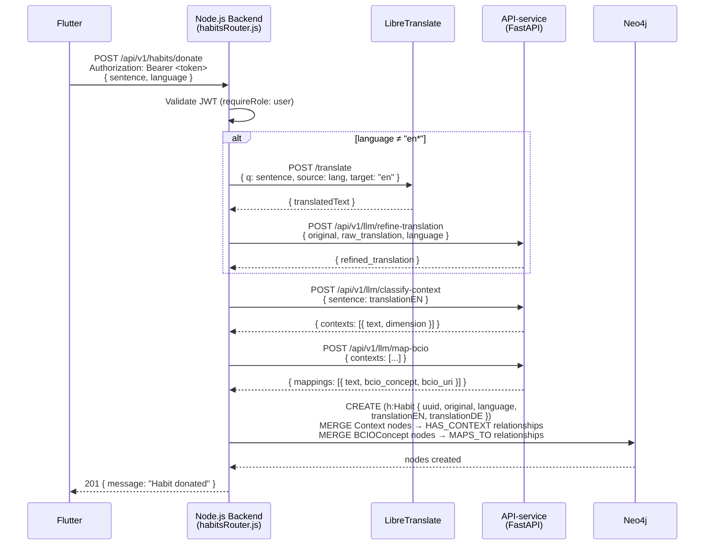
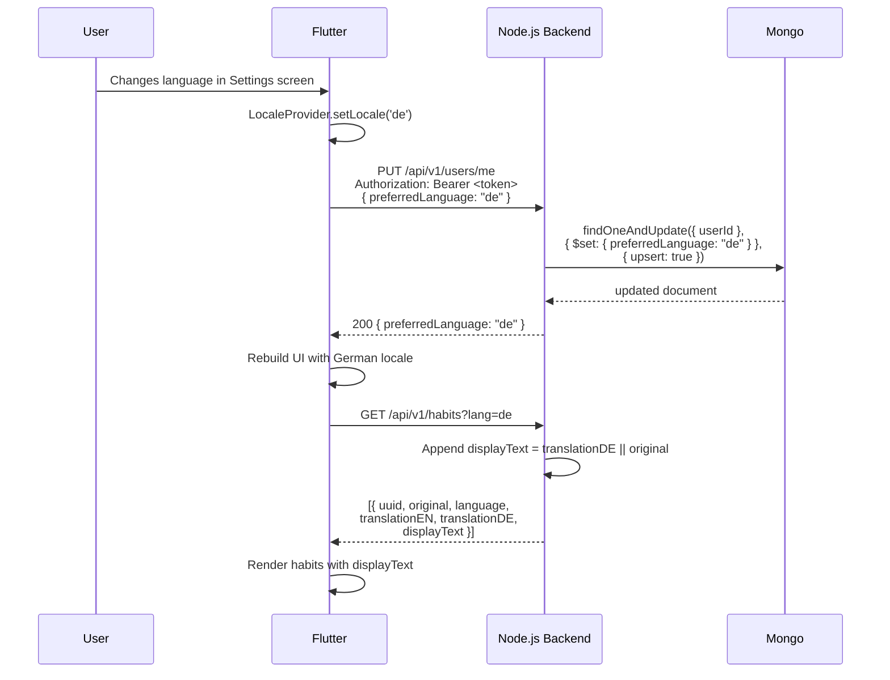
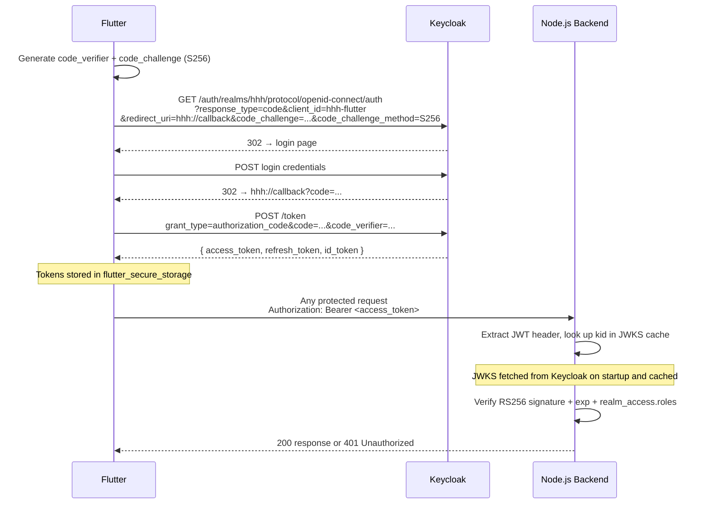
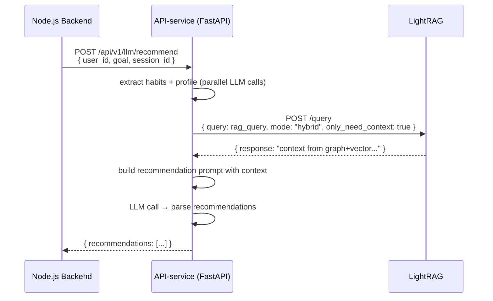
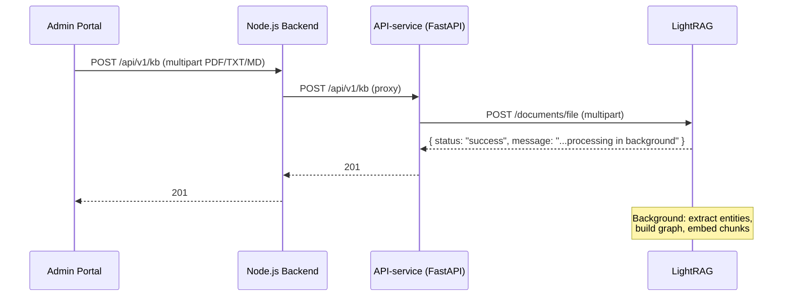

# Health Habit Hub — System Architecture

> **Related:** the full diagram suite (system architecture, UML use case diagram, 30 per-use-case sequence diagrams, domain class diagram) lives in [`docs/diagrams/`](diagrams/README.md) as renderable Mermaid/PlantUML sources. The use case catalogue with code traceability is in [`diagrams/use-cases/use-case-overview.md`](diagrams/use-cases/use-case-overview.md).

## Overview

Health Habit Hub (HHH) is a research platform for collecting, annotating, and recommending behavioural habits. It consists of thirteen Docker services orchestrated via `docker-compose`, a Flutter mobile/web app, a Next.js admin panel, and a Python-based recommender/enrichment microservice. All HTTP traffic is routed through a Traefik reverse proxy.

---

## Component Diagram


---

## Per-Service Reference Table

| Service | Technology | Purpose | Internal Port | External URL (dev) | Key Env Vars |
|---|---|---|---|---|---|
| **proxy** | Traefik v3.0 | Reverse proxy, TLS termination, routing | 8080 (dashboard) | `proxy.localhost:8888` | `TRAEFIK_HOST_PORT80`, `TRAEFIK_HOST_PORT8080`, `PATH_SUFFIX`, `ACME_EMAIL` (prod) |
| **app** | Node.js 20 + Express | REST API `/api/v1/*` | 3000 | `app.localhost:3000` | `MONGO_HOST`, `MONGO_USER`, `MONGO_PASSWORD`, `MONGO_DB`, `NEO4J_URI`, `NEO4J_USER`, `NEO4J_PASSWORD`, `KEYCLOAK_JWKS_URL`, `API_SERVICE_URL`, `LIBRE_TRANSLATE_URL`, `ALLOWED_ORIGINS` |
| **api-service** | Python 3.11 + FastAPI | LLM inference (context classification, BCIO mapping, translation refinement, RAG recommendations); KB CRUD proxied to LightRAG | 8000 | `localhost:8000` | `NEO4J_URI`, `NEO4J_USER`, `NEO4J_PASSWORD`, `REDIS_URL`, `LIGHTRAG_URL`, `LIGHTRAG_API_KEY` |
| **lightrag** | LightRAG 1.5.0 (Python) | Graph+vector knowledge base; builds entity graph from uploaded documents; exposes REST query API and built-in graph visualization UI | 9621 | `localhost:9622` | `LLM_API_BASE`, `LLM_API_KEY`, `LLM_MODEL`, `EMBEDDING_API_BASE`, `EMBEDDING_API_KEY`, `EMBEDDING_MODEL`, `LIGHTRAG_API_KEY` |
| **knowledge-mcp** | FastMCP (Python) | MCP server wrapping LightRAG; exposes `search_knowledge` and `ingest_document` tools for AI agent use via SSE transport | 8002 | `localhost:8002` | `LIGHTRAG_URL`, `LIGHTRAG_API_KEY` |
| **keycloak** | Keycloak 26.5.5 | OIDC/OAuth2 identity provider; manages realms, users, roles | 8080 | `localhost:8080` | `KEYCLOAK_ADMIN`, `KEYCLOAK_ADMIN_PASSWORD`, `KC_DB`, `KC_HTTP_RELATIVE_PATH` (prod) |
| **admin** | Next.js 14 (App Router) | Researcher/admin web panel: questionnaire management, settings, cue pools, study analytics, notification campaigns | 3001 | `admin.localhost:3001` | `NEXTAUTH_URL`, `NEXTAUTH_SECRET`, `KEYCLOAK_ID`, `KEYCLOAK_SECRET`, `KEYCLOAK_ISSUER`, `KEYCLOAK_BROWSER_URL`, `KEYCLOAK_INTERNAL_URL`, `HHH_ADMIN_USER` |
| **neo4j** | Neo4j 5 (n10s plugin) | Graph database; stores habit graph with BCIO alignment | 7474 (HTTP), 7687 (Bolt) | `neo4j.localhost:7474` | `NEO4J_AUTH` (`user/password`), `NEO4J_PLUGINS` |
| **mongo** | MongoDB (latest) | Document store; holds questionnaires, form responses, recommendations, user preferences | 27017 | Internal only | `MONGO_INITDB_ROOT_USERNAME`, `MONGO_INITDB_ROOT_PASSWORD`, `MONGO_INITDB_DATABASE` |
| **mongo-express** | Mongo Express | MongoDB admin web UI | 8081 | `localhost/mongo` | `ME_CONFIG_MONGODB_URL`, `ME_CONFIG_BASICAUTH_USERNAME`, `ME_CONFIG_BASICAUTH_PASSWORD` |
| **translate** | LibreTranslate | Self-hosted machine translation API (en/de) | 5000 | `translate.localhost:5000` | `LT_LOAD_ONLY`, `LT_REQ_LIMIT` |
| **backup** | Custom Alpine + daily loop | Daily backups of MongoDB, LightRAG, Neo4j, Keycloak; configurable retention (default 14 days) | — | Internal only | `BACKUP_RETENTION_DAYS`, `ALERT_WEBHOOK_URL`, `BACKUP_EMAIL`, `MONGO_USER`, `MONGO_PASSWORD` |

> **Flutter mobile/web**: Not a separate Docker container. Flutter runs natively on Android/iOS or as a compiled web app. In dev the backend is reached directly; in production the compiled web bundle may be hosted on the `app` service.
>
> **Admin panel**: Runs as a separate Docker container (`h3-admin`) on port 3001. Uses NextAuth v4 + Keycloak for authentication and enforces `admin` or `researcher` realm roles at the middleware layer.

---

## Node.js Backend — Internal Module Structure

The `app/` service is internally organized into the following layers (as of the v1.2.0 clean-code refactor):

| Directory | Purpose |
|---|---|
| `app/routes/` | Thin Express routers — parameter extraction, auth middleware, delegating to services |
| `app/services/` | Business logic: `habitDonationService.js`, `adminParticipantService.js`, `adminHabitService.js`, `adminStatsService.js`, `keycloakAdminClient.js`; DFG study services: `habitConfigService.js`, `intentionService.js`, `dailyLogService.js`, `srhiService.js`, `cuePoolService.js`, `exportService.js`, `notificationCampaignService.js`, `studyAnalyticsService.js` |
| `app/db/` | Named Cypher query modules: `habitQueries.js`, `adminQueries.js` |
| `app/models/` | MongoDB collection validators and domain models (`study.js`, `enrollment.js`, `implementationIntention.js`, …) |
| `app/middleware/` | Express middleware: `auth.js` (JWT/JWKS), `roles.js` (ROLES constants, isPrivileged) |
| `app/utils/` | Infrastructure helpers: `getDb.js`, `healthCheck.js`, `translate.js`, `localization.js`, `constants.js` |

---

## End-to-End Donation Pipeline

The donation pipeline ingests a habit sentence from the Flutter app, enriches it with BCIO context classifications and machine translations, and persists everything to Neo4j.



### Pipeline Stages

| Stage | Service | Input | Output | Notes |
|---|---|---|---|---|
| Auth | Node.js Backend | JWT Bearer token | `req.user` with roles | JWKS fetched from Keycloak |
| Translation | LibreTranslate | `sentence` (non-English) | Raw English draft | Only runs when `language` does not start with `en` |
| Translation Refinement | API-service LLM | Raw English draft + original | Natural English | Falls back to raw draft on LLM timeout (10 s) |
| Context Classification | API-service LLM | `translationEN` | `[{ text, dimension }]` | Uses `classify-context` prompt |
| BCIO Mapping | API-service LLM | Context phrases | `[{ bcio_concept, bcio_uri }]` | Uses `map-bcio` prompt + RAG over `bcio.owl` |
| Graph Persistence | Neo4j | Enriched habit data | `Habit`, `Context`, `BCIOConcept` nodes | MERGE ensures idempotency |

---

## Language / Locale Flow



### Language Conventions

| Concern | Convention |
|---|---|
| Locale codes | ISO 639-1 two-letter: `"en"`, `"de"` (consistent across Flutter, backend, MongoDB) |
| `preferredLanguage` field | Stored in MongoDB `users` collection, keyed by Keycloak `sub` |
| `?lang=` query parameter | Supported on `GET /api/v1/habits`; triggers `displayText` field in response |
| Donation language detection | Flutter sends `language` field in POST body; backend uses it to decide whether to translate |
| `translationEN` | Stored on all non-English `Habit` nodes; `null` for English habits |
| `translationDE` | Stored on `Habit` nodes when German translation is available |
| Fallback | `displayText = translationXX || original` — `||` handles both `null` and `undefined` |

---

## Auth Flow



### Realm Roles

| Role | Granted to | Permissions |
|---|---|---|
| `user` | Study participants (end users of the Flutter app) | Donate habits, view recommendations, submit questionnaires |
| `researcher` | Research staff | All `user` permissions + admin panel access (excluding KB and Settings), questionnaire and study management |
| `admin` | Platform administrators | All `researcher` permissions + full admin panel access including Knowledge Base and Settings |

> **Note:** The `user` role was previously named `participant`. It was renamed across `app/middleware/roles.js`, `keycloak/hhh-realm.json`, and `scripts/seed-local.js` to align with Keycloak terminology and to avoid clashing with the domain term "participant" used in study admin contexts.

### Admin Panel Auth

The Next.js admin panel uses NextAuth v4 with the Keycloak provider. On each request, `src/middleware.ts` calls `getToken()` to validate the session JWT and additionally logs method, path, user `sub`, roles, and request latency (visible in `docker logs h3-2-admin`). If the decoded token's `realm_access.roles` array does not include `admin` or `researcher`, the user is redirected to `/access-denied`. The Keycloak client used is `hhh-admin` (confidential client with client secret).

#### Inside the JWT callback

`realm_access.roles` is present on **access tokens** but absent from ID tokens (Keycloak default). The JWT callback in `admin/src/lib/auth.ts` therefore decodes roles from `account.access_token` directly rather than from the OIDC `profile` (ID token claims).

#### Docker-aware OIDC endpoints

Because Keycloak runs inside Docker but the browser runs on the host, the admin panel cannot rely on OIDC discovery (`wellKnown`) — the discovery document returns the internal Docker hostname (`http://keycloak:8080/...`) for the authorization endpoint, which browsers cannot resolve. The NextAuth provider instead sets endpoints explicitly:

| Endpoint | Resolves to | Env var |
|---|---|---|
| `authorization.url` | `http://localhost:8080` | `KEYCLOAK_BROWSER_URL` |
| `token` | `http://keycloak:8080` (internal) | `KEYCLOAK_INTERNAL_URL` |
| `userinfo` | `http://keycloak:8080` (internal) | `KEYCLOAK_INTERNAL_URL` |
| `jwks_endpoint` | `http://keycloak:8080` (internal) | `KEYCLOAK_INTERNAL_URL` |
| Issuer (`iss` validator) | `http://localhost:8080/realms/hhh` | `KEYCLOAK_ISSUER` |

Note that `KEYCLOAK_ISSUER` uses the **browser-facing** hostname even though token/JWKS calls go to the internal hostname. This is because Keycloak in `start-dev` mode stamps the `iss` claim on issued tokens from the browser-side Host header.

#### Page-level role guards

Beyond the middleware allow-list, the admin panel enforces fine-grained access control at the page level:

- `/knowledge-base` and `/settings` are admin-only — `researcher` users are redirected to `/access-denied`
- The sidebar hides the KB and Settings entries for `researcher` users so the navigation reflects what they can actually open
- Flutter admin routes (when the admin Flutter UI is in use) are restricted to `admin` only

#### Local admin user provisioning

In local development, the `keycloak-init` container automatically creates a user in the `hhh` realm with both `admin` and `researcher` roles, using `HHH_ADMIN_USER` (default `admin`) as the username and `KEYCLOAK_ADMIN_PASSWORD` as the password. Demo users (`demo-admin`, `demo-researcher`) have been removed from `keycloak/hhh-realm.json`.

---

## Knowledge Base & RAG Pipeline

The knowledge base stores academic papers and documents that inform habit recommendations. Admins upload PDF, TXT, or MD files via the admin portal. LightRAG processes each document and builds two parallel indexes:

1. **Knowledge graph** — LightRAG extracts key concepts and relationships from the document text using the LLM (scads AI). For example, from a sleep paper it might extract `sleep → improves → recovery` as a graph edge. This graph captures semantic structure that pure vector search misses.
2. **Vector index** — The same document chunks are embedded and stored for dense similarity search.

When a habit recommendation is requested, the API-service calls LightRAG with `mode=hybrid`. LightRAG searches both the graph and the vector index simultaneously and returns a synthesized context string. This context is passed to the recommendation LLM alongside the user's goal to generate personalized habit suggestions.

### Recommendation retrieval flow



### Document ingestion flow



### MCP server

The `knowledge-mcp` container exposes the knowledge base as Model Context Protocol tools over SSE at `http://localhost:8002/sse`. Claude Desktop or Claude Code can connect to it and call `search_knowledge` (queries LightRAG) or `ingest_document` (inserts text). Every tool call is logged to stdout with the query and LightRAG response status.

### Graph visualization

LightRAG's built-in web UI is served at `http://localhost:9622` (local) and can be reached via SSH tunnel on the server. The admin portal "View Graph" button links directly to this UI. It shows the entity graph built from all uploaded documents — useful for verifying that LightRAG has correctly extracted concepts.

---

## Data Storage Rationale

| Store | Technology | What is stored | Why |
|---|---|---|---|
| **Graph DB** | Neo4j 5 | `Habit`, `Context`, `BCIOConcept` nodes and `HAS_CONTEXT`, `MAPS_TO` relationships | Graph traversal for habit similarity, BCIO alignment queries, and recommender reads |
| **Document DB** | MongoDB | `users` (preferences), `questionnaires`, `form_responses`, `recommendations`, `recommendation_feedback`; DFG collections: `implementation_intentions`, `daily_behavior_logs`, `srhi_responses`, `cue_pools`, `notification_campaigns` | Flexible schema for survey/form data; no strong relational joins required |
| **Triplestore** *(retired)* | Apache Jena Fuseki | BCIO ontology (`Ontology.ttl`, `schema.ttl`, `data.ttl`) | **Removed from the compose stack** — BCIO mapping now uses in-process embeddings in the API-service; ontology sections below are kept for historical reference (see `docs/migration.md`) |
| **Vector search** | In-process (API-service) | Embedded BCIO concept descriptions | Fast similarity search during `map-bcio` pipeline step; no separate vector DB needed at current scale |
| **Graph+vector KB** | LightRAG (file-based) | Knowledge graph of concepts/relationships extracted from uploaded documents + vector embeddings | Hybrid retrieval for habit recommendations; graph captures semantic relationships, vector handles dense similarity |

### Neo4j Schema (Current — `ralph/hhh-platform-unified`)

```
(:Habit { uuid, original, language, translationEN, translationDE })
  -[:HAS_CONTEXT]->(:Context { text, dimension })
  -[:MAPS_TO]->(:BCIOConcept { name, uri })
```

> **Note:** Legacy `hhh__Habit` / `hhh__Donor` data from the old n10s/RDF pipeline may still exist in the Neo4j instance, but the code that wrote it (legacy web donate flow, `Neo4jDatabase.js`) was removed in 2026-06. See `docs/migration.md` for the data migration plan.

---

## Ontology

> **Note (2026-06):** the Fuseki triplestore has been removed from the deployment. The ontology reference below documents the RDF model used by the legacy pipeline and remains relevant for interpreting historical data and the BCIO concept space.

### Namespaces

| Prefix | URI | Description |
|---|---|---|
| `hhh:` | `http://example.com/hhh#` | HHH domain ontology (habits, donors, groups) |
| `bcio:` | `http://humanbehaviourchange.org/ontology/BCIO#` | Behaviour Change Intervention Ontology |
| `owl:` | `http://www.w3.org/2002/07/owl#` | OWL 2 Web Ontology Language |
| `rdfs:` | `http://www.w3.org/2000/01/rdf-schema#` | RDF Schema |
| `xsd:` | `http://www.w3.org/2001/XMLSchema#` | XML Schema Datatypes |

### HHH Core Classes

| Class | URI | Description |
|---|---|---|
| `hhh:Donor` | `hhh:Donor` | A study participant who donates habits |
| `hhh:Habit` | `hhh:Habit` | A donated habit instance |
| `hhh:Behavior` | `hhh:Behavior` | The action component of a habit |
| `hhh:Context` | `hhh:Context` | The situational trigger for a habit |
| `hhh:InternalState` | subclass of `Context` | Self-reported psychological state |
| `hhh:PhysicalSetting` | subclass of `Context` | Physical environment where habit occurs |
| `hhh:TimeReference` | subclass of `Context` | Time-based trigger |
| `hhh:People` | subclass of `Context` | Social context |
| `hhh:PriorBehavior` | subclass of `Context` | Preceding behaviour trigger |
| `hhh:Reasoning` | subclass of `Context` | Cognitive reasoning trigger |
| `hhh:ExperimentalSetting` | `hhh:ExperimentalSetting` | Study arm superclass (G1–G4) |

### BCIO Integration Point

The BCIO is merged inline into `fuseki/init/Ontology.ttl`. Key alignment points:

- `hhh:Behavior` → partial alignment with `bcio:BehaviourChangeTechnique`
- `hhh:Context` → partial alignment with `bcio:Setting`
- `hhh:InternalState` → possible alignment with `bcio:MechanismOfAction`

All alignments are marked `TODO: domain-review` in the ontology and should be validated by a domain expert before formal publication.

### G1–G4 Experimental Group Encoding

| Class | rdfs:comment | Description |
|---|---|---|
| `hhh:Group1` | Closed-Ended | Both task + general sections are closed-ended |
| `hhh:Group2` | Closed-Ended Task, Opened-Ended General | Structured task section; free-text general section |
| `hhh:Group3` | Opened-Ended Task, Closed-Ended General | Free-text task section; structured general section |
| `hhh:Group4` | Opened-Ended | Both sections are free-text |

---

## DFG Study Module

### Purpose

The DFG study module (DFG CuB — Contextual Cues for Habit Formation) extends the platform with a longitudinal research protocol. Participants form implementation intentions, log daily behaviour, and complete weekly SRHI (Self-Report Habit Index) check-ins. Researchers configure per-group cue pools and receive automated analytics and CSV exports.

### Architecture Overview

The module is layered on top of the existing Node.js backend and MongoDB. A single resolved-config endpoint (`GET /me/habit-config`) returns the cue configuration for the participant's study group (or the public default), together with pre-rated cues drawn randomly from the assigned pool and the SRHI item list. This drives the Flutter "My Habits" tab.

Data flow:

1. **Intention creation** — participant selects a behaviour, trigger cue, and time; `intentionService.js` persists the intention and enforces the per-study `maxHabits` cap.
2. **Daily logging** — participant marks habit done/not-done; `dailyLogService.js` performs an idempotent upsert keyed on `(intentionId, date)`.
3. **SRHI check-in** — `srhiService.js` computes the next due window per intention and accepts a 12-item response; scores are stored for trajectory analysis.
4. **Export** — `exportService.js` builds three CSVs (SRHI responses, daily logs, dropouts) bundled as a ZIP for researcher download.

### API Route Groups

| Route prefix | Description |
|---|---|
| `GET /me/habit-config` | Resolved cue config + assigned cues + SRHI items for the authenticated user |
| `/habits/intentions` | Implementation intention CRUD and status updates |
| `/habits/intentions/:id/logs` | Daily behaviour log creation and history |
| `/srhi/*` | SRHI due-window query, weekly submission, and trajectory history |
| `/admin/cue-pools` | Cue pool CRUD and bulk CSV import |
| `/admin/studies/:id/analytics` | Per-group weekly active rate, SRHI trajectory, dropout curve |
| `/admin/studies/:id/export` | Research data ZIP download (3 CSVs) |
| `/admin/notifications` | Researcher FCM notification campaign management |
| `/admin/studies/:id/groups/:groupId/cue-config` | Per-group cue source, count, and behaviour config |

### New MongoDB Collections

| Collection | Purpose |
|---|---|
| `implementation_intentions` | Participant intentions (behaviour, cue, time, status) |
| `daily_behavior_logs` | Idempotent daily done/not-done logs keyed on intention + date |
| `srhi_responses` | Weekly SRHI submissions with computed composite score |
| `cue_pools` | Named pools of pre-rated contextual cues; supports per-group assignment |
| `notification_campaigns` | Researcher-authored FCM push campaigns with schedule and target group |

---

*Updated: 2026-06-10 | Fuseki removed from architecture docs (service retired from compose stack); backup targets corrected*

*Updated: 2026-06-10 | Diagram suite added under `docs/diagrams/` (architecture, use cases, 30 sequence diagrams, class diagram)*

*Updated: 2026-06-03 | LightRAG upgraded to 1.5.0*

*Updated: 2026-06-02 | DFG study module added*

*Updated: 2026-05-09 | Branch: platform_unified — LightRAG knowledge base added*
